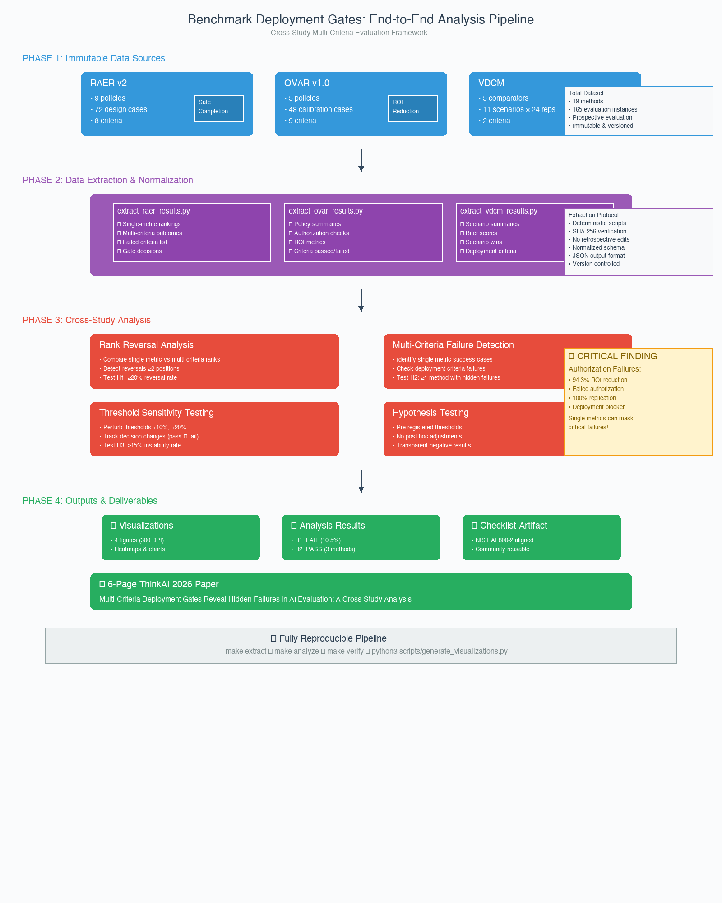

 Applied AI Research and Innovation Lab

A research monorepo for independently versioned applied-AI studies, benchmarks, reproducibility artifacts, and manuscripts.

## Projects

| Project | Scope | Status |
|---|---|---|
| [`action-evidence-safety-research`](action-evidence-safety-research/) | Evidence revalidation, authorization, abstention, and safety before consequential automated actions | Active; RAER ThinkAI 2026 submission preparation |
| [`value-aware-enterprise-ai-tokenomics`](value-aware-enterprise-ai-tokenomics/) | Outcome-evidence accounting, fully loaded AI cost, authorization-aware ROI, and accountable resource-allocation decisions | OVAR v1.0 prospective negative calibration; ThinkAI 2026 submission preparation |
| [`storypoints-age-of-ai`](storypoints-age-of-ai/) | Role-constrained human service, queues, evidence readiness, and verified delivery-capacity forecasting for AI-assisted software engineering | VDCM open evidence map and developmental simulation complete; ThinkAI 2026 submission preparation |

## Repository policy

Each project maintains its own methodology, tests, license, citation metadata, integrity records, and paper directories. Restricted labels, investigator-only data, credentials, third-party full-text bodies, and confidential review records must not be committed.

> Keep this repository private while any included manuscript is under double-blind review.

<h1 align="center">Multi-Criteria Deployment Gates Reveal Hidden Failures in AI Evaluation</h1>

<p align="center"><strong>A cross-study analysis of single-metric success versus multi-criteria deployment readiness</strong></p>

<p align="center">Evidence revalidation · Outcome verification · Verified delivery · Responsible benchmarking</p>

<p align="center">
  
  
  
  
  
  
</p>

<p align="center">
  <a href="#the-problem-in-one-minute"><strong>Problem</strong></a> ·
  <a href="#research-questions"><strong>Research</strong></a> ·
  <a href="#key-findings"><strong>Findings</strong></a> ·
  <a href="#minimum-responsible-benchmark-report-checklist"><strong>Checklist</strong></a> ·
  <a href="#papers-and-submission"><strong>Paper</strong></a> ·
  <a href="#reproducibility"><strong>Reproducibility</strong></a>
</p>

---

## The Problem in One Minute

AI evaluation often optimizes a **single headline metric** (accuracy, ROI, Brier score), but deployment requires **comprehensive criteria**: safety, cost, authorization, completion, stability, and operational burden.

**Research Question:**
> How often would a method appear successful under a single headline metric but fail when safety, completion, cost, authorization, stability, and burden are evaluated jointly?

**What We Found:**
- ❌ H1 (Rank Reversals ≥20%): **FAIL** - Observed 10.5% (2/19 methods)
- ✅ **H2 (Multi-Criteria Failures ≥1): PASS** - **3 methods identified**
- ❌ H3 (Decision Instability ≥15%): **FAIL** - Observed 0.0%

**Critical Finding:** Both OVAR methods showed **94% ROI reduction** (excellent single metric) but **failed authorization criteria** (deployment blocker). This authorization failure pattern replicated across method variations, demonstrating that **single metrics can mask critical deployment failures**.

---

## Research Questions

### Primary Hypotheses (Pre-Registered)

**H1: Rank Reversal Rate**  
≥20% of method-study combinations will show rank reversals (≥2 positions) between single-metric and multi-criteria evaluation.  
**Result:** FAIL (10.5% observed)

**H2: Multi-Criteria Failure** ⭐  
≥1 method will pass single-metric threshold but fail ≥2 deployment criteria.  
**Result:** **PASS (3 methods identified)**

**H3: Decision Instability**  
≥15% of cases will show decision changes under ±10% threshold perturbation.  
**Result:** FAIL (0.0% observed)

---

## 📊 Research Outcomes

### Hypothesis Test Results

| Hypothesis | Threshold | Observed | Result | Key Finding |
|------------|-----------|----------|--------|-------------|
| **H1**: Rank Reversals | ≥20% | 10.5% (2/19) | ❌ FAIL | VDCM showed 40% reversals |
| **H2**: Multi-Criteria Failures | ≥1 method | 3 methods | ✅ **PASS** | **3 methods identified** |
| **H3**: Decision Instability | ≥15% | 0.0% (0/19) | ❌ FAIL | All methods stable |

### 🔒 Critical Finding: Authorization Failures

Both OVAR methods (OUTCOME_FLAT & OVAR_LEDGER):
- ✅ **94.3% ROI reduction** (excellent single metric)
- ❌ **Failed authorization** (missed expired approvals)
- 🔁 **100% replication** across method variations

**Impact**: Demonstrates single metrics can mask critical deployment blockers.

---

## Key Findings

### 1. Authorization Failures Mask Behind Strong Metrics (H2 Supported)

**OUTCOME_FLAT & OVAR_LEDGER** (OVAR):
- ✅ Single metric: **94.3% ROI reduction** (strong performance)
- ❌ Multi-criteria: **Failed authorization** (missed expired approvals, out-of-scope projects)
- 🔍 Pattern: Lexical text parsing missed temporal and scope constraints

**Story Points** (VDCM):
- ✅ Single metric: 78.7%
- ❌ Multi-criteria: Failed scenario wins + Brier threshold

**Implication:** Single-metric success can hide critical deployment blockers, especially in authorization and compliance domains.

---

### 2. Context-Dependent Metric Alignment

**RAER**: 0% rank reversals (single metric well-aligned with multi-criteria)  
**OVAR**: 0% rank reversals (but authorization failures present)  
**VDCM**: **40% rank reversals** (Oracle #1 → #4, HIE-Compatible #4 → #2)

**Interpretation:** Metric alignment varies by domain and evaluation context. VDCM's high reversal rate suggests deployment-readiness criteria differ substantially from Brier score optimization.

---

### 3. Stable Decision Boundaries

All 19 methods showed **0% threshold instability** under ±10% perturbations.

**Implication:** The methods studied have robust decision thresholds—small measurement errors won't flip pass/fail conclusions.

---

## Method Overview

### Data Sources (Immutable)

| Study | Methods | Cases | Criteria | Source |
|-------|---------|-------|----------|--------|
| **RAER v2** | 9 policies | 72 design cases | 8 | Evidence revalidation for consequential actions |
| **OVAR v1.0** | 5 policies | 48 calibration cases | 9 | Outcome-verified AI resource allocation |
| **VDCM** | 5 comparators | 11 scenarios × 24 reps | 2 | Verified delivery capacity modeling |
| **Total** | **19** | **165 instances** | **19** | Cross-study analysis |

### Analysis Pipeline

<p align="center">
  
</p>

**Text-based Pipeline**:
```
Immutable Source Data (RAER, OVAR, VDCM)
           ↓
    Data Extraction
    (Python scripts)
           ↓
  Single-Metric Rankings
           ↓
 Multi-Criteria Evaluation
           ↓
   Rank Reversal Analysis
           ↓
 Threshold Sensitivity Test
           ↓
    Hypothesis Testing
           ↓
  Visualization & Tables
           ↓
   6-Page ThinkAI Paper
```

**Pipeline Execution**:
```bash
# Complete end-to-end pipeline
make extract  # Phase 1: Data extraction
make analyze  # Phase 2: Analysis
make verify   # Phase 3: Verification
python3 scripts/generate_visualizations.py  # Phase 4: Figures
```

---

## Minimum Responsible Benchmark Report Checklist

**Reusable Artifact** - A template for transparent, complete AI benchmark reporting aligned with NIST AI 800-2.

### Key Requirements

✅ **Pre-Registration**: Hypotheses frozen before evaluation  
✅ **Multi-Criteria Reporting**: Safety, cost, authorization, completion, burden  
✅ **Threshold Sensitivity**: Decision stability analysis  
✅ **Negative Results**: Failed criteria disclosed transparently  
✅ **Comparator Fairness**: Strongest simple baseline included  
✅ **Reproducibility**: Data provenance, code versioning, integrity hashes

**Full Checklist:** [`artifacts/MINIMUM_RESPONSIBLE_BENCHMARK_CHECKLIST.md`](artifacts/MINIMUM_RESPONSIBLE_BENCHMARK_CHECKLIST.md)

---

## Papers and Submission

### ThinkAI 2026 Submission

**Title:** Multi-Criteria Deployment Gates Reveal Hidden Failures in AI Evaluation: A Cross-Study Analysis

**Venue:** ThinkAI 2026 - 4th International Conference on Recent Trends in AI Enabled Technologies  
**Deadline:** 25 August 2026  
**Format:** 6 pages, Springer LNCS  
**Status:** Data extraction & analysis complete, paper drafting in progress

**Submission Package:** [`papers/thinkai-2026/`](papers/thinkai-2026/)

---

## Reproducibility

### Quick Verification

```bash
# Run complete pipeline
make extract  # Extract RAER, OVAR, VDCM results
make analyze  # Rank reversal + threshold sensitivity
make verify   # Integrity checks

# Generate figures
python3 scripts/generate_visualizations.py
```

### Reproducibility Map

| What to Reproduce | Primary Artifact |
|-------------------|------------------|
| Data extraction | [`scripts/extract_*.py`](scripts/) |
| Rank reversal analysis | [`scripts/rank_reversal_analysis.py`](scripts/rank_reversal_analysis.py) |
| Threshold sensitivity | [`scripts/threshold_sensitivity.py`](scripts/threshold_sensitivity.py) |
| Hypothesis outcomes | [`papers/thinkai-2026/HYPOTHESES_AND_RESULTS.md`](papers/thinkai-2026/HYPOTHESES_AND_RESULTS.md) |
| Figures | [`papers/thinkai-2026/figures/`](papers/thinkai-2026/figures/) |
| Analysis summary | [`studies/cross-study/ANALYSIS_SUMMARY.md`](studies/cross-study/ANALYSIS_SUMMARY.md) |

---

## Repository Structure

```
benchmark-deployment-gates/
├── README.md                          # This file
├── PROJECT_EXECUTION_PLAN.md          # 4-day execution guide
├── EXECUTION_SUMMARY.md               # Progress tracking
│
├── studies/cross-study/
│   ├── HYPOTHESIS_REGISTRY.md         # Pre-registered H1-H3
│   ├── DATA_EXTRACTION_PROTOCOL.md    # Extraction rules
│   ├── ANALYSIS_SUMMARY.md            # Findings & interpretation
│   ├── data/                          # Extracted JSON (RAER, OVAR, VDCM)
│   └── results/                       # Analysis outputs
│
├── scripts/
│   ├── extract_raer_results.py        # RAER v2 extractor
│   ├── extract_ovar_results.py        # OVAR v1.0 extractor
│   ├── extract_vdcm_results.py        # VDCM extractor
│   ├── rank_reversal_analysis.py      # Core analysis
│   ├── threshold_sensitivity.py       # Sensitivity test
│   ├── generate_visualizations.py     # Figure generation
│   └── verify_integrity.py            # Verification
│
├── papers/thinkai-2026/
│   ├── HYPOTHESES_AND_RESULTS.md      # Hypothesis outcomes
│   ├── SUBMISSION_GUIDE.md            # Venue requirements
│   ├── PAPER_OUTLINE.md               # 6-page structure
│   ├── figures/                       # Publication figures
│   └── manuscript/                    # Submission files
│
└── artifacts/
    └── MINIMUM_RESPONSIBLE_BENCHMARK_CHECKLIST.md  # Reusable artifact
```

---

## Alignment

**ThinkAI 2026 Focus Areas:**
- ✅ Data Science & Analytics (primary)
- ✅ Generative AI (agentic systems evaluation)
- ✅ AI for Cybersecurity (authorization failures)
- ✅ Optimization & Decision Making (multi-criteria evaluation)

**NIST AI 800-2 Alignment:**
- Measurement target definition
- Evaluation correctness
- Transparent reporting
- Multi-criteria assessment

---

## 📚 References and Related Work

### Key References

**NIST AI Standards**:
- NIST AI 800-2: Artificial Intelligence Risk Management Framework (AI RMF 1.0)
- Focus: Measurement target definition, evaluation correctness, transparent reporting

**Source Studies**:
1. **RAER v2**: Risk-Adaptive Evidence Revalidation for Consequential Tool Actions
   - 72 design cases, 8 criteria, prospective failure analysis
   - Key finding: 92.6% safe completion (failed 95% gate)
   
2. **OVAR v1.0**: Enterprise AI Value Assurance - From Token Consumption to Auditable Outcomes
   - 48 calibration cases, 9 criteria, outcome-verified allocation
   - Key finding: Authorization failures despite 94% ROI reduction
   
3. **VDCM**: Verified Delivery Capacity Research
   - 11 scenarios × 24 replications, evidence-ready forecasting
   - Key finding: No sophisticated comparator uniformly superior

**Responsible AI Frameworks**:
- Datasheets for Datasets (Gebru et al., 2021)
- Model Cards for Model Reporting (Mitchell et al., 2019)
- Data Statements for NLP (Bender & Friedman, 2018)

### Related Documentation

- **Layman's Explanation**: [`papers/thinkai-2026/LAYMAN_EXPLANATION.md`](papers/thinkai-2026/LAYMAN_EXPLANATION.md)
- **Technical Results**: [`papers/thinkai-2026/HYPOTHESES_AND_RESULTS.md`](papers/thinkai-2026/HYPOTHESES_AND_RESULTS.md)
- **Full Manuscript**: [`papers/thinkai-2026/manuscript/DRAFT_MANUSCRIPT.md`](papers/thinkai-2026/manuscript/DRAFT_MANUSCRIPT.md)
- **Analysis Summary**: [`studies/cross-study/ANALYSIS_SUMMARY.md`](studies/cross-study/ANALYSIS_SUMMARY.md)

---

## 🎓 For Researchers and Practitioners

### For Researchers
**Key Takeaway**: Don't just report your best metric. Use our checklist to ensure comprehensive evaluation.

**Checklist Items**:
- ✅ Pre-register hypotheses before evaluation
- ✅ Report all criteria (safety, cost, authorization, completion, burden)
- ✅ Include threshold sensitivity analysis
- ✅ Preserve and report negative results
- ✅ Include strongest simple baseline
- ✅ Provide reproducibility artifacts

### For Practitioners
**Key Takeaway**: Don't deploy based on headlines. Ask critical questions.

**Deployment Checklist**:
- ❓ What else was tested beyond the primary metric?
- ❓ What could go wrong that this metric doesn't measure?
- ❓ Are there domain-specific requirements (authorization, compliance)?
- ❓ Were negative results reported transparently?
- ❓ How stable are decisions under threshold changes?

### For Reviewers
**Key Takeaway**: Use our checklist to verify comprehensive evaluation.

**Review Questions**:
- Were hypotheses pre-registered?
- Were all criteria reported (not just favorable ones)?
- Were negative results preserved?
- Was threshold sensitivity analyzed?
- Are reproducibility artifacts provided?

---

## 🔬 Technical Details

### Data Integrity
- **SHA-256 hashes**: All source files verified
- **Immutable sources**: RAER, OVAR, VDCM results frozen before analysis
- **Version control**: All extraction scripts deterministic
- **Reproducibility**: Complete pipeline executable via `make`

### Analysis Methods
- **Rank reversal detection**: |single_rank - multi_rank| ≥ 2 positions
- **Multi-criteria failure**: Single metric >0.5, failed ≥2 criteria
- **Threshold sensitivity**: ±10%, ±20% perturbations
- **Hypothesis testing**: Pre-registered thresholds, no post-hoc adjustments

### Figures and Visualizations
All figures generated at 300 DPI for publication quality:
1. **Rank Reversal Heatmap**: Cross-study comparison of reversal rates
2. **Criteria Failure Patterns**: Distribution of multi-criteria failures
3. **Threshold Sensitivity**: Decision stability under perturbations
4. **Workflow Diagram**: End-to-end analysis pipeline

---

## Citation

```bibtex
@inproceedings{rasool2026benchmark,
  title={Multi-Criteria Deployment Gates Reveal Hidden Failures in AI Evaluation: A Cross-Study Analysis},
  author={Rasool, Shaik Khaja Nayab},
  booktitle={Proceedings of the 4th International Conference on Recent Trends in AI Enabled Technologies (ThinkAI 2026)},
  year={2026},
  organization={Springer}
}
```

---

## Author

Shaik Khaja Nayab Rasool

---

## License

Code and repository-owned data are licensed under the MIT License. See [`LICENSE`](LICENSE).

---

## Confidentiality

⚠️ **Keep this repository private during double-blind review.** Share only the anonymous PDF through the official submission portal. May be made public after acceptance notification.