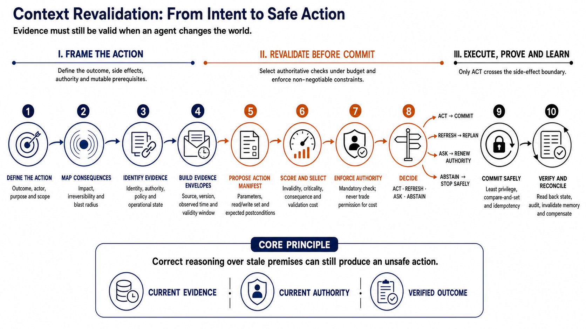

<h1 align="center">Action Evidence Safety: From Stale Evidence to Safe Execution</h1>

<p align="center"><strong>An end-to-end research framework for deciding what to revalidate, when to abstain, and how to protect authorization before consequential automated actions</strong></p>

<p align="center">Evidence revalidation · Authorization safety · Budgeted validation · Prospective evaluation</p>

<p align="center">
  
  
  
  
  
  
  
  
  
</p>

<p align="center">
  <a href="#the-problem-in-one-minute"><strong>Problem</strong></a> ·
  <a href="#method-overview"><strong>Method</strong></a> ·
  <a href="#benchmark-design"><strong>Benchmark</strong></a> ·
  <a href="#main-design-stage-results"><strong>Results</strong></a> ·
  <a href="#papers-and-submission-files"><strong>Papers &amp; Artifacts</strong></a> ·
  <a href="#reproducibility-expectations"><strong>Reproducibility</strong></a> ·
  <a href="#end-to-end-context-revalidation-workflow"><strong>Workflow</strong></a> ·
  <a href="#references"><strong>References</strong></a>
</p>

<p align="center"><a href="#quick-glance-research-and-adoption-review"><strong>Quick-glance research and adoption review</strong></a></p>

## Quick-glance research and adoption review

This section is an outcome-first guide to the research, its practical integration path, contribution model, and future growth. It complements rather than replaces the complete scientific record below.

### Bird's-eye view: outcome, use, and growth

| View | What a reader should take away |
|---|---|
| Outcome | RAER makes the pre-action evidence decision explicit: select which mutable prerequisites to revalidate under a finite budget, protect authorization-sensitive evidence, and return `ACT`, `REFRESH`, `ASK`, or `ABSTAIN` before a consequential side effect is allowed. |
| Current maturity | RAER v2 is a reproducible methods artifact and prospective negative design-stage result. It passed seven of eight criteria but missed the safe-completion requirement, so it is not a validated production control or a basis for autonomous authorization. |
| Best initial use | Apply the concepts in shadow mode to one bounded, consequential action whose authorization, policy, identity, scope, consent, or operational prerequisites can change between planning and execution. |
| How teams plug it in | Place an evidence-validity gate between action planning and the irreversible or externally visible commit. Feed it a typed action manifest, versioned evidence envelopes, authoritative validation functions, cost/latency budgets, and current authorization state; allow only an approved decision path to reach the executor. |
| Configuration principle | Configure the action and its prerequisites first, then consequence, irreversibility, criticality, mutability, validation cost, authorization sensitivity, correlation, budget, and decision thresholds. Safety-mandatory authority checks must not become fungible merely because another check is cheaper. |
| Team benefit if validated | More inspectable action admission, explicit handling of stale evidence, traceable reasons for refresh or abstention, controlled validation spend, and a durable separation between model confidence, evidence validity, and action authority. |
| Contribution value | Versioned extensions can improve prerequisite representations, validation policies, benchmarks, failure handling, connectors, tests, and human-review procedures while the frozen protocols, negative results, and sealed-test boundary prevent convenient retrospective rewriting. |
| Current relevance | Tool-using AI is moving from recommendation toward state-changing execution. Longer context, better retrieval, and higher model confidence do not establish that stored evidence or delegated authority remains valid at commit time. |
| Growth path | Progress through new design cases, human-domain construct review, structured evidence and authority records, high-fidelity simulation, preregistered external replication, and only then limited production shadowing with monitoring and accountable human control. |
| Stop rule | Prefer mandatory exhaustive checks, an existing policy engine, transactional preconditions, or human approval when the action is too consequential for budgeted selection, when prerequisites cannot be represented reliably, or when RAER adds false blocks without defensible safety value. |

In one sentence: **use the RAER research to make current evidence and current authority explicit at the side-effect boundary, but operationalize it only through separately validated controls that preserve safe completion.**

### Team plug-in map

RAER is best treated as a deterministic admission layer around an existing workflow or agent rather than as a replacement for the planner, policy engine, identity system, validator, or transactional executor.

| Existing system touchpoint | Minimum information to map | RAER-facing control | Decision-facing output |
|---|---|---|---|
| Planner, workflow, or agent | Exact proposed action, parameters, actor/delegated principal, purpose, anticipated read/write set, consequence, and reversibility | Typed action manifest with stable action and correlation identifiers | One reviewable action request rather than an unbounded natural-language intention |
| Identity and authorization service | Subject, resource, action, scope, purpose, issuer, validity interval, revocation state, and source version | Non-fungible authorization prerequisite and authoritative recheck | Current authority, renewed-authority request, or refusal |
| Policy, consent, and governance sources | Applicable rule/consent version, jurisdiction, purpose limitation, expiry, and invalidation triggers | Versioned evidence envelopes and source-precedence rules | `ACT`, policy-driven `REFRESH`, `ASK`, or `ABSTAIN` rationale |
| Operational system of record | Resource state, observation time, volatility, dependency changes, source reliability, contradictions, and concurrency token | Candidate authoritative checks with explicit cost and latency | Selected check set and residual modeled risk |
| Validation and human-review services | Validation function, expected monetary/latency/attention cost, availability, failure semantics, and escalation owner | Budget and safeguard constraints | Executed validations, consumed budget, unresolved prerequisites, and accountable escalation |
| Side-effect executor | Idempotency key, transactional preconditions, commit authority, timeout semantics, and compensation path | Hard gate that permits execution only on the authorized outcome | Committed, refused, refreshed, or escalated action with no silent bypass |
| Audit, monitoring, and memory | Source observations, decisions, validation responses, rule/method version, hashes, postconditions, and dependent caches | Immutable decision receipt and post-action invalidation record | Reproducible explanation, drift/failure analysis, and updated institutional memory |

The research specification is [`studies/raer/evaluation/v2/RAER_V2_METHOD_SPECIFICATION_v1.0.json`](studies/raer/evaluation/v2/RAER_V2_METHOD_SPECIFICATION_v1.0.json), and the reviewer-visible data boundary is illustrated by [`studies/raer/calibration/benchmark/release_v1.1/reviewer_visible_schema.json`](studies/raer/calibration/benchmark/release_v1.1/reviewer_visible_schema.json). These are research contracts, not production configuration templates. The end-to-end engineering interpretation is documented in the [context-revalidation workflow](communications/linkedin/context-revalidation/LINKEDIN_CONSOLIDATED_ARTICLE.md#end-to-end-workflow-from-intent-to-a-verified-outcome).

### Minimum viable adoption and configuration sequence

1. **Bound the action:** select one consequential action type, accountable owner, side-effect boundary, prohibited outcomes, and explicit human override/escalation path.
2. **Map mutable prerequisites:** identify the smallest set of facts whose invalidity would make that exact action unsafe, unauthorized, incorrectly scoped, or operationally invalid.
3. **Create evidence envelopes:** record semantic type, authoritative source, source identifier/version, observation time, validity window, purpose/scope, dependencies, invalidation triggers, contradiction state, and validation function.
4. **Classify decision factors:** define consequence, irreversibility, prerequisite criticality, authorization sensitivity, correlation, validation cost/latency, and the cost of unnecessary abstention using reviewable anchors.
5. **Freeze the policy:** version budgets, safeguards, thresholds, tie-breaking, failure semantics, and the mapping to `ACT`, `REFRESH`, `ASK`, and `ABSTAIN`; do not let the runtime model rewrite them.
6. **Run beside current controls:** compare RAER-style selections with exhaustive checks, fixed thresholds, current policy, and human decisions without allowing the research policy to authorize production effects.
7. **Evaluate both safety and completion:** measure harmful actions, authorization failures, false blocks, safe completion, validation cost, latency, domain transfer, and operator burden under a prospective gate.
8. **Scale, simplify, or stop:** proceed only after external validation shows stable incremental value; retain mandatory checks and simpler controls wherever budgeted selection is unnecessary or inferior.

### Enhancement and contribution pathway

| Contribution type | Potential benefit | Evidence and controls expected |
|---|---|---|
| New prerequisite or evidence-envelope type | Extends RAER to a real policy, identity, consent, resource, or dependency condition | Operational definition, authoritative source, time/scope semantics, invalidation rules, ambiguity cases, and tests |
| Improved invalidity estimator or selection policy | May reduce harmful unchecked changes or unnecessary refreshes | Pre-action feature boundary, calibration data provenance, comparator parity, leakage tests, uncertainty, and prospective evaluation |
| Authorization safeguard enhancement | Addresses temporal, scoped, delegated, or revoked authority more faithfully | Structured authority model, fail-closed behavior, boundary fixtures, human/legal review, and zero-bypass tests |
| Connector or validator adapter | Makes evidence refresh executable against an authoritative service | Minimal privileges, identity binding, timeout and partial-failure semantics, rate/latency limits, audit events, and replay-safe tests |
| New benchmark domain or case family | Tests transfer and exposes unrepresented failure mechanisms | Versioned construction protocol, reviewer/reference separation, provenance, independent review, balanced valid/invalid cases, and immutable release |
| Runtime and observability control | Improves enforcement, postcondition proof, compensation, and evidence invalidation | Transactional boundary, idempotency, durable receipts, threat model, fault injection, monitoring, retention, and privacy review |
| Documentation or usability improvement | Reduces integration and review burden without changing scientific meaning | Named audience, tested examples, controlling-definition links, accessibility, and explicit confirmation of claim impact |

All contributions should follow [`CONTRIBUTING.md`](CONTRIBUTING.md): preserve frozen records and unfavorable outcomes, isolate exploratory work, add tests for behavioral changes, disclose protocol effects, update claim/evidence records where needed, and run `make verify` before review.

### Trend fit and future extension points

RAER addresses an increasingly important systems boundary: AI workflows can retain, share, and act on context over longer periods, while the truth and authority represented by that context can change independently. The framework makes that temporal mismatch testable without assuming that more context or more validation is always better.

Future growth can proceed along four independently gated tracks:

- **Representation maturity:** typed evidence envelopes, structured temporal and scoped authorization, dependency graphs, source precedence, contradiction handling, and explicit postcondition evidence.
- **Decision maturity:** calibrated invalidity estimates, uncertainty-aware budgets, correlation models, sequential checking, domain-robust completion safeguards, and comparisons with strong deterministic baselines.
- **Evaluation maturity:** new untouched cases, independent human review, operationally realistic latency/cost distributions, external replication, adversarial state change, and one-time preregistered held-out evaluation.
- **Operational maturity:** least-privilege connectors, transaction-safe commit gates, idempotency, compensation, continuous authority validation, immutable receipts, drift monitoring, privacy controls, and human-accountable escalation.

These are research and engineering opportunities, not claims about current RAER capability. Each extension should advance only when it improves the joint safety–completion–cost position under prospective evaluation.

Research on whether consequential automated actions should proceed when their authorization, policy, identity, scope, or operational prerequisites may have changed.

This repository is a research monorepo: each study has an isolated protocol, benchmark, implementation, results, integrity record, and paper directory. The first study is **Risk-Adaptive Evidence Revalidation (RAER)**.

> **Double-blind review notice:** keep this repository **private** while an identified manuscript is under double-blind review. The `papers/thinkai-2026/` directory and repository license identify the author. Do not publish the repository or create a public Zenodo deposit until the venue permits deanonymization.

## Author

Shaik Khaja Nayab Rasool.

---

## Research project dossier

### Project identity

**Risk-Adaptive Evidence Revalidation for Consequential Tool Actions**<br>
*A prospective failure analysis of budgeted, authorization-sensitive evidence checking before an automated action.*

| Item | Description |
|---|---|
| Research area | AI safety, agentic systems, decision-making under uncertainty, evidence validity, authorization governance |
| Study type | Methods research with a constructed benchmark and prospectively specified design gate |
| Primary method | Risk-Adaptive Evidence Revalidation (RAER v2) |
| Unit of analysis | A proposed consequential action with three mutable evidence prerequisites |
| Evaluation scope | 72 exposed design cases across six domains; 24 held-out cases remain sealed |
| Current conclusion | Promising descriptive safety-cost trade-off, but the prespecified design hypothesis was not supported |
| Publication framing | Transparent methods and prospective negative-results paper |

### Dossier coverage at a glance

| Research-project requirement | Where it is documented |
|---|---|
| Direct artifact links | [Papers and submission files](#papers-and-submission-files), [Tables, figures, and result artifacts](#tables-figures-and-result-artifacts), and [Reproducibility map](#reproducibility-map) |
| Explicit hypothesis and outcome | [Hypothesis and decision rule](#hypothesis-and-decision-rule) and [Main design-stage results](#main-design-stage-results) |
| Benchmark coverage | [Benchmark design](#benchmark-design) and the [reviewer-visible benchmark](studies/raer/calibration/benchmark/release_v1.1/reviewer_visible_cases.json) |
| Analytical methods | [Method overview](#method-overview) and [Analysis performed](#analysis-performed) |
| Technology boundaries | [Key technologies and libraries](#key-technologies-and-libraries) and [Technology boundaries](#technology-boundaries) |
| Reproducibility expectations | [Quick verification](#quick-verification), [Reproducibility map](#reproducibility-map), and [Reproducibility expectations](#reproducibility-expectations) |

### Problem statement

Automated systems may prepare an action using evidence that was correct when observed but no longer valid when the action is executed. Authorization may be revoked, a policy may change, an identity binding may expire, or operational state may drift. Rechecking every prerequisite can consume latency, money, rate limits, or human attention, while reusing every stored observation can permit an unsafe or unauthorized action.

The research problem is therefore:

> How should an automated system select which action-specific prerequisites to revalidate under a limited validation budget, while balancing harmful action, unnecessary abstention, validation cost, authorization safety, and safe task completion?

RAER addresses the decision before execution. It does not evaluate which commercial tool or agent framework performs best.

### Research questions

1. Can action-specific prerequisite revalidation reduce harmful actions without requiring exhaustive evidence refresh?
2. Can harmful-action loss, abstention loss, and validation cost be combined in an interpretable constrained objective?
3. Does a prespecified authorization safeguard prevent harmful actions caused by unchecked, invalid authorization evidence?
4. Can a configuration selected on five domains transfer to a sixth domain without materially degrading safe completion?
5. Can prospective gates and sealed test data prevent favorable descriptive results from being overstated as validation?

## The problem in one minute

Many automated actions are safe only while several supporting facts remain valid. A system may verify those facts when planning an action, but the world can change before execution.

```text
Evidence collected            State changes                 Action executes
        t0                         t1                              t2
        |                          |                               |
 "Approved and valid"    authorization revoked,        system still relies on
                         policy updated, identity         the evidence from t0
                         changed, resource moved
```

The central risk is a **time-of-check to time-of-action evidence gap**. The system may reason correctly from its stored evidence and still perform the wrong action because one prerequisite became invalid after it was observed.

Checking everything again is not always practical. Authoritative validation may require a human approval, a slow system of record, a paid service, a rate-limited API, or an operational interruption. The system must decide:

1. Which evidence is important enough to revalidate now?
2. Which checks fit within the available cost or latency budget?
3. Should the action proceed if all selected checks remain valid?
4. Should the system refresh state, request renewed authority, or abstain?
5. How can safety improve without blocking too many valid actions?

RAER studies this decision boundary before execution.

## Why ordinary controls do not completely resolve it

Existing controls remain necessary, but each usually addresses only part of the problem:

| Existing control | What it helps with | Remaining gap studied here |
|---|---|---|
| Authentication | Confirms who or what is making a request | Does not prove that a previously granted action-specific authorization is still active |
| Access control | Checks a permission against a policy | May not cover changed purpose, scope, consent, state, or dependent prerequisites |
| Input validation | Checks syntax, type, and allowed values | Cannot establish that an externally observed fact is still current |
| Transaction checks | Protect consistency at commit time | May not identify which upstream evidence should be refreshed before commitment |
| Confidence scoring | Estimates model or prediction confidence | Is not the same as validity of authorization, identity, policy, inventory, or operational state |
| Refresh everything | Minimizes stale-evidence reuse | Can be too costly, slow, disruptive, or impossible under a validation budget |
| Fixed refresh threshold | Rechecks evidence above one cutoff | Can ignore action consequence, evidence criticality, correlation, and authorization sensitivity |
| Human approval | Adds accountable oversight | Human attention is limited and still depends on current, correctly scoped evidence |

The open engineering and research challenge is not the absence of authentication, policy enforcement, or validation tools. It is the absence of a generally validated decision mechanism that jointly handles **mutable action prerequisites, limited validation resources, authorization safeguards, abstention cost, and safe completion across domains**. RAER is an experimental method for that combined problem; the present results do not establish that it has solved it.

## Cross-industry examples

The following are illustrative problem scenarios, not reports of real incidents and not additional benchmark results.

### Healthcare and medical administration

A system prepares to schedule or authorize a high-cost procedure using a referral, patient identity match, payer authorization, and current clinical order. Before execution, the authorization expires or the clinical order changes.

- **If it acts:** the patient may receive an incorrectly scheduled service, experience a billing dispute, or bypass a required clinical review.
- **If it always abstains:** valid and time-sensitive care may be delayed.
- **Evidence-selection problem:** determine whether to recheck authorization, patient-order binding, eligibility, or all prerequisites within the available time.

RAER does not provide medical advice or clinical validation. It studies the pre-action evidence-control problem around an administrative action.

### Banking, payments, and finance

A payment workflow prepares a beneficiary change or fund transfer using identity verification, account status, transaction authority, and fraud-screening state. Authority is revoked or the destination account changes after the evidence was collected.

- **If it acts:** funds may be sent without current authority or to an invalid destination.
- **If it refreshes everything:** the transaction may miss a legitimate settlement deadline and incur unnecessary cost.
- **Evidence-selection problem:** prioritize high-consequence authorization and destination-binding checks without treating every transaction as equally risky.

### E-commerce and digital marketplaces

An order service prepares a refund, cancellation, address change, price correction, or inventory commitment. Customer authorization, catalogue price, fulfillment state, or available inventory changes before commitment.

- **If it acts:** the service may refund the wrong party, ship to an outdated address, apply an invalid price, or promise unavailable inventory.
- **If it blocks too often:** legitimate purchases and customer-service requests fail.
- **Evidence-selection problem:** balance customer authorization, order state, fulfilment state, and validation cost for the proposed action.

### Transportation and logistics

A dispatch system prepares to reroute a vehicle, release a shipment, assign a driver, or change a delivery destination. Driver eligibility, cargo restrictions, route conditions, customer authority, or vehicle availability changes after planning.

- **If it acts:** a shipment may be released to the wrong destination, a route may violate a new restriction, or an unavailable resource may be assigned.
- **If it revalidates every dependency:** time-critical dispatch can become too slow.
- **Evidence-selection problem:** identify the minimum sufficient checks while treating safety-critical and authorization evidence conservatively.

Transportation is an illustrative extension domain; it is not one of the six domains in the current RAER-B96 benchmark.

### Cybersecurity and access operations

A security workflow prepares to release quarantined content, rotate credentials, isolate a host, or change access using a ticket, asset state, policy, incident severity, and approver authority. The incident classification or approval changes before execution.

- **If it acts:** it may restore malicious content, revoke legitimate access, or execute a privileged change without current authority.
- **If it abstains indiscriminately:** incident response may be delayed.
- **Evidence-selection problem:** revalidate the prerequisites whose invalidity would make the specific action unsafe or impermissible.

### Privacy and data governance

A workflow prepares to send a campaign, export records, apply a retention action, or satisfy a data-subject request. Consent, identity binding, legal hold, jurisdiction, or requested scope changes before execution.

- **If it acts:** data may be disclosed, retained, deleted, or processed outside the current authorized scope.
- **If it blocks every uncertain case:** legitimate rights requests and operational obligations may not be completed on time.
- **Evidence-selection problem:** give authorization and scope evidence special treatment while controlling unnecessary abstention.

### Human resources and workforce systems

A workforce workflow prepares an offer, compensation update, access change, schedule adjustment, or offboarding action. Manager approval, employment state, labor constraint, or effective date changes before execution.

- **If it acts:** the wrong access, payment, employment, or scheduling state may be committed.
- **If it delays every action:** onboarding, payroll, staffing, and offboarding workflows may be disrupted.
- **Evidence-selection problem:** recheck the most consequential and irreversible prerequisites within the operational budget.

## The desired safety behavior

RAER separates four outcomes that are often collapsed into a single proceed/deny response:

| Decision | Meaning |
|---|---|
| `ACT` | Selected checks remain valid and modeled action loss is acceptable |
| `REFRESH` | A checked state, policy, identity, or scope prerequisite is invalid and updated evidence is required |
| `ASK` | A checked authorization prerequisite is invalid and renewed human or institutional authority is required |
| `ABSTAIN` | Available checks and modeled risk do not justify executing the action within the allowed budget |

The goal is not maximum automation. It is a defensible balance among safety, completion, authority, and validation cost—with every trade-off recorded and evaluated prospectively.

## Current study

RAER asks which action-specific evidence should be revalidated under a limited budget and when a system should act, request renewed authority, refresh state, or abstain.

The current RAER v2 result is a prospective negative design-stage result:

- 72 exposed design cases across six domains;
- 24 held-out cases remain sealed and are not in this repository;
- harmful action: 14/45 invalid cases (31.1%);
- safe completion: 25/27 valid cases (92.6%);
- the registered 95% safe-completion requirement was not met;
- no confirmatory or deployment-effectiveness claim is made.

See [`studies/raer/README.md`](studies/raer/README.md) for the scientific scope and reproducibility boundary.

## Repository layout

```text
.
├── studies/
│   └── raer/                 # Benchmark, evaluators, results, integrity records
├── papers/
│   ├── thinkai-2026/         # Identified manuscript and declarations
│   └── _template/            # Starting structure for later papers
├── communications/
│   └── linkedin/              # Public technical articles, visuals, and source drafts
├── docs/                     # Governance and repository conventions
├── scripts/                  # Repository-level verification
├── .github/workflows/        # Continuous integration
├── CITATION.cff
├── LICENSE
└── pyproject.toml
```

## Quick verification

Python 3.11 or later is recommended. The research evaluators and tests use only the Python standard library.

```bash
python3 scripts/verify_repository.py
python3 studies/raer/evaluation/test_raer_benchmark.py
python3 studies/raer/evaluation/v2/test_raer_v2_design.py
```

Or run:

```bash
make verify
```

## Reuse and citation

Code and repository-owned data are licensed under the MIT License unless a file states otherwise. Citation metadata are provided in [`CITATION.cff`](CITATION.cff). Referenced publications remain subject to their respective rights.

### Hypothesis and decision rule

The binding RAER v2 design hypothesis was composite: the method had to occupy a useful safety-cost position **and pass every prespecified operational criterion** on leave-one-domain-out design evaluation.

The registered gate required:

- safe completion within five percentage points of the best registered comparator;
- harmful-action rate no worse than `FIXED_0.20`;
- zero harmful actions caused by unchecked triggered authorization evidence;
- no comparable-safe policy dominating RAER v2 on both harm and cost;
- positive budget-slack use in no more than 25% of cases;
- mean slack no greater than 0.025 and maximum slack no greater than 0.05;
- an eligible configuration in at least five of six outer-domain folds.

**Decision:** the composite hypothesis was **not supported**. RAER v2 passed seven of eight criteria but achieved 25/27 safe completions (92.6%), below the required 95%. The correct interpretation is not that the research process failed; the prespecified v2 design hypothesis failed, and the held-out set was preserved.

### Method overview

For a candidate subset of evidence checks, RAER v2 combines:

```text
expected loss
= harmful-action loss
+ unnecessary-abstention loss
+ validation cost
+ controlled budget-slack penalty
```

The method uses:

- a frozen monotone evidence-invalidity estimator based only on pre-action observable features;
- consequence, irreversibility, authorization sensitivity, criticality, and validation-cost rubric scores;
- exact enumeration of feasible evidence subsets;
- deterministic tie-breaking by cost, residual harm, check count, and evidence identifier;
- an authorization safeguard for sufficiently sensitive and risky authorization prerequisites;
- a maximum boundary slack of 0.05 with an explicit penalty;
- `ACT`, `ABSTAIN`, `ASK`, and `REFRESH` outcomes determined by selected checks and their observed validity.

The complete mathematical definition is in the [RAER v2 method specification](studies/raer/evaluation/v2/RAER_V2_METHOD_SPECIFICATION_v1.0.json). The frozen design rules are in the [prospective design plan](studies/raer/evaluation/v2/RAER_V2_PROSPECTIVE_DESIGN_PLAN_v1.0.json).

### Benchmark design

RAER-B96 contains 96 constructed scenarios and 288 evidence prerequisites.

| Dimension | Coverage |
|---|---|
| Domains | Commerce, cybersecurity, finance, healthcare administration, human resources, privacy |
| Cases per domain | 16 |
| Evidence prerequisites per case | 3 |
| Original partitions | 48 development, 24 validation, 24 held-out |
| Exposed design set used by v2 | 72 cases: 27 all-valid and 45 containing at least one invalid prerequisite |
| State patterns | All-valid, single invalidity, correlated failures, independent dual failures, authorization revocation, policy change, contradiction, budget insufficiency |
| Reviewer separation | Reviewer-visible operational facts were separated from investigator-only validity labels |

Start with the [reviewer-visible benchmark](studies/raer/calibration/benchmark/release_v1.1/reviewer_visible_cases.json), its [schema](studies/raer/calibration/benchmark/release_v1.1/reviewer_visible_schema.json), and the [scenario provenance register](studies/raer/calibration/benchmark/release_v1.1/scenario_provenance.json).

### Analysis performed

The completed analysis includes:

- exact evaluation against eight registered comparators;
- an 80-configuration prospective RAER v2 grid;
- six-fold leave-one-domain-out configuration selection;
- deterministic policy execution and recorded tie-breaking;
- domain-stratified bootstrap uncertainty with a fixed seed and 10,000 replicates;
- non-dominance and budget-slack checks;
- authorization-specific harmful-action analysis;
- ablations for abstention loss, authorization safeguard, slack, and correlation uplift;
- failure-category analysis of the two out-of-fold false blocks;
- v1-to-v2 methodological history without relabelling v1 outcomes as v2 evidence;
- frozen manifests and SHA-256 integrity checks before and after evaluation.

### Main design-stage results

| Measure | RAER v2 OOF | `FIXED_0.20` | Interpretation |
|---|---:|---:|---|
| Safe completion on valid cases | 25/27 (92.6%) | 27/27 (100.0%) | RAER v2 failed the registered ≥95% requirement |
| Harmful actions on invalid cases | 14/45 (31.1%) | 18/45 (40.0%) | Favorable descriptive difference; not confirmatory |
| Mean validation cost | 0.547 | 0.800 | Lower descriptive cost for RAER v2 |
| False blocks | 2 | 0 | Cross-domain completion instability |
| Triggered-authorization harmful actions | 0 | 0 | RAER v2 passed its authorization criterion |
| Prospective criteria passed | 7/8 | Not applicable | Overall gate decision remained failure |

The authoritative machine-readable decision is [v2_design_gate.json](studies/raer/evaluation/v2/results_design_v1.0/v2_design_gate.json). Detailed outcomes are available in [oof_policy_outcomes.csv](studies/raer/evaluation/v2/results_design_v1.0/oof_policy_outcomes.csv), [oof_policy_summary.csv](studies/raer/evaluation/v2/results_design_v1.0/oof_policy_summary.csv), and [bootstrap_intervals.json](studies/raer/evaluation/v2/results_design_v1.0/bootstrap_intervals.json).

### Research history and work completed

1. **Feasibility pilot:** established deterministic scenario execution, evidence selection, diagnostics, and immutable pilot records.
2. **Novelty audit:** screened close research and narrowed the contribution after identifying prior work combining budgeted evidence acquisition and abstention.
3. **Calibration protocol:** defined leakage-safe evidence-invalidity estimation and scoring rubrics for consequence, irreversibility, authorization sensitivity, criticality, and cost.
4. **Benchmark construction:** created 96 cases across six domains, separated reviewer-visible facts from investigator labels, and performed blinded clarity and anti-shortcut checks.
5. **RAER v1 evaluation:** preserved a negative validation result and stopped before consuming held-out labels.
6. **RAER v2 formulation:** prospectively froze an abstention-aware expected-loss objective, authorization safeguard, controlled slack rule, comparators, metrics, and decision gate.
7. **Design-only evaluation:** performed leave-one-domain-out selection, bootstrap analysis, ablations, and failure analysis on the 72 exposed cases.
8. **Research closure:** recorded the failed safe-completion criterion, retained all favorable and unfavorable outcomes, and kept the 24-case test partition sealed.
9. **Manuscript preparation:** produced editable Word and matching PDF versions with declarations, citation verification, and a claim-to-evidence ledger.

### Key technologies and libraries

| Technology | Use in this project |
|---|---|
| Python 3.11+ | Reference evaluators, exact subset enumeration, analysis, tests, and verification |
| Python standard library | `argparse`, `csv`, `hashlib`, `itertools`, `json`, `math`, `pathlib`, `random`, `unittest`, and collection utilities |
| JSON and CSV | Versionable benchmark, protocol, manifest, score, outcome, and summary formats |
| SHA-256 | Immutable release locks, artifact manifests, and integrity verification |
| `unittest` | Determinism, boundary, authorization, outcome, and summary-denominator tests |
| Git and GitHub Actions | Version control and automated research-integrity/test checks |
| Microsoft Word and PDF | Editable manuscript source and visually verified submission rendering |

The evaluation runtime deliberately has no mandatory NumPy, pandas, scikit-learn, orchestration-framework, model-provider, or external API dependency. This keeps the reference computation inspectable and reproducible with the Python standard library.

### Technology boundaries

The repository separates the **research method**, **reference implementation**, and **possible deployment context**:

- RAER is a deterministic evidence-selection and action-control method, not a language model, agent framework, tool router, or workflow orchestrator.
- The committed evaluator does not call an LLM, external API, database, vector store, browser, or live operational system.
- The constructed benchmark does not contain production telemetry or claim to simulate every behavior of a deployed agent.
- Synthetic model review supported rubric and scenario stress testing, but it is not part of runtime inference and is not treated as independent human validation.
- Word and PDF applications were used for manuscript preparation and visual verification; they are not dependencies of the analytical evaluator.
- A production integration would require separate work on authoritative data connectors, identity and access control, policy enforcement, latency, monitoring, audit logging, fault handling, security testing, and external validation.
- Any future implementation using an agentic or multi-agent architecture must preserve the same evidence/label separation and may not infer hidden validity labels from benchmark construction patterns.

### Papers and submission files

| Artifact | Format | Purpose |
|---|---|---|
| [Camera-ready manuscript](papers/thinkai-2026/manuscript/RAER_v2_ThinkAI2026_CAMERA_READY_v1.0.docx) | Word (`.docx`) | Editable identified manuscript |
| [Camera-ready manuscript](papers/thinkai-2026/manuscript/RAER_v2_ThinkAI2026_CAMERA_READY_v1.0.pdf) | PDF | 14-page Word-exported version used for visual verification |
| [Author and declarations](papers/thinkai-2026/declarations/author_and_declarations.md) | Markdown | Authorship, interests, funding, ethics, CRediT, AI-use, and availability declarations |
| [ThinkAI submission notes](papers/thinkai-2026/README.md) | Markdown | Venue status, formatting, confidentiality, and pending actions |

The Word and PDF manuscripts contain the same research narrative. The PDF was visually checked page by page; Tables 1–8 and Equations 1–5 render without clipping or broken table pagination.

### Public technical communication

| Artifact | Format | Purpose |
|---|---|---|
| [Context revalidation article](communications/linkedin/context-revalidation/LINKEDIN_CONSOLIDATED_ARTICLE.md) | Markdown | Consolidated technical explanation of temporal context change, RAER, production precautions, and adoption guidance |
| [Context revalidation visual package](communications/linkedin/context-revalidation/README.md) | Markdown + PNG + Python | Publication-ready diagrams, provenance, source drafts, and reproducible rendering instructions |

#### End-to-end context revalidation workflow



_AI-assisted conceptual overview for technical communication; this diagram is explanatory and is not an analytical result or empirical evidence._

The workflow summarizes three control phases:

1. **Frame the action:** define the intended outcome, map consequence and irreversibility, identify mutable prerequisites, and bind them to versioned evidence envelopes.
2. **Revalidate before commit:** construct the action manifest, select authoritative checks under budget, enforce non-fungible authority constraints, and return `ACT`, `REFRESH`, `ASK`, or `ABSTAIN`.
3. **Execute, prove, and learn:** allow only `ACT` to cross the side-effect boundary, commit with transactional and replay-safe controls, verify the authoritative postcondition, reconcile partial effects, and invalidate dependent memory.

The governing principle is that **current evidence**, **current authority**, and a **verified outcome** are separate conditions that must be jointly established. See the [full end-to-end workflow explanation](communications/linkedin/context-revalidation/LINKEDIN_CONSOLIDATED_ARTICLE.md#end-to-end-workflow-from-intent-to-a-verified-outcome) for the complete ten-step interpretation.

### Tables, figures, and result artifacts

The current paper is table- and equation-led; no standalone generated figure is required to interpret the reported result.

| Paper item | Content | Supporting artifact |
|---|---|---|
| Table 1 | Closest research families and bounded novelty claim | Manuscript and citation log |
| Table 2 | Reviewer scoring dimensions | [Adjudicated scores](studies/raer/calibration/benchmark/release_v1.1/adjudicated_master_scores.json) |
| Table 3 | Prospective RAER v2 configuration grid | [Method specification](studies/raer/evaluation/v2/RAER_V2_METHOD_SPECIFICATION_v1.0.json) |
| Table 4 | Prospective v2 gate | [Design plan](studies/raer/evaluation/v2/RAER_V2_PROSPECTIVE_DESIGN_PLAN_v1.0.json) |
| Table 5 | Main design-stage results | [OOF policy summary](studies/raer/evaluation/v2/results_design_v1.0/oof_policy_summary.csv) |
| Table 6 | Registered gate outcome | [Gate decision](studies/raer/evaluation/v2/results_design_v1.0/v2_design_gate.json) |
| Table 7 | Out-of-fold false blocks | [OOF policy outcomes](studies/raer/evaluation/v2/results_design_v1.0/oof_policy_outcomes.csv) |
| Table 8 | Design-data ablations | [Ablation results](studies/raer/evaluation/v2/results_design_v1.0/ablations.csv) |
| Equations 1–5 | Invalidity estimate, harm, residual risk, safe-probability proxy, and expected-loss objective | [Method specification](studies/raer/evaluation/v2/RAER_V2_METHOD_SPECIFICATION_v1.0.json) |

Future figures should be generated from immutable CSV/JSON results by a versioned script and committed with a caption, source-data path, and generation command. Manually edited result graphics should not be used as analytical evidence.

### Reproducibility map

| Need | Location |
|---|---|
| Scientific scope and limitations | [RAER study README](studies/raer/README.md) |
| Statistical analysis plan | [STATISTICAL_ANALYSIS_PLAN_v1.0.json](studies/raer/evaluation/STATISTICAL_ANALYSIS_PLAN_v1.0.json) |
| v1 implementation | [raer_benchmark.py](studies/raer/evaluation/raer_benchmark.py) |
| v2 implementation | [raer_v2_design.py](studies/raer/evaluation/v2/raer_v2_design.py) |
| v1 tests | [test_raer_benchmark.py](studies/raer/evaluation/test_raer_benchmark.py) |
| v2 tests | [test_raer_v2_design.py](studies/raer/evaluation/v2/test_raer_v2_design.py) |
| Design closure | [V2_DESIGN_CLOSURE_MANIFEST_v1.0.json](studies/raer/integrity/V2_DESIGN_CLOSURE_MANIFEST_v1.0.json) |
| Claim support | [Claim-to-evidence ledger](studies/raer/integrity/RAER_Claim_to_Evidence_Ledger_v0.2.csv) |
| Citation checks | [Citation-verification log](studies/raer/integrity/RAER_Citation_Verification_Log_v0.2.csv) |
| Repository boundary check | [verify_repository.py](scripts/verify_repository.py) |

### Reproducibility expectations

A reproduction should satisfy all of the following conditions:

1. Use Python 3.11 or later and run the repository from a clean checkout.
2. Do not add, reconstruct, or inspect the sealed 24-case held-out label partition.
3. Preserve the frozen benchmark text, partitions, scoring records, estimator coefficients, candidate grid, comparator definitions, bootstrap seed, and gate thresholds.
4. Run `make verify` before interpreting results; all 15 unit tests and the restricted-artifact boundary check must pass.
5. Treat the committed CSV and JSON outputs as immutable historical results. Recomputed outputs should be written to a separate directory and compared against the recorded manifests.
6. Record the operating system, Python version, commit hash, commands executed, and any deviation from the frozen protocol.
7. Report both favorable and unfavorable metrics, including the two false blocks and the failed safe-completion criterion.
8. Do not describe design-data reproduction as an independent held-out replication or effectiveness validation.

Minimum verification commands:

```bash
git rev-parse HEAD
python3 --version
make verify
```

A scientifically faithful reproduction should recover the registered decision `FAIL_KEEP_HELD_OUT_SEALED`. A different result should be investigated as a code, input, environment, or protocol deviation rather than silently replacing the historical record.

### Research-integrity safeguards

- The invalidity estimator uses only pre-action features; actual validity is not used to calculate its estimate.
- Reviewer-visible facts and investigator validity labels were structurally separated.
- Synthetic model reviewers were used for methodological stress testing and are not represented as human inter-rater validation.
- Development and validation cases are explicitly labelled design evidence.
- The held-out label file is absent and prohibited by repository checks.
- Frozen protocols, code, inputs, and results are bound by hashes and additive closure manifests.
- Negative outcomes are retained; thresholds are not relaxed after seeing results.
- Novelty is bounded to the screened literature and is not described as proof of global uniqueness.
- Public availability does not imply production readiness, clinical validity, legal compliance, or external effectiveness.

### Scope and limitations

The benchmark is constructed rather than operational. The design analysis contains only 27 all-valid cases, making safe-completion estimates discrete and uncertain. Rubric values and the frozen invalidity estimator are interpretable proxies rather than calibrated deployment probabilities. The benchmark has no external dataset, production latency measurement, field deployment, independent human-domain validation, or confirmatory held-out result. Generalization beyond the benchmark is unsupported.

### Relationship to agentic systems

This work is relevant to tool-using and agentic systems because such systems may execute state-changing actions based on mutable observations. RAER contributes a pre-action safety and governance layer: it reasons about prerequisite evidence, validation cost, authorization, state drift, and abstention before an action is allowed to proceed.

The repository is not an implementation of a multi-agent orchestration or content-generation framework. Its focus is the evidence-validity decision boundary that could be integrated into single-agent, multi-agent, workflow, or conventional automation architectures.

### Citation and responsible use

When referencing the project, distinguish between the repository, the RAER method, and the ThinkAI manuscript. Use [`CITATION.cff`](CITATION.cff) for repository metadata and cite the final published paper once its bibliographic record is available.

Do not state that RAER v2 was validated, proven superior, or shown to be deployment-ready. A faithful summary is:

> RAER v2 showed a promising descriptive harm-cost trade-off on exposed design data but did not satisfy its prospectively registered safe-completion criterion; the held-out test partition remained sealed.

## Research interpretation, limitations, and forward agenda

This section connects the registered hypothesis, observed outcome, defensible conclusion, and next research questions. It introduces no new experiment or effectiveness claim.

### Concrete hypothesis and observed outcome

The prospective RAER v2 hypothesis was an **all-criteria design hypothesis**: when configurations were selected by leave-one-domain-out evaluation on the 72 exposed cases, RAER v2 had to satisfy every frozen safety, completion, cost, authorization, non-dominance, slack, and fold-stability condition. A favorable result on one metric could not compensate for failure on another.

| Tested proposition | Observed design-stage outcome | What the result supports |
|---|---|---|
| Reduce harmful actions relative to `FIXED_0.20` without exceeding its harm rate | 14/45 harmful actions for RAER v2 versus 18/45 for `FIXED_0.20` | A favorable descriptive harm signal on the exposed cases |
| Use validation resources more selectively | Mean validation cost of 0.547 versus 0.800 | A descriptive cost advantage under the benchmark cost model |
| Protect triggered authorization prerequisites | Zero authorization-related harmful actions | The frozen safeguard worked on the authorization events represented in the design set |
| Preserve safe completion at or above the registered threshold | 25/27 safe completions (92.6%) versus the required 95% | The completion proposition was not supported; two valid actions were blocked |
| Pass the complete prospective gate | Seven of eight criteria passed | The composite RAER v2 design hypothesis was **not supported** |

This was a narrow numerical miss, but it remains a binding failure. With 27 valid cases, 26 safe completions would have exceeded 95%; the observed 25 cannot be replaced by the more favorable all-design fitted result. The correct conclusion is that RAER v2 is **promising but unvalidated**: it exposed a potentially useful harm-cost-authorization trade-off while also revealing that configuration selection did not preserve the required safe-completion level across held-out domains.

### Conclusions that can and cannot be drawn

The study supports three methodological conclusions. First, action-specific evidence revalidation can be represented as an interpretable, budget-constrained decision problem rather than a refresh-all or fixed-threshold rule. Second, authorization can be treated as a distinct safety condition instead of merely another evidence feature. Third, a prospective multi-criterion gate can prevent favorable harm and cost measurements from masking an operationally important completion failure.

The study does **not** establish superiority, deployment readiness, real-world effectiveness, calibrated risk probabilities, or generalization beyond the constructed benchmark. It also does not show that the proposed problem has been solved. Its most concrete negative finding is that safety-oriented evidence selection may unnecessarily block valid actions when a configuration learned across some domains is transferred to another domain.

### Limitations and what they convey

| Limitation | Consequence for interpretation |
|---|---|
| Constructed scenarios rather than operational records | Results test controlled method behavior, not performance in a live organization or production workflow |
| Only 27 all-valid design cases | Safe-completion estimates are coarse; a single case changes whether the 95% threshold is crossed |
| Exposed development and validation cases used as design data | Reported results are useful for method development and failure analysis, but are not confirmatory evidence |
| Synthetic reviewers used for rubric and ambiguity stress testing | Their agreement indicates AI–AI consistency, not independent human expert validity or human inter-rater reliability |
| Frozen invalidity estimates and rubric scores are proxy quantities | Their interpretability does not make them calibrated probabilities of real-world evidence failure |
| Six represented application domains | Cross-domain instability can be studied, but transfer to unrepresented industries, institutions, or action types remains unknown |
| Three prerequisites per scenario and a simplified cost budget | Findings may not persist in larger dependency graphs, continuous workflows, or systems with variable latency and partial observability |
| No operational deployment or external replication | Security, policy, usability, latency, organizational, and human-oversight effects remain unmeasured |
| Sealed 24-case test partition not opened | No confirmatory held-out claim is available; preserving the seal protects a future one-time evaluation |

These limitations do not invalidate the design-stage result. They define its evidential boundary: the work is a reproducible methods and prospective failure-analysis study, not a field validation.

### Future research and testable next findings

The next phase should be separately registered as RAER v3 and should avoid repeated tuning on the same 72 cases. Priority work is:

1. Construct new design cases, with additional all-valid and boundary cases, before changing the objective or thresholds.
2. Test whether a completion-aware or domain-robust selection rule eliminates the observed false blocks without losing the harm, authorization, and validation-cost behavior seen in v2.
3. Obtain independent human-domain review of consequence, irreversibility, authorization sensitivity, criticality, cost, scenario realism, and missing prerequisites.
4. Evaluate larger and correlated prerequisite graphs, heterogeneous validation latency, partial check failure, uncertain authority, and dynamic validation budgets.
5. Calibrate evidence-invalidity estimates against timestamped operational or high-fidelity simulated state transitions without using post-action outcomes as pre-action features.
6. Conduct preregistered external replication across institutions and application domains before making deployment or generalization claims.
7. Open the existing held-out partition only after the successor method, code, parameters, comparators, metrics, and decision gate are frozen; execute that evaluation once and report every outcome.

The most important future hypothesis is therefore falsifiable: a prospectively frozen successor can meet the safe-completion requirement while retaining a non-dominated harmful-action and validation-cost position, including zero systematic authorization failures. If it cannot, the appropriate conclusion is that the current RAER formulation requires a substantive methodological pivot rather than a relaxed threshold.

## References

This section provides a navigable bibliography for the research method, software, communication material, and external literature cited by this repository. External links follow the primary URLs recorded as verified in the frozen [`RAER_Citation_Verification_Log_v0.2.csv`](studies/raer/integrity/RAER_Citation_Verification_Log_v0.2.csv). Inclusion identifies intellectual or methodological relevance; it does not imply that the cited authors endorse RAER or its conclusions.

### Author publication and repository citation

1. **Rasool, S. K. N. (2026). _Risk-Adaptive Evidence Revalidation for Consequential Tool Actions: A Prospective Failure Analysis_.** ThinkAI 2026 identified camera-ready manuscript. Available as [Microsoft Word](papers/thinkai-2026/manuscript/RAER_v2_ThinkAI2026_CAMERA_READY_v1.0.docx) and [PDF](papers/thinkai-2026/manuscript/RAER_v2_ThinkAI2026_CAMERA_READY_v1.0.pdf). This is the primary scholarly narrative for the RAER v2 method, prospective evaluation, negative design-stage result, limitations, and future research boundary.
2. **Rasool, S. K. N. (2026). _Action Evidence Safety Research_ (version 0.1.0) [Software and research artifact].** MIT License. Repository citation metadata, author record, keywords, release date, and software type are provided in [`CITATION.cff`](CITATION.cff). See the [GitHub repository](https://github.com/khshaik/applied-ai-research-lab/tree/main/action-evidence-safety-research).
3. **Rasool, S. K. N. (2026). _Context Is Not a Snapshot: Engineering Evidence-Safe Agentic Systems Across State Change_.** Long-form technical communication connecting temporal context change, RAER, action manifests, evidence envelopes, production precautions, and an enterprise adoption path. See the [consolidated article](communications/linkedin/context-revalidation/LINKEDIN_CONSOLIDATED_ARTICLE.md) and its [visual and editorial package](communications/linkedin/context-revalidation/README.md).
4. **Author and declarations record.** Authorship, CRediT roles, funding, competing interests, ethics applicability, generative-AI use, and code/data availability are documented in [`author_and_declarations.md`](papers/thinkai-2026/declarations/author_and_declarations.md).

Until a venue record or DOI is assigned, cite the manuscript and software record separately. Do not describe the camera-ready preparation as a published or independently validated effectiveness result.

### RAER method, benchmark, and evidentiary record

- **Method definition:** [`RAER_V2_METHOD_SPECIFICATION_v1.0.json`](studies/raer/evaluation/v2/RAER_V2_METHOD_SPECIFICATION_v1.0.json) freezes the invalidity estimator, harm model, safe-probability proxy, expected-loss objective, authorization safeguard, slack rule, and deterministic selection behavior.
- **Prospective design:** [`RAER_V2_PROSPECTIVE_DESIGN_PLAN_v1.0.json`](studies/raer/evaluation/v2/RAER_V2_PROSPECTIVE_DESIGN_PLAN_v1.0.json) records the configuration grid, comparators, metrics, folds, thresholds, and all-criteria decision gate before execution.
- **Statistical analysis:** [`STATISTICAL_ANALYSIS_PLAN_v1.0.json`](studies/raer/evaluation/STATISTICAL_ANALYSIS_PLAN_v1.0.json) defines the evaluation estimands, denominators, uncertainty procedures, and interpretation rules.
- **Benchmark construction:** [`studies/raer/calibration/benchmark/release_v1.1/`](studies/raer/calibration/benchmark/release_v1.1/) contains reviewer-visible cases, schema, adjudicated scores, provenance, agreement, disagreement, and independent quality-audit artifacts.
- **Out-of-fold results:** [`oof_policy_summary.csv`](studies/raer/evaluation/v2/results_design_v1.0/oof_policy_summary.csv) and [`oof_policy_outcomes.csv`](studies/raer/evaluation/v2/results_design_v1.0/oof_policy_outcomes.csv) contain the aggregate and case-level design-stage results.
- **Registered decision:** [`v2_design_gate.json`](studies/raer/evaluation/v2/results_design_v1.0/v2_design_gate.json) records `FAIL_KEEP_HELD_OUT_SEALED` and preserves the binding safe-completion failure.
- **Failure analysis:** [`PREHELDOUT_FAILURE_DIAGNOSIS_v1.0.json`](studies/raer/evaluation/results/PREHELDOUT_FAILURE_DIAGNOSIS_v1.0.json) localizes the observed pre-held-out failure modes without consuming sealed test labels.
- **Claim traceability:** [`RAER_Claim_to_Evidence_Ledger_v0.2.csv`](studies/raer/integrity/RAER_Claim_to_Evidence_Ledger_v0.2.csv) maps manuscript claims to committed evidence, while [`RAER_Citation_Verification_Log_v0.2.csv`](studies/raer/integrity/RAER_Citation_Verification_Log_v0.2.csv) records the verified literature sources and their manuscript use.
- **Integrity boundary:** [`RAER_V2_PRE_EXECUTION_LOCK_v1.0.json`](studies/raer/integrity/RAER_V2_PRE_EXECUTION_LOCK_v1.0.json), [`V2_DESIGN_CLOSURE_MANIFEST_v1.0.json`](studies/raer/integrity/V2_DESIGN_CLOSURE_MANIFEST_v1.0.json), and [`VALIDATION_STOP_RECORD_v1.0.json`](studies/raer/integrity/VALIDATION_STOP_RECORD_v1.0.json) document pre-execution freezing, design closure, and the stop-before-held-out decision.

### Selective prediction, abstention, and cost-sensitive evidence acquisition

1. Franc, V., Prusa, D., & Voracek, V. (2023). **Optimal strategies for reject option classifiers.** _Journal of Machine Learning Research, 24_(11), 1–49. [Primary publication](https://www.jmlr.org/papers/v24/21-0048.html). Foundation for reject costs, selective classification, and risk–coverage trade-offs.
2. Shim, H., Hwang, S. J., & Yang, E. (2018). **Joint active feature acquisition and classification with variable-size set encoding.** In _Advances in Neural Information Processing Systems 31_. [Proceedings record](https://proceedings.neurips.cc/paper/2018/hash/e5841df2166dd424a57127423d276bbe-Abstract.html). Establishes joint cost-sensitive acquisition and prediction.
3. Li, Y., & Oliva, J. (2025). **Towards cost sensitive decision making.** In _Proceedings of the 28th International Conference on Artificial Intelligence and Statistics_, PMLR 258, 3601–3609. [PMLR publication](https://proceedings.mlr.press/v258/li25h.html). Frames active acquisition as sequential decision-making under partial observability.
4. Xu, J., Wu, Y., Zeng, D., Paisley, J., & Zhao, Q. (2026). **Look again before you abstain: Budgeted conformal evidence acquisition for reliable vision-language model.** arXiv:2606.16667. [arXiv](https://arxiv.org/abs/2606.16667). The closest located acquire-or-abstain combination; RAER differs through action-prerequisite, authorization, state-transition, and tool-harm semantics.

### Stale memory, contextual conflict, and agentic abstention

5. Chao, H., Bai, Y., Sheng, R., Li, T., & Sun, Y. (2026). **STALE: Can LLM agents know when their memories are no longer valid?** arXiv:2605.06527. [arXiv](https://arxiv.org/abs/2605.06527). Evaluates implicit memory invalidation, premise resistance, and policy adaptation.
6. Tao, Z., et al. (2026). **MemConflict: Evaluating long-term memory systems under memory conflicts.** arXiv:2605.20926. [arXiv](https://arxiv.org/abs/2605.20926). Studies query-conditioned temporal, factual, and contextual memory fitness.
7. Liu, X., et al. (2026). **AgentAbstain: Do LLM agents know when not to act?** arXiv:2607.10059. [arXiv](https://arxiv.org/abs/2607.10059). Provides paired should-act and should-abstain evaluation in executable environments.
8. Luo, H., Wen, B., & Wang, L. L. (2026). **Agentic abstention: Do agents know when to stop instead of act?** arXiv:2606.28733. [arXiv](https://arxiv.org/abs/2606.28733). Treats abstention and continued information gathering as a sequential stopping problem.

### Contract verification and policy-constrained tool execution

9. Liu, Y., et al. (2026). **ToolGate: Contract-grounded and verified tool execution for LLMs.** arXiv:2601.04688. [arXiv](https://arxiv.org/abs/2601.04688). Uses symbolic state, preconditions, and postconditions to gate tool execution and state commitment.
10. Winston, C., Winston, C., & Just, R. (2026). **Solver-aided verification of policy compliance in tool-augmented LLM agents.** arXiv:2603.20449. [arXiv](https://arxiv.org/abs/2603.20449). Translates operational policies into constraints checked before tool execution.

### Tool-agent benchmarks, risk discovery, and runtime protection

11. Ruan, Y., et al. (2024). **Identifying the risks of LM agents with an LM-emulated sandbox.** arXiv:2309.15817. [arXiv](https://arxiv.org/abs/2309.15817). Introduces ToolEmu for scalable tool-agent risk discovery.
12. Yao, S., Shinn, N., Razavi, P., & Narasimhan, K. (2024). **tau-bench: A benchmark for tool-agent-user interaction in real-world domains.** arXiv:2406.12045. [arXiv](https://arxiv.org/abs/2406.12045). Evaluates dynamic interaction, domain policy, and stateful tool use.
13. Lu, J., Holleis, T., Zhang, Y., et al. (2025). **ToolSandbox: A stateful, conversational, interactive evaluation benchmark for LLM tool-use capabilities.** arXiv:2408.04682. [arXiv](https://arxiv.org/abs/2408.04682). Tests stateful tools, implicit dependencies, and conversational interaction.
14. Zhang, Z., et al. (2025). **Agent-SafetyBench: Evaluating the safety of LLM agents.** arXiv:2412.14470. [arXiv](https://arxiv.org/abs/2412.14470). Broadens agent-safety evaluation across environments and failure categories.
15. Mou, Y., et al. (2026). **ToolSafe: Enhancing tool invocation safety of LLM-based agents via proactive step-level guardrail and feedback.** arXiv:2601.10156. [arXiv](https://arxiv.org/abs/2601.10156). Adds proactive step-level intervention and feedback for tool invocation.
16. Liu, H., Ilyushin, E., Ni, J., & Zhu, M. (2026). **SafeAgent: A runtime protection architecture for agentic systems.** arXiv:2604.17562. [arXiv](https://arxiv.org/abs/2604.17562). Provides stateful runtime protection for agentic systems.

### System-design context

- Vijayan, K. **Agentic AI: Building the Right Mental Model for System Design.** [Medium article](https://medium.com/inspiredbrilliance/agentic-ai-building-the-right-mental-model-for-system-design-269d85c1689f). Referenced by the consolidated communication article for its capability-first progression from business objective to deterministic software, LLM capability, workflow, agent, and multi-agent system. The RAER communication adds the orthogonal pre-action evidence-validity boundary.

### Citation and interpretation guidance

- Cite the **manuscript** for the RAER method, prospective evaluation, and negative design-stage result.
- Cite the **repository software record** for code, benchmark, protocols, integrity controls, and reproducibility artifacts.
- Cite the **consolidated communication article** for the engineering synthesis around temporal context, action manifests, evidence envelopes, production controls, and the end-to-end workflow.
- Cite the corresponding **external primary source** when discussing reject options, evidence acquisition, memory invalidation, abstention, contract verification, tool-agent benchmarks, or runtime protection.
- Preserve the registered interpretation: RAER v2 is promising but unvalidated, failed its all-criteria design gate, and did not consume the sealed held-out partition.
