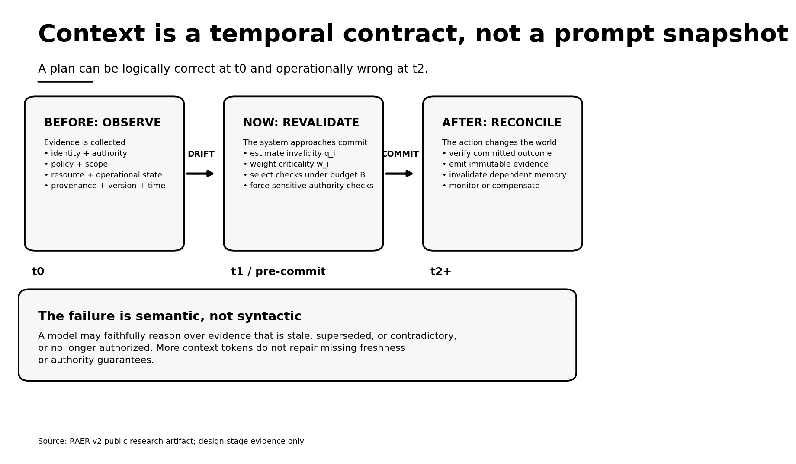
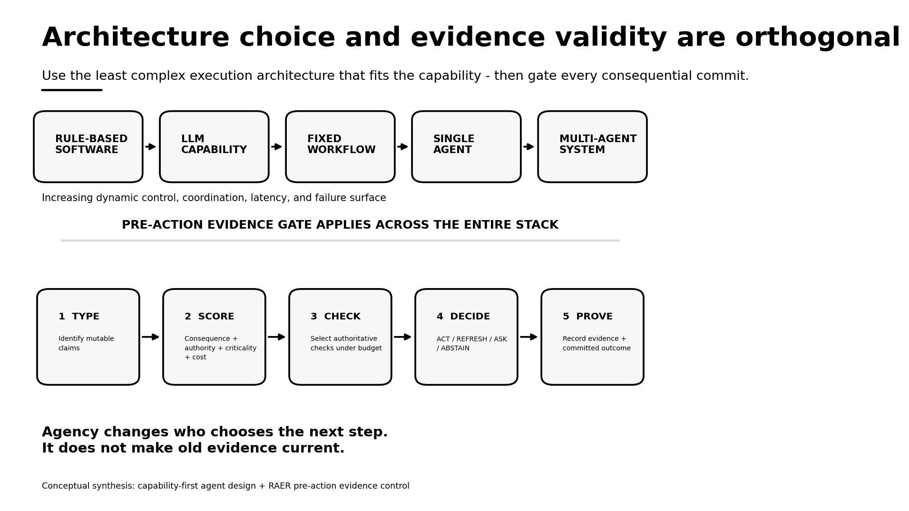
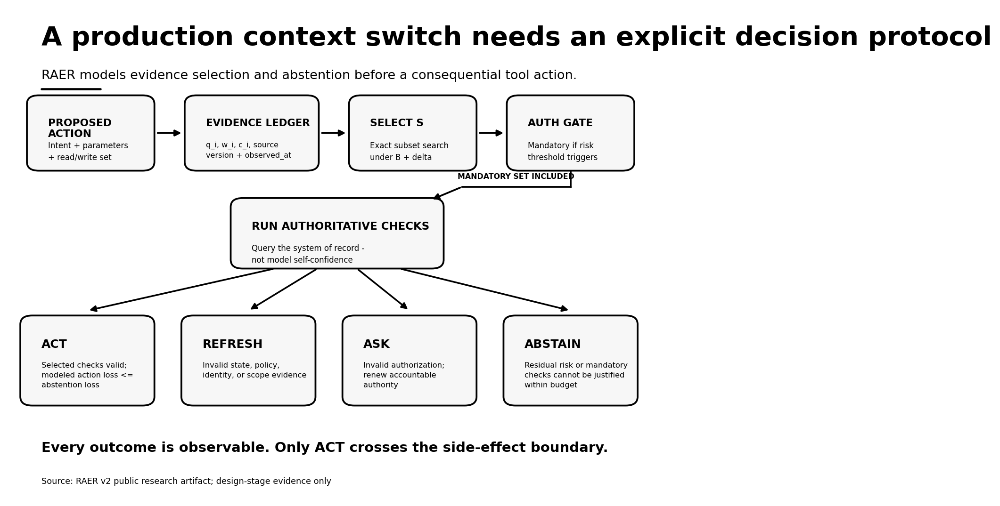
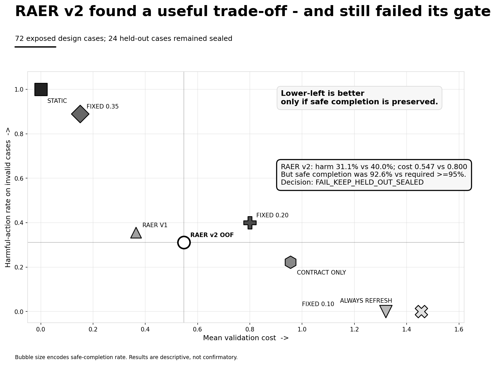
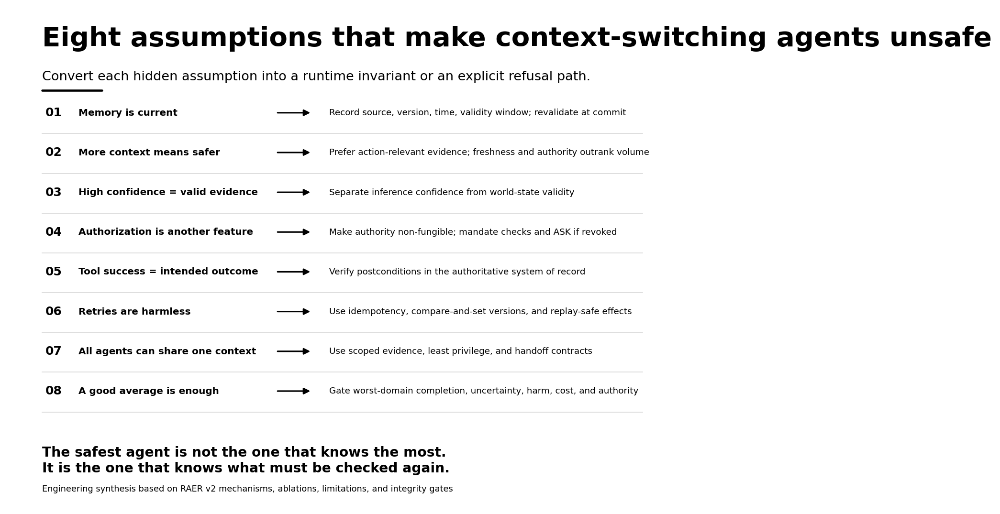

# Context Is Not a Snapshot: Engineering Evidence-Safe Agentic Systems Across State Change

## The missing safety boundary in agentic AI

An AI system can produce a coherent plan, choose the intended tool, satisfy every local schema, and still perform the wrong action.

The failure does not require hallucination, prompt injection, jailbreak, or a defective model. It requires only time.

At observation time, a fact is true. At planning time, that fact is retrieved from memory, a document, or a database. At execution time, the world has changed. Approval was revoked. Consent was narrowed. A policy was superseded. An identity-to-account binding changed. Inventory was consumed by another channel. A work order was amended. A legal hold was issued. A credential rotated. A downstream agent inherited an upstream conclusion without inheriting the evidence conditions that made it valid.

The model can remain logically correct relative to its inputs while the proposed action becomes operationally invalid relative to the present world.

This is the engineering problem examined by the **Action Evidence Safety** research repository through its first study, **Risk-Adaptive Evidence Revalidation (RAER)**. The study's most important contribution is not a claim that one policy has solved agent safety. It has not: the prospectively specified RAER v2 method failed one of eight registered design gates. Its contribution is to make a frequently implicit problem precise, measurable, and falsifiable:

> When a consequential automated action depends on mutable evidence, what should be revalidated, at what cost, and when must the system refuse to act?

## The problem statement: context can expire before action

Most agent architectures treat context as input: prompt history, retrieved documents, memory, tool responses, identity attributes, policies, approvals, operational state, and intermediate conclusions from other agents.

For a system that can change external state, that model is incomplete.

Context is not merely information available to the model. It is a collection of claims whose **truth, authority, provenance, purpose, scope, and freshness** determine whether a proposed side effect is permissible now.

Suppose an agent observes evidence \(E_{t0}\), constructs plan \(P_{t1}\), and attempts action \(A_{t2}\). If the world changes between \(t0\) and \(t2\), then:

> Correct reasoning over stale premises can produce an unsafe state transition.

The relevant failure boundary is therefore not only model inference. It is also the **time-of-check to time-of-use boundary** surrounding the action.

The problem can be stated as an engineering question:

> Which mutable prerequisites must still be true at the exact moment an automated system is allowed to change the world—and how should the system establish that truth under finite cost, latency, availability, and authority constraints?

This is not merely a conversational context switch. It is a change in the truth conditions, authority, identity binding, purpose, scope, policy, or operational state on which an action depends.

## Why this is the need of the hour

An assistant that produces text can often be corrected. An agent that transfers money, modifies access, sends regulated data, changes infrastructure, schedules treatment, updates an employee record, discloses personal information, or commits an order can create effects that are costly, propagating, legally significant, or irreversible.

Longer context windows do not solve this problem. Better retrieval does not automatically solve it. Higher model confidence does not solve it. More agents may amplify it by copying stale claims, authority, and assumptions across hand-offs.

Three properties are frequently—and dangerously—collapsed:

1. **Inference confidence:** how strongly a model supports a conclusion given its supplied inputs.
2. **Evidence validity:** whether those inputs still correspond to an authoritative source of truth.
3. **Action authority:** whether the principal remains permitted to perform this exact action, for this purpose, within this scope, at this time.

A system can have high inference confidence, low evidence validity, and no current action authority simultaneously.

As agentic systems move from recommending decisions to executing them, the control objective must therefore shift from “provide more context” to “establish the minimum sufficient, currently valid evidence required to cross a side-effect boundary.”

The complete control journey can be understood as a progression from intent to evidence, from evidence to a pre-commit decision, and from execution to verified institutional memory:

## Start with the right architecture question—and add the missing execution question

Karthika Vijayan's essay on the mental model for agentic system design advances an important capability-first principle: begin with the business objective, decompose it into capabilities, and use deterministic software, an LLM capability, a fixed workflow, a single agent, or multiple agents only as the problem requires.

An LLM is appropriate where interpretation is required. An agent becomes useful where the next step must be selected dynamically. Multiple agents are justified when responsibilities, tools, knowledge, authority, or contexts require genuine separation. Complexity should be earned by the problem rather than imposed by architectural fashion.

That progression prevents “agent” from becoming the default answer to every software problem:

**Business objective → capability → deterministic software → LLM → workflow → agent → multi-agent system**

RAER adds a second, orthogonal design axis. Even when the execution architecture is correctly scoped, the evidence supporting an action may lose validity before the action commits.

Architecture answers:

> Who or what selects the next step?

Evidence control answers:

> Are the premises authorizing that step still fit for use?

Every action-taking architecture therefore needs two explicit decisions:

1. Does this capability require deterministic code, an LLM, a fixed workflow, a single agent, or a multi-agent system?
2. Before this capability changes external state, which prerequisites must still be true, and how will the system establish that they are true now?

Use the least complex architecture that satisfies the capability. Regardless of the selected rung, place an evidence-validity gate before every consequential commit.

## Context has three temporal forms

For action-taking systems, context should not be treated as one prompt payload. It evolves through an action lifecycle.

### Before: observed context

The system assembles evidence about identity, authorization, policy, consent, purpose, scope, resource state, operational constraints, and dependent records. Every material claim should carry provenance and time semantics:

- semantic type and value;
- authoritative source and source-record identifier;
- source version, ETag, or equivalent concurrency token;
- observation timestamp;
- validity window or maximum acceptable age;
- known dependencies and invalidation triggers;
- contradiction state and source precedence;
- permitted purpose, action, and scope;
- authoritative validation function and expected validation cost.

The appropriate abstraction is an **evidence envelope**, not a free-form memory fragment.

### Now: pre-commit context

The system has a proposed action with concrete parameters, an actor or delegated principal, and an anticipated read/write set. The relevant question is no longer “What did the agent know?” It is:

> Which prerequisites remain sufficiently valid for this exact action?

This is where authoritative revalidation belongs. Some checks are inexpensive. Others consume latency, money, API capacity, rate limits, operational availability, human review, or scarce institutional attention.

“Trust the context” is unsafe because mutable prerequisites can expire. “Refresh everything” is also incomplete because exhaustive checking may be unavailable, unaffordable, slow, or itself capable of creating denial-of-service behavior. A consequential system needs a principled selection rule and a refusal path.

### After: committed context

The action changes the environment. Its result becomes new evidence for subsequent decisions. The system must:

- verify postconditions in the authoritative system of record;
- distinguish transport success from application acceptance and intended business effect;
- emit a durable, attributable audit event;
- reconcile partial execution and ambiguous timeout states;
- invalidate dependent memories and cached evidence;
- initiate compensation, escalation, or human review when required.

Without this phase, yesterday's successful tool response becomes tomorrow's stale premise.

## What RAER is trying to solve

The open problem is not the absence of authentication, policy engines, validation APIs, workflow tools, or databases. It is the absence of a generally validated decision mechanism that jointly handles:

- mutable action prerequisites;
- limited validation resources;
- action consequence and irreversibility;
- authorization safeguards;
- correlated evidence failure;
- the cost of unnecessary abstention;
- and safe completion across heterogeneous domains.

RAER studies the decision between unconditional trust and unconditional refresh:

- Which evidence should be revalidated for this proposed action?
- Which checks are mandatory rather than economically tradable?
- How should validation cost be balanced against expected action harm and abstention loss?
- When should the system act, rebuild its context, request renewed authority, or abstain?
- Can this decision be deterministic, reproducible, and testable rather than delegated to an LLM's self-reported confidence?

The goal is not to make an agent “feel safer.” It is to create an explicit pre-action control policy over observable evidence and frozen decision rules.

## RAER: from context volume to action-specific evidence selection

RAER represents a proposed consequential action using a validation budget \(B\), consequence score \(C\), irreversibility score \(I\), authorization sensitivity, and a set of mutable evidence prerequisites.

For prerequisite \(i\):

- \(q_i\) is a pre-action estimate of invalidity;
- \(w_i\) is normalized criticality;
- \(c_i\) is normalized authoritative-check cost.

The frozen estimator uses observable pre-action features only: evidence age, source volatility, dependent changes, update frequency, inverse source reliability, authorization age, and contradictory observations. The actual validity label remains hidden from selection.

For a candidate subset of checks \(S\), a successful authoritative check reduces modeled invalidity to a small verifier-error floor. Residual harm accounts for unchecked invalidity and a prespecified correlated-prerequisite uplift. A safe-probability proxy estimates whether the remaining prerequisites are likely to stay valid.

RAER v2 then minimizes an interpretable objective:

> validation cost + bounded budget-slack penalty + min(expected action loss, expected abstention loss)

The method exactly enumerates feasible evidence subsets and applies deterministic tie-breaking. Consequence, irreversibility, invalidity, criticality, authorization sensitivity, correlation, and cost shape the decision. Token salience and model confidence do not substitute for an action-control policy.

The model may propose an action. It does not get to redefine the admission policy at runtime.

## The solution direction: an evidence gate at the action boundary

Before tool execution, the system should convert a model proposal into a typed **action manifest** containing:

- action type and exact parameters;
- actor, service identity, and delegated principal;
- purpose and permitted scope;
- expected read set and write set;
- reversible and irreversible effects;
- required evidence prerequisites;
- authoritative validation endpoints;
- validation budget and deadline;
- idempotency key and operation identifier;
- expected postconditions;
- compensation and escalation plan.

The validation policy operates over the action manifest and its evidence envelopes—not over undifferentiated conversation history.

After selected authoritative checks run, the policy returns one of four semantically distinct outcomes:

- **ACT** — selected checks remain valid and modeled action loss does not exceed abstention loss.
- **REFRESH** — checked policy, identity, scope, resource, or operational evidence is invalid; rebuild the plan from current state.
- **ASK** — authorization is missing, expired, narrowed, or revoked; obtain renewed accountable human or institutional authority.
- **ABSTAIN** — residual risk is unacceptable, evidence remains contradictory, or mandatory checks cannot be completed within the available budget.

This distinction is operationally important. REFRESH initiates a state-recovery workflow. ASK initiates an authority-recovery workflow. ABSTAIN is a deliberate safety outcome. Treating all three as a generic “tool failure” destroys their audit meaning and encourages unsafe retries.

## Authorization is non-fungible

Some evidence can be optimized under a cost–risk objective. Some constraints must not be traded away.

RAER includes a mandatory authorization safeguard. When authorization sensitivity and invalidity-weighted criticality cross a frozen threshold, the relevant authorization prerequisite must be checked. If that mandatory check cannot fit within the permitted budget, the policy abstains. It cannot silently omit present authority because another subset is faster or cheaper.

This is not a cosmetic rule. In the fitted design-data ablation, removing the safeguard increased harmful actions from **14/45 to 19/45** and produced **seven harmful actions involving unchecked, triggered authorization evidence**. The full fitted configuration produced zero in that category.

The broader principle extends to consent, legal holds, segregation-of-duties approvals, safety interlocks, data-residency constraints, regulated-purpose restrictions, and other non-negotiable rights or duties.

A probabilistic optimizer needs hard admission constraints. Current authority must not be traded against token cost, latency, confidence, or operational convenience.

## What the experiment actually found

The RAER-B96 benchmark contains **96 constructed scenarios** and **288 evidence prerequisites** across commerce, cybersecurity, finance, healthcare administration, human resources, and privacy. Each scenario contains three prerequisites.

The exposed design set contains 72 cases:

- 27 all-valid cases;
- 45 cases with at least one invalid prerequisite.

A separate 24-case held-out partition remained sealed and is absent from the public repository.

RAER v2 used leave-one-domain-out selection across a prospectively specified 80-configuration grid. The method was required to satisfy all eight frozen criteria, including safe completion, harmful-action rate, authorization safety, non-dominance, budget-slack constraints, and fold eligibility.

Out-of-fold RAER v2 results were:

- safe completion: **25/27 = 92.6%**;
- harmful actions: **14/45 = 31.1%**;
- mean validation cost: **0.547**;
- false blocks: **2**;
- harmful actions involving triggered authorization evidence: **0**.

The registered FIXED_0.20 comparator produced:

- safe completion: **27/27 = 100.0%**;
- harmful actions: **18/45 = 40.0%**;
- mean validation cost: **0.800**;
- false blocks: **0**.

RAER v2 therefore showed a descriptive reduction of four harmful actions and a **31.6% lower mean validation cost**. However, its safe-completion rate was below the prospectively specified 95% requirement.

Seven of eight criteria passed. The composite hypothesis still failed. The correct decision was:

> **FAIL_KEEP_HELD_OUT_SEALED**

## Why the negative result matters

The negative result is one of the strongest features of the study.

A weaker evaluation narrative could emphasize reduced harm and cost while minimizing the two unnecessary blocks. A disciplined multi-objective gate prevents favorable averages from overriding a failed operational constraint. False blocks can create their own safety, access, service, and business risks.

Preserving the held-out partition also protects it as a future scientific resource rather than spending it on a method that did not clear its design threshold.

Failure analysis localized both false blocks to cross-domain configuration transfer. Inner-domain selection chose a lower abstention-loss weight in the omitted finance and privacy folds. All six inner configurations remained eligible, yet each of those two unseen domains contributed one false block.

The general lesson is important:

> Pooled eligibility does not guarantee worst-domain stability.

The study should therefore be interpreted as a rigorous **design-stage method and falsifiable research direction**, not as a production-certified safety mechanism or confirmatory held-out effectiveness result.

## Precautions for production systems

### 1. Represent action-critical evidence as typed, versioned data

Do not allow authorization, consent, policy version, identity binding, balances, inventory, scope, or safety state to exist only as prompt prose or opaque vector memory. Store each prerequisite as a typed claim with provenance, version, observation time, validity window, dependencies, source precedence, authority, scope, contradiction state, and an authoritative validation function.

Memory is a cache unless the source contract proves otherwise.

### 2. Separate inference confidence from evidence validity

Model confidence describes an inference conditioned on supplied inputs. Evidence validity describes whether those inputs still correspond to the world. A perfectly calibrated model can be perfectly confident about a stale fact.

### 3. Make the action and its prerequisites explicit

Reasoning should produce a proposed action, not an immediate side effect. Convert the proposal into an action manifest before the tool boundary. The policy must evaluate concrete parameters, affected principals, expected writes, prerequisites, authority, consequence, reversibility, and validation requirements.

### 4. Minimize the check-to-commit gap

Where possible, validate prerequisites and mutate state in the same transaction. Otherwise use compare-and-set, version preconditions, conditional requests, leases, transactional guards, or a final critical recheck immediately before effect.

### 5. Budget validation by risk, not token salience

Evidence selection should reflect consequence, irreversibility, authorization sensitivity, criticality, change likelihood, source reliability, dependency, correlation, cost, and the consequences of abstention. Attention weight, retrieval rank, and recency alone are not safety policies.

### 6. Design for correlated invalidity

Prerequisites are not necessarily independent. A role change may invalidate identity, authority, and scope together. A policy change can invalidate several downstream interpretations. Represent dependencies explicitly and stress-test correlated evidence failures.

### 7. Preserve distinct refusal and recovery outcomes

ASK, REFRESH, and ABSTAIN require different owners, escalation paths, service-level objectives, user explanations, and audit meanings. Fail-closed behavior without a recovery path becomes operational paralysis; a generic retry can become unsafe re-execution.

### 8. Make retries replay-safe

A timeout does not establish that an action failed. Use idempotency keys, stable operation identifiers, durable state machines, reconciliation, compare-and-set versions, and explicit compensation. A conversational retry must never silently become a duplicate transaction.

### 9. Verify postconditions in the authoritative system

HTTP 200, a schema-valid response, application acceptance, and the intended state transition are different facts. Read back authoritative state, reconcile partial effects, record the committed result, and invalidate dependent context.

### 10. Bound multi-agent context and authority

Do not default to shared-memory soup. Hand off scoped evidence envelopes with explicit provenance, freshness, purpose, dependencies, and allowed actions. Give each agent minimum necessary context and least-privilege authority. A downstream agent must not inherit upstream confidence as if it were current evidence or permission.

### 11. Observe the entire decision, not only the model call

Record the proposed action, candidate evidence, selected checks, invalidity estimates, costs, residual risk, authorization triggers, source versions, validation results, decision outcome, tool request, tool response, verified postcondition, retry state, and compensation. This is the minimum substrate for incident analysis and policy evaluation.

### 12. Test drift as a first-class fault model

Inject authorization revocation, consent changes, policy supersession, identity rebinding, delayed writes, contradictory sources, correlated failures, insufficient budgets, rate limits, dependency outages, tool timeouts, retries, and state changes between validation and commit. Prompt-only benchmarks cannot exercise these failure modes.

### 13. Evaluate domains and uncertainty separately

Track worst-domain safe completion, harmful-action rate, false blocks, authorization failures, cost, latency, and uncertainty—not only pooled averages. A global metric can hide unacceptable local behavior.

### 14. Do not equate benchmark improvement with deployment readiness

Constructed scenarios support controlled comparison. They do not establish calibrated production invalidity probabilities, field effectiveness, external validity, regulatory acceptance, or safety under novel distributions.

## Assumptions that must be prohibited

1. **“Memory is current.”** Memory is a cache unless its source contract proves otherwise.
2. **“More context is safer.”** Volume cannot compensate for missing provenance, freshness, authority, or relevance.
3. **“The latest timestamp wins.”** Source authority and precedence matter; the newest observation may be non-authoritative, delayed, or adversarial.
4. **“High confidence means the premise is valid.”** Inference confidence and temporal validity are different variables.
5. **“Authorization is just another feature.”** Some constraints are admission requirements, not weighted preferences.
6. **“A successful tool call means success.”** Transport success, application acceptance, business commitment, and intended outcome are distinct.
7. **“Retries are harmless.”** Consequential effects require idempotency, reconciliation, and replay-safe behavior.
8. **“One shared context improves collaboration.”** Shared context can amplify stale evidence, excessive privilege, purpose drift, and scope leakage.
9. **“Refresh everything is always safest.”** Exhaustive checking can violate latency, availability, rate-limit, and human-attention constraints or create denial-of-service behavior.
10. **“Average safety is enough.”** Pooled results can hide domain-specific harm and false blocks.
11. **“An action is reversible because an API has an undo endpoint.”** Disclosure, downstream propagation, customer impact, and audit consequences may remain irreversible.
12. **“A benchmark improvement proves deployment readiness.”** Descriptive results on constructed scenarios do not establish external effectiveness.

## Turning the research into engineering practice

The most responsible way to apply this research is not to copy one threshold or deploy the experimental estimator unchanged. It is to adopt the architecture pattern, measurement discipline, and prospective governance process.

### Phase 1 — Map consequential actions

Inventory every model or agent tool that can change external state. Classify consequence, reversibility, affected principal, regulatory sensitivity, financial exposure, disclosure risk, and blast radius. Begin with one narrow, high-value workflow rather than the entire enterprise.

### Phase 2 — Define evidence contracts

For each action, enumerate what must be true at commit time. Assign authoritative sources, freshness requirements, versions, source precedence, dependency links, mandatory constraints, validation functions, and check costs. Convert undocumented assumptions into explicit contracts.

### Phase 3 — Introduce a plan/commit boundary

Allow the model to propose an action and rationale. Convert that proposal into a typed action manifest. Insert a deterministic policy-enforcement point between planning and execution. Issue an execution credential only after the evidence gate succeeds, and scope it to the approved action, parameters, purpose, and time window.

### Phase 4 — Run in shadow mode

Compute ACT, REFRESH, ASK, and ABSTAIN decisions without changing production behavior. Compare them with real outcomes, human decisions, stale-evidence incidents, false blocks, validation latency, check cost, and postcondition failures. Calibrate using local evidence rather than importing research parameters.

### Phase 5 — Exercise temporal failure modes

Use controlled fault injection and replay to simulate revocation, policy updates, identity rebinding, contradiction, correlated invalidity, delayed writes, tool timeouts, rate limits, budget exhaustion, dependency failure, retry ambiguity, and changes after validation but before commit.

### Phase 6 — Establish prospective deployment gates

Define success criteria before inspecting final outcomes. Include safe completion, harmful action, mandatory-authorization violations, false blocks, cost, latency, worst-domain performance, calibration, and uncertainty intervals. Require all critical gates to pass. Do not relax thresholds or redefine metrics after seeing results.

### Phase 7 — Roll out progressively

Move from observe-only to human-confirmed actions, then to bounded autonomy for reversible, low-consequence operations. Expand authority only when evidence supports the next level. Maintain kill switches, rate limits, least-privilege credentials, immutable audit records, and rollback or compensation mechanisms.

### Phase 8 — Learn from committed outcomes

Treat every action result as new evidence. Verify postconditions, measure drift, invalidate dependent caches, examine ASK/REFRESH/ABSTAIN patterns, investigate false blocks, and update estimators under controlled governance. Version policies, preserve reproducibility, and retain complete decision records.

## A practical reference architecture

A robust production implementation can be separated into five planes:

1. **Capability plane:** deterministic services, LLM functions, workflows, and agents selected according to actual problem complexity.
2. **Evidence plane:** typed claims, authoritative connectors, provenance, versions, validity windows, source precedence, and dependency graphs.
3. **Decision plane:** action manifest, invalidity estimator, risk–cost model, mandatory constraints, evidence-subset selection, and ACT/REFRESH/ASK/ABSTAIN policy.
4. **Execution plane:** scoped credentials, transactional adapters, conditional writes, compare-and-set, idempotency, postcondition checks, reconciliation, and compensation.
5. **Assurance plane:** complete traces, immutable decision ledgers, temporal fault injection, domain-stratified evaluation, prospective gates, monitoring, and incident review.

This decomposition prevents the LLM from simultaneously becoming the reasoner, database, policy engine, authorization service, workflow coordinator, execution controller, and safety monitor.

## How RAER connects to the wider research landscape

RAER sits at the intersection of several established research directions and should be understood within carefully bounded novelty claims.

- **Selective prediction and reject options** formalize abstention cost and risk–coverage trade-offs: Franc, Prusa, and Voracek (2023).
- **Active feature and evidence acquisition** examines which observations to purchase before prediction: Shim, Hwang, and Yang (2018); Li and Oliva (2025).
- **Budgeted acquire-or-abstain systems** combine evidence acquisition and abstention: Xu et al.'s BCEA (2026). RAER's distinct focus is action-prerequisite semantics, authorization, deterministic state transitions, and explicit tool-action harm.
- **Stale and conflicting memory benchmarks** test whether agents recognize invalid memories: STALE (Chao et al., 2026) and MemConflict (Tao et al., 2026).
- **Agentic abstention** asks whether systems know when not to act or when to stop acquiring information: AgentAbstain (Liu et al., 2026) and Luo, Wen, and Wang (2026).
- **Contract and solver-aided tool verification** checks formal preconditions, postconditions, and policy compliance: ToolGate (Liu et al., 2026) and Winston, Winston, and Just (2026). RAER adds the premise that observations feeding those contracts may themselves be stale and costly to refresh.
- **Tool-agent safety benchmarks and runtime protection** cover stateful interaction and broader failure surfaces: ToolEmu, tau-bench, ToolSandbox, Agent-SafetyBench, ToolSafe, and SafeAgent.

The research boundary is therefore precise. RAER is:

- not a generic agent framework;
- not a prompt-injection defense;
- not a calibrated production probability model;
- not proof of general agent safety;
- not a confirmatory held-out effectiveness result.

It is a deterministic research method for selecting which mutable, action-specific prerequisites to revalidate under budget before committing a consequential action.

## The engineering principle

The next generation of reliable agentic systems will not be secured by larger context windows alone.

Reliability will come from knowing:

- which claims are mutable;
- which sources are authoritative;
- which dependencies can invalidate multiple claims;
- which constraints are non-negotiable;
- how validity and authority evolve over time;
- what must be checked at commit;
- how the resulting state will be verified;
- and when the only correct action is to stop.

The first architecture question remains:

> **Does this capability actually require an agent?**

Every action-taking system needs a second question:

> **What must still be true at the exact moment this system is permitted to change the world?**

That second question is the missing safety boundary between an agent that can reason and a system that can be trusted to act.

## Source links

- RAER repository: https://github.com/khshaik/applied-ai-research-lab/tree/main/action-evidence-safety-research
- Karthika Vijayan, “Agentic AI: Building the Right Mental Model for System Design”: https://medium.com/inspiredbrilliance/agentic-ai-building-the-right-mental-model-for-system-design-269d85c1689f
- Franc et al. (2023): https://www.jmlr.org/papers/v24/21-0048.html
- Shim et al. (2018): https://proceedings.neurips.cc/paper/2018/hash/e5841df2166dd424a57127423d276bbe-Abstract.html
- Li and Oliva (2025): https://proceedings.mlr.press/v258/li25h.html
- Xu et al. (2026), BCEA: https://arxiv.org/abs/2606.16667
- Chao et al. (2026), STALE: https://arxiv.org/abs/2605.06527
- Tao et al. (2026), MemConflict: https://arxiv.org/abs/2605.20926
- Liu et al. (2026), AgentAbstain: https://arxiv.org/abs/2607.10059
- Luo et al. (2026), agentic abstention: https://arxiv.org/abs/2606.28733
- Liu et al. (2026), ToolGate: https://arxiv.org/abs/2601.04688
- Winston et al. (2026), solver-aided policy verification: https://arxiv.org/abs/2603.20449
- Ruan et al. (2024), ToolEmu: https://arxiv.org/abs/2309.15817
- Yao et al. (2024), tau-bench: https://arxiv.org/abs/2406.12045
- Lu et al. (2025), ToolSandbox: https://arxiv.org/abs/2408.04682
- Zhang et al. (2025), Agent-SafetyBench: https://arxiv.org/abs/2412.14470
- Mou et al. (2026), ToolSafe: https://arxiv.org/abs/2601.10156
- Liu et al. (2026), SafeAgent: https://arxiv.org/abs/2604.17562

#AgenticAI #AISafety #ContextEngineering #LLMOps #AgentArchitecture #ResponsibleAI #AIResearch #ToolUse #EnterpriseAI

## End-to-end workflow: from intent to a verified outcome

The complete operating model can be read as a controlled progression from **business intent**, through **current evidence and authority**, to a **verified state transition**. The workflow below makes the critical boundary visible: planning may remain adaptive, but only a validated ACT decision is allowed to cross into consequential execution.

### Phase I — Frame the action

The first phase establishes what the system is trying to do and which conditions make that action legitimate.

1. **Define the action.** Specify the intended outcome, acting identity, delegated principal, business purpose, target resources, and permitted scope. A vague objective cannot support a precise safety decision.
2. **Map consequences.** Determine the possible impact, irreversibility, affected parties, propagation paths, financial or regulatory exposure, and maximum credible blast radius. Consequence belongs to the action being proposed—not merely to the tool being called.
3. **Identify evidence.** Enumerate the identity, authorization, policy, consent, scope, resource, and operational claims that must be true for this exact action. These are action prerequisites rather than generic background context.
4. **Build evidence envelopes.** Bind every material claim to its authoritative source, source version, observation time, validity window, dependencies, purpose, and validation function. This converts unstructured context into inspectable evidence with explicit temporal semantics.

The output of Phase I is a bounded action problem: the system knows what it wants to change, what can go wrong, and what evidence would justify proceeding.

### Phase II — Revalidate before commit

The second phase operates at the time-of-check to time-of-use boundary. It determines whether the plan remains admissible under the current world state.

5. **Propose the action manifest.** Convert the model's intent into a typed structure containing exact parameters, actor, purpose, expected read/write set, required prerequisites, expected postconditions, execution deadline, idempotency key, and compensation strategy. The proposal is not yet permission to execute.
6. **Score and select.** Estimate prerequisite invalidity, criticality, action consequence, irreversibility, authorization sensitivity, validation cost, dependency, and correlation. Select the authoritative checks that best control residual risk within the available budget and latency envelope.
7. **Enforce authority.** Apply mandatory safeguards to non-fungible constraints. Current authorization, consent, legal holds, segregation-of-duties approvals, and safety interlocks cannot be omitted because checking them is inconvenient or expensive. If a mandatory authority check cannot be completed, the system must not act.
8. **Decide.** Translate validation results and residual risk into one of four explicit outcomes:

   - **ACT → COMMIT:** the selected checks are valid, mandatory conditions are satisfied, and modeled action loss is acceptable.
   - **REFRESH → REPLAN:** policy, identity, scope, resource, or operational evidence changed; rebuild the action using current state.
   - **ASK → RENEW AUTHORITY:** permission is absent, expired, narrowed, or revoked; return control to an accountable authority.
   - **ABSTAIN → STOP SAFELY:** residual uncertainty is unacceptable, evidence remains contradictory, or mandatory validation cannot fit within the allowed budget.

These outcomes are deliberately not collapsed into “success” and “failure.” Each has a different owner, recovery path, service expectation, and audit meaning. REFRESH repairs state. ASK repairs authority. ABSTAIN prevents unjustified action. Only ACT authorizes execution.

### Phase III — Execute, prove, and learn

The third phase ensures that authorization to act becomes a controlled, observable, and verifiable state transition.

9. **Commit safely.** Execute with least-privilege, action-scoped credentials. Use transactional preconditions, compare-and-set versions, conditional writes, idempotency keys, stable operation identifiers, and replay-safe adapters. Minimize the interval between the last authoritative check and the side effect.
10. **Verify and reconcile.** Read back the resulting state from the authoritative system of record. Distinguish transport success from application acceptance and the intended business outcome. Record the decision and evidence versions, reconcile partial or ambiguous execution, compensate where necessary, and invalidate every memory or downstream claim that depended on the previous state.

The workflow is therefore a loop rather than a one-way pipeline. A committed action changes the world; the verified outcome becomes evidence for the next decision. Monitoring, audit, incident review, and measured drift feed back into evidence contracts, estimators, validation policies, and deployment gates.

### How to read the workflow

The diagram is anchored by three conditions that must remain distinct and jointly satisfied:

- **Current evidence:** the action's factual prerequisites still correspond to authoritative state.
- **Current authority:** the actor remains permitted to perform this action for the declared purpose and scope.
- **Verified outcome:** the intended state transition actually occurred and was reconciled with the system of record.

The end-to-end principle is simple but demanding:

> Correct reasoning is necessary, but it is not sufficient. A consequential system must prove that its premises and authority remain current before acting—and prove the resulting state after it acts.
