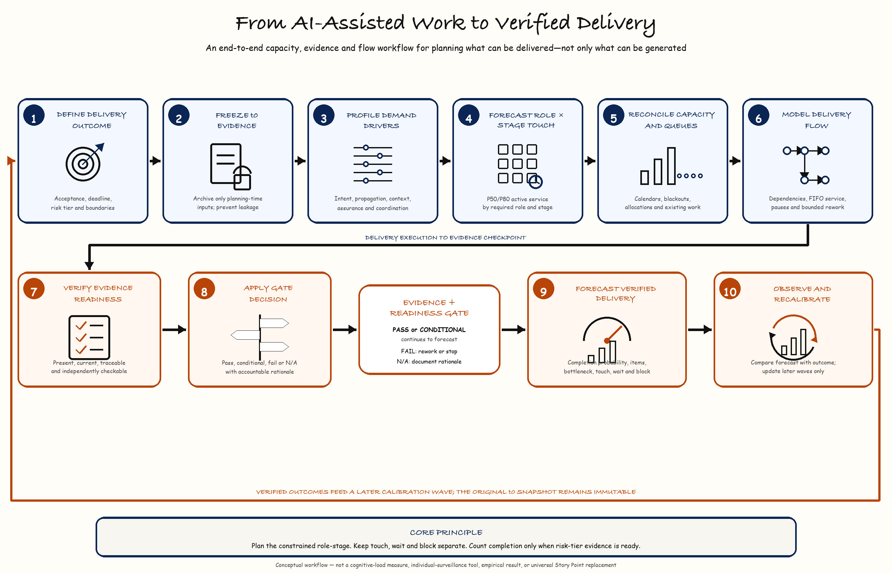

# Verified Delivery Capacity Research

**Beyond Story Points in AI-Assisted Delivery: an open evidence map, design-science framework, and developmental simulation for role-constrained human capacity.**

<p align="center">AI-assisted software engineering · Role-constrained delivery · Evidence readiness · Queue-aware planning</p>

<p align="center">
  
  
  
  
  
  
  
  
  
</p>

<p align="center">
  <a href="#the-research-problem"><strong>Problem</strong></a> ·
  <a href="#research-project-dossier"><strong>Dossier</strong></a> ·
  <a href="#method-overview"><strong>Method</strong></a> ·
  <a href="#key-findings"><strong>Results</strong></a> ·
  <a href="#end-to-end-verified-delivery-workflow"><strong>Workflow</strong></a> ·
  <a href="#key-technologies-and-libraries"><strong>Libraries</strong></a> ·
  <a href="#reproducibility-map"><strong>Reproducibility</strong></a> ·
  <a href="#navigate-the-research"><strong>Artifacts</strong></a> ·
  <a href="#quick-glance-research-and-adoption-review"><strong>Quick glance</strong></a> ·
  <a href="#references"><strong>References</strong></a>
</p>

This repository develops the **Verified Delivery Capacity Model (VDCM)** and its proposed elicitation artifact, the **Role–Stage Demand and Readiness Instrument (RSDRI)**. The work asks whether pre-commitment role-stage demand, effective capacity, queues, dependencies, and evidence readiness can make cross-functional delivery constraints more visible than a single work-item estimate.

> **Double-blind review notice:** keep this repository private while the THINKAI 2026 submission is under review. Repository metadata, workbooks, declarations, and identified-author material may reveal authorship.

## Author

Shaik Khaja Nayab Rasool.

---

## Research project dossier

### Project identity

**Beyond Story Points in AI-Assisted Delivery**  
*An evidence map and simulation framework for forecasting role-constrained, evidence-ready software delivery.*

| Item | Description |
|---|---|
| Research area | AI-assisted software engineering, Agile estimation, human oversight, quality assurance, delivery flow, and operations research |
| Study type | Open evidence map, design-science artifact, and developmental discrete-event simulation |
| Primary artifact | Verified Delivery Capacity Model (VDCM) with the proposed Role–Stage Demand and Readiness Instrument (RSDRI) |
| Unit of planning | A work item represented as role-by-lifecycle-stage service demand, capacity exposure, dependencies, readiness obligations, and rework risk |
| Forecast target | Verified completion probability and expected evidence-ready items per horizon, with bottleneck and delay decomposition |
| Evidence scope | 791 included study families, 2,343 exact-locator findings, and 769 quantitative findings under the Open Evidence Route |
| Evaluation scope | 11 developmental synthetic scenarios with 24 replications each; no organizational participant data |
| Current conclusion | A falsifiable planning representation with mixed synthetic results; no deployable comparator was uniformly best |
| Publication framing | Framework-development and conditional mechanism-evidence paper; Route A organizational validation remains future work |

### Dossier coverage at a glance

| Research-project requirement | Where it is documented |
|---|---|
| Numbered research design and protocol record | [Research-design index](research/design/README.md) |
| Research questions and positioning | [Scientific manuscript](papers/thinkai-2026/manuscript/manuscript_working_draft.md) and [VDCM study dossier](research/studies/vdcm/README.md) |
| Evidence-map method and results | [Evidence-map workspace](research/studies/vdcm/evidence-map/README.md) and [evidence preservation map](docs/traceability/evidence-preservation-map.md) |
| Framework constructs and boundaries | [Protocol workspace](research/studies/vdcm/protocol/README.md) |
| Simulation mechanisms and comparators | [Simulation workspace](research/studies/vdcm/simulation/README.md) and [developmental results](papers/thinkai-2026/results/README.md) |
| Material claim verification | [Claim-verification ledger](papers/thinkai-2026/manuscript/claim_verification_ledger.md) and [D17 approval](research/studies/vdcm/integrity/releases/D17_ACCOUNTABLE_AUTHOR_CONFIRMATION_2026-08-19.json) |
| End-to-end operating model | [Workflow guide](docs/communications/verified-delivery-capacity/END_TO_END_WORKFLOW.md) and [communication dossier](docs/communications/verified-delivery-capacity/README.md) |
| Technology boundaries | [Key technologies and libraries](#key-technologies-and-libraries) and [interpretation boundary](#interpretation-and-responsible-use-boundary) |
| Reproduction and integrity | [Quick verification](#quick-verification), [reproducibility map](#reproducibility-map), and [repository verifier](scripts/verify_repository.py) |

## End-to-end verified delivery workflow



The diagram is a conceptual communication artifact, not an empirical result. See the [workflow guide](docs/communications/verified-delivery-capacity/END_TO_END_WORKFLOW.md) for definitions, operating steps, and guardrails.

The operating model progresses through three controlled phases:

1. **Frame and forecast:** define the work item, freeze the `t0` information set, profile pre-commitment demand drivers, and forecast active service by role and stage.
2. **Flow and verify:** load effective role capacity, model queues and dependencies, and evaluate whether required evidence is present, current, traceable, and independently checkable.
3. **Commit and learn:** apply explicit gate semantics, forecast verified completion, then compare prediction with outcomes in a later calibration wave without leaking execution data into the original forecast.

## The research problem

AI assistance can shorten some implementation activities without proportionally shortening end-to-end delivery. Requirements clarification, architecture, integration, review, security, testing, release, and acceptance still consume finite specialist capacity. If implementation accelerates faster than those functions, the constraint moves downstream and work accumulates in queues.

VDCM reframes the planning question:

> Can the required roles produce and verify the evidence needed for the planned portfolio by the commitment deadline?

The proposed representation separates active human service from queue delay, dependency blocking, and calendar pauses. It forecasts verified completion against explicit evidence obligations rather than treating code generation or task completion as delivery completion.

## Current scientific status

| Area | Status |
|---|---|
| Research contribution | Prospective multi-role capacity-and-flow representation; not a first human-attention model or universal Story Point replacement |
| Evidence review | Open Evidence Route protocol v1.3 frozen; D05–D17 complete |
| Evidence synthesis | 791 included study families; 2,343 exact-locator findings; 769 quantitative findings |
| Novelty boundary | No family met all five declared overlap dimensions for the same planning use within the bounded search |
| Material claims | CL-001 through CL-010 confirmed by the accountable author on 2026-08-19 |
| Simulation | 11 developmental scenarios × 24 replications; mechanisms and comparators implemented |
| Comparative result | No deployable comparator was uniformly best; simpler models won in several declared worlds |
| Empirical validation | Route A future work requiring genuine practitioners and organizational data |
| Manuscript | Anonymous full-paper release candidate generated and visually inspected; final venue/authorship release gates remain |
| Verification | Integrated tests, artifact checks, and manuscript-boundary checks run through `make verify` |

Developmental search records are not PRISMA inclusions. Synthetic simulation results do not validate human cognition, organizational usefulness, causal AI effects, or return on investment.

## Contributions

1. **A bounded open evidence map** separating peer-reviewed studies, preprints, secondary research, practitioner evidence, and foundational references.
2. **A prospective planning representation** covering pre-commitment demand drivers, role-stage human touch demand, effective capacity, evidence readiness, dependencies, queues, and bounded rework.
3. **A reproducible developmental simulation** comparing Story Points, an HIE-compatible baseline, simple role load, the proposed model, and a diagnostic oracle.
4. **A falsifiable validation agenda** for later shadow-mode, multi-team evaluation with temporal and team/project holdouts.
5. **Explicit failure and simplification rules** for cases where added detail is unstable, burdensome, or no better than a simpler baseline.

## Method overview

VDCM links planning-time evidence, service demand, resource constraints, and delivery outcomes without collapsing them into one score:

```text
work item + risk tier + frozen t0 evidence
        ↓
pre-commitment demand-driver profile
        ↓
role × lifecycle-stage human touch-demand distribution
        + effective role capacity and existing queue
        + dependency graph and calendar availability
        + evidence-readiness state and bounded rework
        ↓
queue-aware delivery simulation / forecast
        ↓
verified completion probability + items per horizon
        + constrained role-stage + touch/wait/block decomposition
        ↓
later outcome reconciliation and Route A recalibration
```

The proposed construct families are:

| Construct | Operational meaning | Explicit exclusion |
|---|---|---|
| Pre-commitment Demand Drivers (PDD) | Intent uncertainty, propagation exposure, context deficit, assurance obligation, and coordination topology known at `t0` | Not realized prompt counts, churn, comments, or failures |
| Role–Stage Human Touch Demand (RHTD) | Forecast P50/P80 active service hours for role `r` at stage `s` | Not psychological workload or individual productivity |
| Available Role Capacity (ARC) | Schedulable role-pool hours after declared allocations, calendars, and blackouts | Not nominal headcount or continuous availability |
| Evidence Readiness State (ERS) | Presence, currency, traceability, and independent checkability of required evidence at a named gate/time | Evidence existence is not evidence correctness |
| Role Capacity Pressure (RCP) | Forecast demand divided by available capacity for each role/horizon | Role ratios are not summed into a universal score |
| Constrained-role Queue Delay (CQD) | Elapsed non-service time awaiting a required role, decision, or evidence | Kept separate from active touch time |
| Verified Delivery Capacity (VDC) | Distribution of evidence-ready items per horizon and per-item completion probability | Not code volume, velocity, or a causal productivity claim |

## Key findings

- The systematic stream began with 5,879 record occurrences and the first citation round with 6,097 candidate occurrences.
- After screening, lawful full-text assessment, appraisal, extraction, bounded citation chasing, and reconciliation, the evidence map contains 791 included study families.
- The evidence base is broad but uneven: implementation/refinement is heavily represented, while manual QA/UAT has substantially less mapped coverage.
- No mapped family satisfied all five novelty dimensions for the same pre-commitment planning use.
- Across 11 developmental synthetic scenarios, the proposed and HIE-compatible models each had the lowest descriptive Brier score in four, simple role load in two, and Story Points in one.
- Mixed results are intentional evidence about boundaries: added structure must earn its elicitation cost.

The maximum defensible novelty statement is:

> No substantively duplicative framework was identified within the predeclared open scholarly indexes, repositories, and citation networks searched through the stated cutoff date and approved resource cap.

This is not an exhaustive-literature claim.

## Repository layout

```text
.
├── research/
│   ├── design/                  # Numbered concept, protocol, framework, and simulation records
│   └── studies/vdcm/            # Study dossier, evidence map, and integrity boundaries
├── papers/thinkai-2026/         # Venue requirements, manuscript, figures, results, release gates
├── docs/
│   ├── communications/          # Platform-neutral narratives and conceptual visuals
│   ├── governance/              # Research and public-release governance
│   ├── repository/              # Repository organization
│   ├── status/                  # Roadmap and controlling completion checklist
│   └── traceability/            # Evidence preservation and relocation records
├── scripts/                      # Repository-level verification
├── gate2/                        # Import-stable open-evidence tooling and systematic artifacts
├── evidence_review/              # Screening, adjudication, appraisal, and extraction controls
├── simulation/                   # DES, comparators, development outputs, and pre-lock controls
├── tests/                        # Integrated regression and hard-stop tests
├── artifacts/
│   ├── workbooks/               # Research workbooks
│   └── reference-images/        # Conference/reference imagery
├── CITATION.cff
└── LICENSE
```

The executable Python packages remain at the root for stable imports. Numbered
research records, study navigation, documentation, communication material,
workbooks, and reference imagery are segregated under their canonical folders.
[Repository layout governance](docs/repository/repository-layout.md) defines the
checksum-preserving migration policy.

## Key technologies and libraries

The repository deliberately separates deterministic research logic from optional retrieval, document, and visualization tooling.

| Layer | Technology or library | Role in this project |
|---|---|---|
| Core runtime | Python 3.9+ standard library | Simulation events, comparators, checksums, schemas, ledgers, deterministic sampling, reconciliation, and most verification logic |
| Configuration | JSON and optional PyYAML | Machine-readable protocols, schemas, simulation worlds, registries, and YAML-compatible configuration loading |
| Testing | `pytest` and `unittest` | Integrated regression, adversarial, hard-stop, determinism, reconciliation, and contract tests |
| Public evidence retrieval | `urllib.request` and `requests` | Bounded calls to declared open scholarly sources and lawful full-text locations |
| PDF safety and extraction | project-local `pypdf`; legacy static extraction through `PyPDF2` | Remove interactive actions, create action-free derivatives, and extract static text without executing document content |
| Analysis and figures | NumPy and Matplotlib | Developmental summaries, uncertainty calculations, and manuscript figures |
| Communication visual | Pillow plus repository-owned SVG generation | Deterministic PNG/SVG rendering of the conceptual VDCM workflow |
| Manuscript generation | `python-docx`, Microsoft Word, and PDF rendering tools | Build, format, render, and visually inspect submission artifacts |
| Human review ledger | Microsoft Excel workbook | Gate/status review, parameter tracking, and accountable human-in-the-loop checkpoints |
| Integrity | SHA-256 via `hashlib` | Bind protocols, source artifacts, outputs, manuscripts, approval records, and communication visuals |

### Technology boundaries

- The simulation engine does not require a model API or production organizational system.
- Public scholarly APIs were used only under the frozen evidence-map protocol; communication and README generation are local-only.
- PDF processing is static and fail-closed: malformed or action-bearing files that cannot be safely sanitized remain excluded.
- Optional libraries support retrieval, rendering, or publication; they do not convert synthetic results into empirical validation.
- Production seed values and real organizational data are not included in this repository.

## Navigate the research

### Scientific study

- [VDCM study dossier](research/studies/vdcm/README.md)
- [Protocol and construct definitions](research/studies/vdcm/protocol/README.md)
- [Evidence-map workspace](research/studies/vdcm/evidence-map/README.md)
- [Simulation workspace](research/studies/vdcm/simulation/README.md)
- [Integrity and release boundary](research/studies/vdcm/integrity/README.md)

### Paper and results

- [THINKAI 2026 submission workspace](papers/thinkai-2026/README.md)
- [Scientific manuscript source](papers/thinkai-2026/manuscript/manuscript_working_draft.md)
- [Claim-verification ledger](papers/thinkai-2026/manuscript/claim_verification_ledger.md)
- [Anonymous-review package](papers/thinkai-2026/manuscript/initial-submission/README.md)
- [Developmental simulation results](papers/thinkai-2026/results/README.md)

### Governance and communication

- [Research governance](docs/governance/research-governance.md)
- [Evidence preservation map](docs/traceability/evidence-preservation-map.md)
- [Research status and release path](docs/traceability/research-status-and-release-path.md)
- [Communication package](docs/communications/verified-delivery-capacity/README.md)
- [Current completion checklist](docs/status/PROJECT_TODO.md)

## Quick verification

Python 3.11 or later is recommended.

```bash
python3 -m simulation.test_runner --quiet
python3 scripts/verify_repository.py
```

Or run the integrated verification target:

```bash
make verify
```

In the complete local archive, this runs all tests and source-body integrity
checks. In the GitHub-ready export, the presence of
`PUBLIC_RELEASE_MANIFEST.json` selects the redistribution-safe test subset and
verifies the release manifest, secrets boundary, GitHub file-size limit, and
manuscript. The excluded source-body checks remain documented in
`PUBLIC_RELEASE_EXCLUSIONS.json`.

Rebuild the conceptual workflow without network or external-system access:

```bash
python3 docs/communications/verified-delivery-capacity/scripts/build_workflow.py
```

## Reproducibility map

| What to reproduce or inspect | Primary artifact |
|---|---|
| Repository structure and safety boundaries | [`scripts/verify_repository.py`](scripts/verify_repository.py) |
| Integrated test suite | [`simulation/test_runner.py`](simulation/test_runner.py) and [`tests/`](tests/) |
| Evidence-map protocol and traceability | [`research/studies/vdcm/evidence-map/`](research/studies/vdcm/evidence-map/) and [`gate2/`](gate2/) |
| Screening and adjudication controls | [`evidence_review/`](evidence_review/) |
| Developmental simulation | [`simulation/`](simulation/) |
| Declared simulation results | [`papers/thinkai-2026/results/`](papers/thinkai-2026/results/) |
| Claim-to-evidence boundary | [`claim_verification_ledger.md`](papers/thinkai-2026/manuscript/claim_verification_ledger.md) |
| Anonymous manuscript and visual QA | [`initial-submission/`](papers/thinkai-2026/manuscript/initial-submission/) |
| Communication workflow and checksum manifest | [`docs/communications/verified-delivery-capacity/`](docs/communications/verified-delivery-capacity/) |

### Reproducibility expectations

- Verification should fail closed when a required file, checksum, frozen count, transition, or claim boundary is inconsistent.
- Developmental outputs remain explicitly separated from locked production evaluation.
- Search, screening, appraisal, extraction, and citation-chasing records retain source IDs, timestamps, locators, decisions, and hashes.
- Frozen artifacts are superseded through versioned records; they are not silently overwritten.
- Negative, null, and comparator-favorable results remain reportable outcomes.
- A successful local test run establishes artifact consistency, not organizational validity.

## Interpretation and responsible-use boundary

- Human touch demand is active work time, not psychological workload or a measure of individual capability.
- Queue delay remains separate from active service.
- Story Points and HIE-compatible estimates remain meaningful comparators, not strawman baselines.
- VDCM must not be used for individual surveillance, ranking, compensation, or automated denial of professional judgment.
- Security, compliance, release, and acceptance decisions remain accountable human responsibilities.
- Route B establishes conditional synthetic mechanism behavior only; Route A is required for organizational validation.

## Reuse, citation, and disclosure

Repository-owned code and data are licensed under the [MIT License](LICENSE) unless a file states otherwise. Referenced publications and retrieved full texts remain subject to their respective rights. Citation metadata are provided in [CITATION.cff](CITATION.cff).

The GitHub-ready export intentionally excludes third-party PDF bodies, bulk
extracted full text, credentials, sealed values, session transcripts, and local
environments. It preserves their reproducibility trail through source metadata,
lawful-location records, hashes, exact locators, and derived evidence. See the
[public release policy](docs/governance/public-release-policy.md).

AI systems assisted with query engineering, record processing, code generation, testing, adversarial audit, visual generation, and drafting. The accountable human author retains responsibility for methods, source verification, claims, authorship, ethics, and submitted content. See the [AI-assistance disclosure](papers/thinkai-2026/declarations/AI_ASSISTANCE_DISCLOSURE.md).

---

## Quick-glance research and adoption review

This section is a decision-oriented synopsis of the research record. It does not replace the protocol, manuscript, evidence ledgers, or result files linked above.

### Bird's-eye view: outcome, use, and growth

| View | What a reader should take away |
|---|---|
| Outcome | VDCM turns a work-item estimate into an inspectable forecast of whether the required role pools can produce and verify the evidence needed by a deadline. Its outputs emphasize completion probability, expected evidence-ready throughput, the constrained role-stage, and separate touch, wait, block, and rework contributions. |
| Current maturity | The framework, proposed RSDRI instrument, evidence map, comparators, and developmental simulation are reproducible research artifacts. They are ready for shadow-mode field evaluation, not production claims of superiority, automated staffing decisions, or organization-wide replacement of Story Points. |
| Best initial use | Apply it to one risk tier or delivery path where specialist queues, dependencies, assurance gates, or acceptance delays are already suspected. Run it beside the team's current estimator and a simple role-load baseline. |
| How teams plug it in | Map existing workflow stages and pooled roles; declare the planning horizon, capacity windows, dependencies, evidence gates, and risk rules; freeze work-item inputs at `t0`; then compare forecasts with later outcomes. Issue trackers, CI/CD, test, security, release, and calendar systems can supply references, but the repository does not ship production connectors. |
| Configuration principle | Begin with the smallest decision-relevant configuration. Add a role, gate, readiness rule, or rework path only when it represents a real constraint, can be rated consistently, and changes a planning decision enough to justify its upkeep. |
| Team benefit if validated | Earlier visibility of downstream bottlenecks, more explicit assurance and acceptance obligations, clearer separation of active effort from waiting, and a shared basis for testing capacity or sequencing options before commitment. |
| Contribution value | Enhancements are reviewable as versioned changes to constructs, schemas, scenarios, comparators, tests, evidence, or documentation. The repository's fail-closed checks and traceability rules help prevent a convenient feature from silently changing scientific meaning. |
| Current relevance | The work addresses a delivery pattern in which AI-assisted implementation can move faster while review, security, testing, operations, and acceptance remain finite human-controlled services. It focuses planning on end-to-end verified outcomes rather than code-generation speed alone. |
| Growth path | Progress from developmental simulation to practitioner content review, reliability and burden testing, prospective multi-team shadow studies, temporal and leave-team/project-out validation, drift monitoring, and—only if warranted—decision-impact evaluation and production-grade integrations. |
| Stop rule | Prefer Story Points, throughput history, or simple role load when those approaches calibrate as well, when VDCM inputs are unstable, or when the framework's measurement burden exceeds its decision value. |

In one sentence: **use VDCM to expose where evidence-ready delivery is capacity-constrained, validate that visibility beside current practice, and retain the model only when it improves decisions at acceptable cost.**

### Research logic in one view

| Element | At-a-glance assessment |
|---|---|
| Observed problem | AI assistance may accelerate implementation while requirements, architecture, review, security, testing, release, and acceptance remain constrained by finite specialist capacity and evidence obligations. A single relative estimate does not show where those constraints or queues occur. |
| Research gap | The bounded open search found adjacent estimation, human-in-the-loop, lifecycle-gate, cost, and delivery-flow approaches, but no study family covered all five predeclared overlap dimensions for the same prospective planning use. This is a bounded novelty result, not proof that no prior framework exists. |
| Central research question | Can a pre-commitment role-by-stage representation of demand, effective capacity, queues, dependencies, and evidence readiness make verified-delivery constraints more inspectable than a single work-item estimate? |
| Artifact proposed | VDCM, supported by RSDRI, represents each work item through demand drivers, role-stage service distributions, capacity exposure, queue and dependency states, evidence obligations, and bounded rework. |
| Analysis performed | A targeted open evidence map, design-science construct development, and a developmental discrete-event simulation with explicit comparators, reproducibility controls, and failure conditions. |
| Main outcome | The framework is coherent and falsifiable enough for prospective evaluation, but the synthetic comparisons are mixed: no deployable comparator was uniformly best and simpler approaches won several scenarios. |
| Present claim level | Conditional mechanism evidence and a field-validation agenda. The project does not yet establish organizational prediction, causal benefit, return on investment, or superiority to Story Points. |
| Practical implication | Use VDCM first as a shadow-mode diagnostic where specialist bottlenecks, assurance gates, or cross-functional queues matter; retain a simpler model where added detail does not improve decisions enough to justify its cost. |

### Research questions and hypothesis status

The current manuscript is organized around four questions:

1. **Evidence:** how accessible scholarly and practitioner evidence characterizes redistribution of human work, review, assurance, coordination, and estimation in AI-assisted delivery.
2. **Artifact:** which pre-commitment constructs and state variables are required to represent role-constrained, evidence-ready delivery without confusing time, capacity, and psychological workload.
3. **Mechanisms:** when role-stage demand, queues, dependencies, readiness, and rework change verified-completion forecasts relative to simpler comparators in declared synthetic conditions.
4. **Boundaries:** when the additional detail adds no material value, becomes unstable, or creates unjustified estimation overhead.

No confirmatory human-subject hypothesis has been tested in this repository. The original candidate hypotheses were refined into seven preregisterable **future empirical propositions**: incremental touch-demand validity, bottleneck and queue validity, completion calibration, readiness-risk association, AI-related work redistribution, role-specific overload validity, and transportability. Their precise comparator and leakage-control rules are recorded in [Gate 3 future empirical propositions](research/design/03_future_empirical_propositions.md). Consequently, “supported” or “rejected” should not yet be assigned to those propositions.

### What was analyzed and what the results mean

| Analysis layer | Evidence produced | Defensible interpretation |
|---|---|---|
| Open evidence map | 5,879 systematic-search occurrences and 6,097 first-round citation candidates were processed into 791 included study families, 2,343 exact-locator findings, and 769 quantitative findings. | The problem has a substantial but uneven adjacent evidence base. Manual QA/UAT and prospective estimation are relatively sparse in the mapped corpus. Frequencies describe coverage, not effect magnitude or direction. |
| Novelty/overlap assessment | Across 3,955 family-by-dimension judgments, no family met all five overlap dimensions for the same planning use. | The combined planning representation appears non-duplicative within the declared open-source search boundary. It is not an exhaustive global novelty claim. |
| Developmental simulation | Eleven synthetic scenarios, 24 replications each, compared Story Points, HIE-compatible forecasting, simple role load, the proposed model, and a non-deployable oracle. | Role constraints, queues, readiness, dependencies, and rework can change forecasts inside the model, but scenario construction and illustrative parameters prevent real-world inference. |
| Comparative behavior | Proposed and HIE-compatible models each had the lowest descriptive Brier score in four scenarios, simple role load in two, and Story Points in one. | There is no general winner. The result supports conditional use and explicit simplification rules, not a universal replacement claim. |
| Mechanism ablation and reproducibility | Queue, readiness, dependency, and multi-role removals were executed; current-code runs and declared artifacts reproduced deterministically. | The mechanisms are executable and auditable. The ablation deltas are not isolated causal effects, and readiness was non-binding in the illustrative ablation worlds. |

For exact counts, appraisal bands, and bounded conclusions, see the [D16 evidence synthesis](gate2/output/systematic/v1.3/20260816/d16_v2/D16_EVIDENCE_SYNTHESIS.md). For scenario-level scores and uncertainty, see the [developmental results](papers/thinkai-2026/results/README.md).

### Outcome and contribution assessment

The research has produced a **testable planning representation**, not a validated organizational instrument. Its strongest current contributions are:

- separating active human service from queue delay, dependency blocking, and calendar time;
- locating demand and capacity at the role-by-lifecycle-stage level rather than hiding them in one scalar;
- making evidence readiness an explicit condition of verified completion;
- comparing against credible simpler baselines and preserving comparator-favorable results;
- defining conditions under which the framework should be simplified or rejected; and
- providing an auditable path from evidence-map records through constructs, simulation, results, and manuscript claims.

The principal scientific value is therefore representational and methodological: VDCM makes a cross-functional capacity hypothesis measurable and falsifiable. The principal practical value is diagnostic: it may reveal *which* role-stage or missing evidence threatens a commitment, rather than only indicating that an item is “large.”

### Where the framework is most and least useful

| More plausible use | Prefer current or simpler practice when |
|---|---|
| Work requires scarce security, architecture, QA, operations, or acceptance capacity. | Team composition, work mix, and assurance obligations are stable and historical throughput already calibrates well. |
| AI acceleration creates uneven arrival rates across lifecycle stages. | A simple role-load ratio predicts completion and bottlenecks just as well. |
| Risk-tier evidence gates determine whether work is genuinely releasable or acceptable. | Evidence readiness is not a binding differentiator for the workflow. |
| Dependencies, queues, handoffs, or calendar availability dominate elapsed time. | Role-stage inputs cannot be rated consistently or maintained at reasonable cost. |
| Leaders need an explainable bottleneck and delay decomposition before commitment. | Forecast conclusions reverse under small, plausible input changes. |

VDCM should complement portfolio, value, and outcome methods; it does not estimate customer value, financial return, or individual performance.

### Suggested integration and use

Adoption should be incremental and reversible:

1. **Choose a narrow pilot.** Select one workflow and risk tier with a known specialist constraint; do not begin with an organization-wide rollout.
2. **Define the decision contract.** Record the planning horizon, terminal definition of verified completion, required evidence, accountable role pools, and gate semantics.
3. **Freeze the information boundary.** Archive predictors available at commitment time (`t0`) so later execution data cannot leak into the forecast.
4. **Run beside current planning.** Retain normal Story Points and add a simple role-load baseline; record VDCM/RSDRI independently without changing commitments.
5. **Integrate minimum operational data.** Use work-item metadata, role-pool calendars, current queues, dependencies, gate/evidence identifiers, and later workflow outcomes. Preserve active service, waiting, blocking, and rework as separate fields.
6. **Evaluate incremental value.** Compare calibration, proper scoring rules, bottleneck identification, decision usefulness, rating reliability, and elicitation burden at the same cutoff.
7. **Scale, simplify, or stop.** Expand only when the added information is stable and decision-relevant; reduce to simple role load or existing practice when it is not.

Potential technical integrations include issue trackers for frozen work-item attributes and dependencies, source-control and CI/CD systems for traceable evidence identifiers, test/security/release systems for gate evidence, and workforce calendars for role-pool availability. These integrations should collect the minimum data required at work-item or role-pool level, preserve access controls and retention rules, and exclude individual surveillance metrics. The repository provides the model and research machinery, not a production connector or automated commitment engine.

### Team plug-in map

The framework can sit above existing delivery systems as a planning and learning layer; teams do not need to replace their workflow platform to evaluate it.

| Existing team touchpoint | Minimum input to map | VDCM configuration area | Decision-facing output |
|---|---|---|---|
| Backlog refinement or commitment review | Work-item boundary, risk class, acceptance conditions, dependencies, existing estimate, and frozen `t0` timestamp | `work_item_templates`, `pdd_profile`, `arrival_models`, and `dependency_models` | Completion probability and assumptions for the planned horizon |
| Delivery workflow | Named lifecycle stages, transition order, and the accountable role pool at each stage | `lifecycle_stages` and `role_pools` | Role-stage demand and the likely constrained service function |
| Capacity planning | Pooled schedulable availability, concurrency, existing queue, and planned blackouts | `capacity_calendars` and role-pool settings | Capacity pressure, queue exposure, and sensitivity to a binding role |
| Quality, security, release, or acceptance control | Risk-scaled gate, required evidence, accountable reviewer, allowed decision states, and evidence validity rule | `gate_definitions`, `evidence_definitions`, and `readiness_models` | Evidence-readiness state and verified rather than task-only completion |
| Rework and dependency management | Permitted return path, evidence invalidation, maximum loops, and predecessor-release rule | `rework_models` and `dependency_models` | Separate rework and blocked-time contribution to forecast risk |
| Retrospective or model review | Later terminal outcome, timestamps, actual role-stage service where feasible, gate decisions, and data-quality notes | Evaluation and reconciliation outputs, kept separate from the original `t0` record | Calibration error, bottleneck accuracy, usefulness, drift, and elicitation cost |

The machine-readable starting point is [`simulation/configs/example.yaml`](simulation/configs/example.yaml), validated against [`research/design/03b_simulation_schema.json`](research/design/03b_simulation_schema.json). Its values are illustrative and its executable mechanics deliberately have a narrower scope than many production workflows. A team-specific pilot should therefore use the example to understand the data contract, then create a separately versioned, provenance-labelled configuration rather than editing illustrative values in place and treating the result as validated.

### Minimum viable configuration sequence

1. **Decision boundary:** choose the portfolio, forecast horizon, verified-completion definition, risk tier, and comparison baseline.
2. **Workflow map:** configure only the lifecycle stages and pooled roles required to reach that terminal state.
3. **Demand and capacity:** record work-item P50/P80 role-stage service assumptions, capacity windows, concurrency, existing queues, and source/provenance notes.
4. **Flow constraints:** add only known finish-to-start dependencies and explicit blackouts; do not infer hidden capacity or silently invent missing links.
5. **Verification rules:** declare the minimum evidence required at each applicable gate, how it becomes current or invalid, who is accountable, and what `Pass`, `Conditional`, `Fail`, and `Not Applicable` mean.
6. **Learning contract:** preserve the `t0` configuration and forecast, collect later outcomes independently, and predefine the scoring, usefulness, privacy, burden, sensitivity, simplification, and stop criteria.
7. **Safe execution:** validate the configuration, run developmental/shadow forecasts, retain current planning outputs for comparison, and use `make verify` before sharing a repository change.

### Enhancement and contribution pathway

| Contribution type | How it improves the framework | Evidence and controls expected before use |
|---|---|---|
| New role, stage, risk tier, or evidence gate | Extends coverage to a real delivery path or assurance obligation | Operational definition, accountable owner, applicability rule, example, schema/config update where needed, and transition tests |
| Better demand or capacity parameterization | Replaces illustrative assumptions with locally relevant estimates | Source provenance, unit and population definition, uncertainty, temporal cutoff, privacy review, and out-of-sample evaluation plan |
| New workflow mechanism | Represents a material constraint such as a routing or evidence lifecycle behavior | Decision-log rationale, explicit scope and claim impact, deterministic fixtures, adversarial tests, conservation checks, and versioned protocol amendment |
| New comparator or metric | Tests whether added framework complexity earns its cost | Identical `t0` information boundary, common outcomes and folds, leakage tests, uncertainty method, and strongest-simple-baseline comparison |
| System connector or adapter | Reduces manual capture while preserving existing team tools | Minimal-data design, field mapping, access and retention controls, failure behavior, immutable snapshot support, and prohibition of individual surveillance |
| New evidence or replication | Strengthens, narrows, or challenges the scientific basis | Lawful source record, exact locator, appraisal/provenance trail, reproducible analysis, and preservation of null or adverse findings |
| Documentation or usability improvement | Lowers adoption and review burden without changing model semantics | Clear audience and decision use, cross-links to controlling definitions, verification of examples, and an explicit note if scientific behavior is unchanged |

All contributions should follow [`CONTRIBUTING.md`](CONTRIBUTING.md): explain scientific impact, version material protocol changes, update affected tests and manifests, preserve unfavorable results, and run the repository checks. Enhancements are beneficial when they improve coverage, calibration, interpretability, reliability, or adoption cost without weakening the `t0` boundary, traceability, responsible-use guardrails, or comparability with simpler alternatives.

### Trend fit and future extension points

VDCM's near-term value proposition is aligned with AI-assisted delivery environments where implementation throughput may rise faster than cross-functional verification capacity. It gives teams a way to test whether the constraint has shifted to context preparation, architecture, review, security, QA, release, operations, or acceptance, while keeping accountable human gates visible.

Future growth can proceed along four independently testable tracks:

- **Measurement maturity:** practitioner-reviewed anchors, inter-rater reliability, lower-burden capture, missing-data rules, and uncertainty-aware parameter updates.
- **Workflow coverage:** additional validated role/stage mappings, risk policies, routing patterns, evidence lifecycles, and portfolio contexts introduced through explicit versioned scope changes.
- **Evaluation maturity:** multi-team prospective data, temporal and cross-team holdouts, transportability tests, calibration-drift monitoring, decision-curve or utility analysis, and comparisons with the strongest simple local baseline.
- **Operational maturity:** privacy-preserving adapters, immutable `t0` snapshots, observable gate evidence, explainable forecast services, scenario interfaces, and governance controls that keep commitment and professional judgment human-accountable.

These are growth opportunities, not current capabilities or evidence claims. Each extension should advance independently only when its added decision value exceeds its complexity, data burden, and governance risk.

### Core assumptions requiring field validation

- Pre-commitment demand drivers can be defined and rated with acceptable inter-rater reliability.
- Active service demand can be estimated or sampled separately from waiting, blocking, and calendar pauses.
- Role pools and lifecycle stages are meaningful enough for the participating organization to map consistently.
- Effective capacity, existing queues, dependencies, and evidence obligations are observable at the chosen planning horizon.
- Evidence states can be defined as present, current, traceable, and independently checkable without equating existence with correctness.
- Declared queue, dependency, gate, and bounded-rework mechanisms approximate the pilot workflow sufficiently for the intended decision.
- Historical Story Points are treated within their team-specific context rather than pooled as universal units.
- The benefit of better forecasts or bottleneck visibility can be compared fairly with measurement and maintenance overhead.
- Calibration may drift as tools, policies, team composition, codebases, and automation maturity change.

### Shortcomings and threats to validity

- **Evidence coverage:** the map is constrained to accessible open indexes, lawful full texts, English-access rules, a stated cutoff, and an approved resource cap; six major subscription sources were unavailable as authenticated systematic-search sources.
- **Review independence:** isolated AI-assisted screening agents and adjudication improve procedural separation but are not equivalent to independent human systematic-review teams and may share model-lineage bias.
- **Construct maturity:** VDCM/RSDRI has not completed expert content validation, inter-rater reliability testing, usability evaluation, or organizational calibration.
- **Parameter provenance:** current simulation inputs are illustrative rather than estimates derived from compatible organizational observations.
- **External and causal validity:** synthetic runs do not establish real productivity, quality, fairness, causal AI effects, or return on investment.
- **Model-world circularity:** a model may perform well in worlds shaped by compatible assumptions; diverse and misspecified scenarios reduce but cannot eliminate this risk.
- **Simplified mechanics:** the minimum simulation excludes or simplifies some real delivery features, including richer routing, parallel service, and organizational heterogeneity.
- **Temporal validity:** fast-changing AI tools, policies, and practices make version reporting, temporal holdouts, drift monitoring, and recalibration necessary.
- **Measurement effects:** added elicitation can create burden, gaming, or Goodhart effects and could distort behavior if used for targets or individual assessment.

### Recommendations based on the present evidence

1. Present VDCM as a **candidate planning aid and research artifact**, not a proven replacement for Story Points.
2. Preserve the mixed result prominently; comparator-favorable and null outcomes are central evidence about the framework's boundary conditions.
3. Begin any organizational use in prospective shadow mode with current practice and a simple role-load comparator retained.
4. Make calibration, bottleneck accuracy, reliability, usefulness, privacy, and elicitation cost explicit adoption criteria.
5. Use distributions and sensitivity analysis instead of collapsing role demands into a universal score or deterministic commitment.
6. Keep accountable humans responsible for security, compliance, release, and acceptance decisions.
7. Reject or simplify the framework if ratings are unreliable, readiness adds no information, small perturbations reverse decisions, or overhead approaches benefit.

### Future research scope and completion criteria

The next scientific phase is Route A organizational validation:

1. conduct expert and practitioner review of construct definitions, behavioral anchors, and risk-scaled evidence gates;
2. assess inter-rater reliability, measurement burden, privacy risk, and usability before prediction claims;
3. preregister a prospective shadow-mode study with a complete `t0` snapshot and identical outcomes, folds, and time windows for all comparators;
4. collect low-burden multi-role touch observations, queue and block timestamps, readiness states, completion, rework, UAT rejection, and prespecified quality outcomes;
5. test the seven future propositions with temporal and leave-team/project-out validation, proper scoring rules, measurement-error audits, and cluster-aware uncertainty;
6. test transportability and calibration drift across team, domain, risk tier, AI mode, tool version, and automation maturity;
7. quantify whether forecast and decision improvements justify elicitation and maintenance cost; and
8. only after predictive and usability validity, evaluate decision impact through a randomized or stepped-wedge rollout where feasible.

Progression from research artifact to operational use should require all of the following: reproducible measurement, acceptable rater agreement, no material leakage, improvement over the strongest simple comparator on prespecified outcomes, stable conclusions under plausible sensitivity tests, acceptable burden and privacy safeguards, and evidence that the resulting information changes decisions constructively. Failure on these criteria is a result and should lead to revision, simplification, or rejection.

### Quick reading path by purpose

| Reader need | Start here |
|---|---|
| Scientific argument, research questions, results, and limitations | [Working manuscript](papers/thinkai-2026/manuscript/manuscript_working_draft.md) |
| Exact framework constructs, outputs, boundaries, and falsification conditions | [Framework specification](research/design/03_framework_specification.md) |
| Evidence-map population, coverage, appraisal, and novelty boundary | [D16 evidence synthesis](gate2/output/systematic/v1.3/20260816/d16_v2/D16_EVIDENCE_SYNTHESIS.md) |
| Scenario-level developmental outcomes | [Developmental results](papers/thinkai-2026/results/README.md) |
| Future empirical hypotheses/propositions and evaluation rules | [Future empirical propositions](research/design/03_future_empirical_propositions.md) |
| Practical pilot workflow and guardrails | [End-to-end workflow](docs/communications/verified-delivery-capacity/END_TO_END_WORKFLOW.md) |
| Current maturity, release state, and remaining work | [Status and roadmap](docs/status/status-and-roadmap.md) |

## References

This section provides a navigable bibliography for the research method, software, communication material, evidentiary record, and selected external literature cited by this repository. The ten external works below are the citation-bearing references in the current scientific manuscript and are linked through their DOI records. The complete evidence map contains a much larger bounded corpus; inclusion here identifies material intellectual or methodological relevance and does not imply that the cited authors endorse VDCM, RSDRI, or the study's conclusions.

### Author publication and repository citation

1. **Rasool, S. K. N. (2026). _Beyond Story Points in AI-Assisted Delivery: An Evidence Map and Simulation Framework for Role-Constrained, Evidence-Ready Software Delivery_.** THINKAI 2026 research manuscript. Available as the [scientific working manuscript](papers/thinkai-2026/manuscript/manuscript_working_draft.md), [anonymous review PDF](papers/thinkai-2026/manuscript/initial-submission/VDCM_ThinkAI2026_Anonymous_Full_Paper_v0.2_FINAL.pdf), and [camera-ready starting-point PDF](papers/thinkai-2026/manuscript/camera-ready-submission/VDCM_ThinkAI2026_CAMERA_READY_STARTING_POINT_v0.2.pdf). This is the primary scholarly narrative for the evidence map, VDCM/RSDRI constructs, developmental simulation, mixed comparative results, limitations, and future Route A validation agenda.
2. **Rasool, S. K. N. (2026). _Verified Delivery Capacity Research_ (version 0.1.0) [Software and research artifact].** MIT License. Repository citation metadata, authorship, release date, abstract, and keywords are provided in [`CITATION.cff`](CITATION.cff). The project is maintained within the [Applied AI Research Lab repository](https://github.com/khshaik/applied-ai-research-lab/tree/main/storypoints-age-of-ai).
3. **Rasool, S. K. N. (2026). _Verified Delivery Capacity: From AI-Assisted Work Item to Evidence-Ready Outcome_.** Technical communication package connecting the research problem, VDCM operating model, shadow-mode adoption, implementation guardrails, and end-to-end workflow. See the [long-form narrative](docs/communications/verified-delivery-capacity/LONG_FORM_NARRATIVE.md), [workflow guide](docs/communications/verified-delivery-capacity/END_TO_END_WORKFLOW.md), and [communication dossier](docs/communications/verified-delivery-capacity/README.md).
4. **Author, availability, ethics, and AI-assistance records.** The repository documents [AI assistance](papers/thinkai-2026/declarations/AI_ASSISTANCE_DISCLOSURE.md), [data and code availability](papers/thinkai-2026/declarations/DATA_CODE_AVAILABILITY.md), and [research ethics and responsible use](papers/thinkai-2026/declarations/RESEARCH_ETHICS_AND_RESPONSIBLE_USE.md). Final identified-author metadata remain governed by the venue and release gates.

Until a venue record or DOI is assigned, cite the manuscript and software record separately. Do not describe an anonymous-review package, camera-ready starting point, developmental simulation, or public repository as a published or independently validated organizational-effectiveness result.

### VDCM method, evidence map, simulation, and evidentiary record

- **Framework definition:** [`03_framework_specification.md`](research/design/03_framework_specification.md) defines the Verified Delivery Capacity Model, proposed RSDRI elicitation artifact, pre-commitment demand drivers, role-stage human touch demand, available role capacity, evidence readiness, queue delay, outputs, exclusions, and falsification conditions.
- **Systematic-review protocol:** [`02_systematic_review_protocol.md`](research/design/02_systematic_review_protocol.md) records the open evidence route, source roles, screening and appraisal controls, extraction rules, citation-chasing procedure, accountable-author requirements, and bounded novelty language.
- **Frozen search and evidence-map package:** [`frozen_protocol_package_v1.3.json`](gate2/frozen_protocol_package_v1.3.json) binds the accepted source-family controls, while the [evidence-map workspace](research/studies/vdcm/evidence-map/README.md) explains the D05–D17 execution and preservation path.
- **Evidence synthesis:** [`D16_EVIDENCE_SYNTHESIS.md`](gate2/output/systematic/v1.3/20260816/d16_v2/D16_EVIDENCE_SYNTHESIS.md), [`evidence_synthesis_summary.json`](gate2/output/systematic/v1.3/20260816/d16_v2/evidence_synthesis_summary.json), and [`overlap_matrix.jsonl`](gate2/output/systematic/v1.3/20260816/d16_v2/overlap_matrix.jsonl) contain the reconciled coverage, appraisal bands, material findings, overlap assessment, and bounded novelty conclusion.
- **Material-claim confirmation:** [`claim_verification_ledger.md`](papers/thinkai-2026/manuscript/claim_verification_ledger.md) maps CL-001 through CL-010 to controlled evidence, and [`D17_ACCOUNTABLE_AUTHOR_CONFIRMATION_2026-08-19.json`](research/studies/vdcm/integrity/releases/D17_ACCOUNTABLE_AUTHOR_CONFIRMATION_2026-08-19.json) records accountable-author approval of the bounded claims.
- **Developmental simulation:** [`03_route_b_simulation_protocol.md`](research/design/03_route_b_simulation_protocol.md), [`simulation/configs/example.yaml`](simulation/configs/example.yaml), and the [simulation workspace](simulation/README.md) specify the synthetic mechanisms, comparator information boundaries, configuration, determinism, and interpretation limits.
- **Comparative results:** the [developmental results dossier](papers/thinkai-2026/results/README.md), [`scenario_summary.csv`](papers/thinkai-2026/results/developmental_simulation_v2/scenario_summary.csv), and [`scenario_model_brier.csv`](papers/thinkai-2026/results/developmental_simulation_v2/scenario_model_brier.csv) preserve the scenario-level mixed results and comparator-favorable outcomes.
- **Future empirical evaluation:** [`03_future_empirical_propositions.md`](research/design/03_future_empirical_propositions.md) defines the seven prospective propositions, comparator parity, leakage controls, holdouts, calibration criteria, and rejection conditions for Route A organizational validation.
- **Artifact and claim traceability:** [`ARTIFACT_TRACEABILITY.md`](papers/thinkai-2026/ARTIFACT_TRACEABILITY.md), the [evidence preservation map](docs/traceability/evidence-preservation-map.md), and the [research release path](docs/traceability/research-status-and-release-path.md) connect manuscript content to the authoritative protocol, evidence, result, figure, and approval layers.

### Agile estimation and LLM-aware effort foundations

1. Fernández-Diego, M., Mendez, E. R., González-Ladrón-de-Guevara, F., Abrahão, S., & Insfrán, E. (2020). **An update on effort estimation in Agile software development: A systematic literature review.** _IEEE Access, 8_. [DOI](https://doi.org/10.1109/ACCESS.2020.3021664). Establishes the broader Agile effort-estimation evidence base and bounds claims about Story Points and related estimation methods.
2. Tawosi, V., Moussa, R., & Sarro, F. (2022). **Agile effort estimation: Have we solved the problem yet? Insights from a replication study.** _IEEE Transactions on Software Engineering_. [DOI](https://doi.org/10.1109/TSE.2022.3228739). Provides empirical context for continuing uncertainty and comparator choice in Agile estimation.
3. Alaswad, F., Poovammal, E., Ramana, K., Surya Narayana, G., Khan, A. A., & Faheem, M. (2026). **Hybrid intelligence effort for software effort estimation in LLM-assisted development.** _Discover Computing_. [DOI](https://doi.org/10.1007/s10791-026-10331-6). Introduces an LLM-assisted effort formulation incorporating context, interaction, transformation, and human oversight; VDCM treats it as a substantive comparator and foundation.
4. Alaswad, F., Poovammal, E., & Aljaddouh, B. (2026). **Toward LLM-aware software effort estimation: A conceptual framework.** _Frontiers in Artificial Intelligence_. [DOI](https://doi.org/10.3389/frai.2026.1772418). Provides the conceptual predecessor for LLM-aware estimation and constrains novelty claims around AI-era effort constructs.

### AI-augmented delivery, lifecycle governance, and agentic cost

5. Koch, C., & Wellbrock, J. A. (2026). **Agile V: A compliance-ready framework for AI-augmented engineering—from concept to audit-ready delivery.** _arXiv preprint_. [DOI](https://doi.org/10.48550/arXiv.2602.20684). Supplies adjacent lifecycle-gate and audit-ready delivery concepts; VDCM does not claim gates or compliance evidence as new inventions.
6. El-Ramly, M. (2026). **ACEM: A cost estimation model for agentic software engineering.** _arXiv preprint_. [DOI](https://doi.org/10.48550/arXiv.2608.02582). Provides adjacent agentic cost and human-in-the-loop accounting concepts that narrow the VDCM contribution boundary.
7. Armesto, M., & Kolb, C. (2026). **Orchestrating human-AI software delivery: A retrospective longitudinal field study of three software modernization programs.** _arXiv preprint_. [DOI](https://doi.org/10.48550/arXiv.2603.20028). Contributes field context on orchestration, lifecycle roles, coordination, and human-AI delivery mechanisms.
8. Tomaz, R., Guenes, P., Araújo, A. A., Baldassarre, M. T., & Kalinowski, M. (2026). **Impacts of generative AI on Agile teams' productivity: A multi-case longitudinal study.** _arXiv preprint_. [DOI](https://doi.org/10.48550/arXiv.2602.13766). Supports the bounded observation that AI-related activity changes are heterogeneous and do not imply proportional end-to-end delivery acceleration.

### Testing, review, and developer-intervention evidence

9. Shi, B. J., & Kristensson, P. O. (2026). **Preemptive, buffered or guided? Empirical studies on human-AI interaction strategies for software test case development.** _University of Cambridge Apollo Repository_. [DOI](https://doi.org/10.17863/CAM.131425). Provides evidence on distinct human-AI testing strategies and the continuing role of human intervention in verification work.
10. Xiao, T., Hata, H., Treude, C., & Matsumoto, K. (2024). **Generative AI for pull request descriptions: Adoption, impact, and developer interventions.** _Proceedings of the ACM on Software Engineering_. [DOI](https://doi.org/10.1145/3643773). Provides empirical evidence on adoption, intervention, and review-related work around generated pull-request descriptions.

### Evidence-map coverage and source-use guidance

The ten references above are the current manuscript's material citation set, not the full literature corpus. The open evidence map reconciles 791 included study families, 2,343 exact-locator findings, and 769 quantitative findings. Consult the [D16 synthesis](gate2/output/systematic/v1.3/20260816/d16_v2/D16_EVIDENCE_SYNTHESIS.md) and [`material_citation_candidates.jsonl`](gate2/output/systematic/v1.3/20260816/d16_v2/material_citation_candidates.jsonl) for broader coverage, evidence bands, exact-locator provenance, and the limitations of the declared open-source boundary.

OpenAlex and Semantic Scholar served declared discovery and citation-network roles; arXiv supported emerging preprint coverage; Crossref was used for DOI and bibliographic verification rather than broad absence evidence. The exact source-family allocation, cutoff, access constraints, lawful-full-text rules, and citation-chasing cap are controlling parts of the protocol and must accompany any completeness or novelty interpretation.

### Citation and interpretation guidance

- Cite the **scientific manuscript** for the research question, VDCM/RSDRI framework, evidence-map synthesis, developmental comparison, limitations, and Route A agenda.
- Cite the **repository software record** for code, configuration, protocols, evidence-map artifacts, simulation machinery, verification controls, and reproducibility resources.
- Cite the **communication package** for the practitioner-facing operating model, shadow-mode adoption path, conceptual workflow, and responsible-use guardrails.
- Cite the corresponding **external primary publication** when discussing Agile estimation, LLM-aware estimation, lifecycle gates, agentic cost, human-AI delivery, test development, or pull-request interventions.
- Preserve the bounded novelty statement: no substantively duplicative framework was identified within the predeclared open scholarly indexes, repositories, and citation networks searched through the stated cutoff and approved resource cap.
- Preserve the registered interpretation: VDCM is a falsifiable planning representation with mixed developmental synthetic results; it is not a validated cognitive measure, universal Story Point replacement, proven productivity intervention, staffing optimizer, or established source of organizational ROI.
