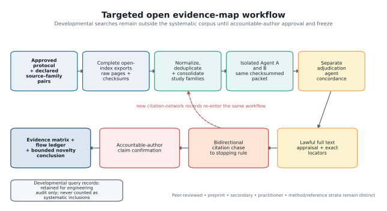
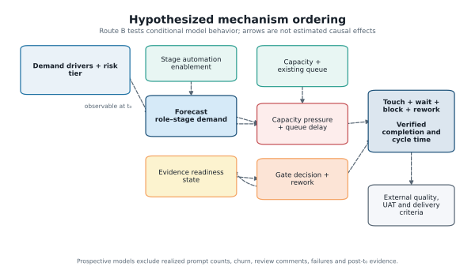
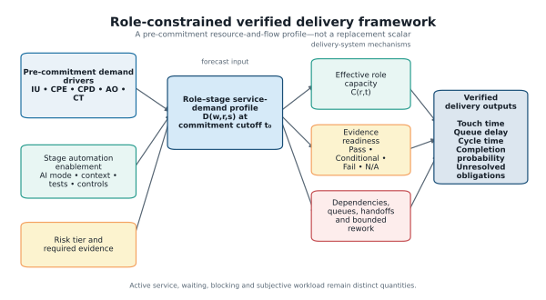
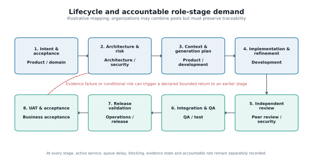
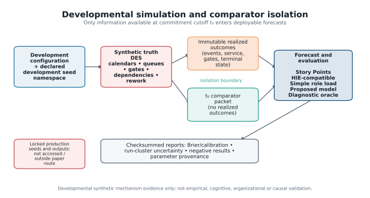
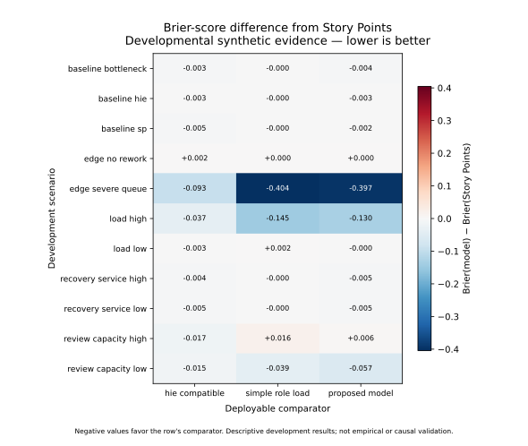

# Beyond Story Points in AI-Assisted Delivery: An Evidence Map and Simulation Framework for Role-Constrained Human Capacity

**Document status:** D17-confirmed scientific draft; venue formatting and final
release approval pending.  
**Paper route:** targeted open evidence map + design-science framework +
developmental synthetic simulation.  
**Release boundary:** evidence claims are limited to the D17-confirmed wording;
venue-specific declarations and author metadata remain pending.

## Abstract

AI-assisted programming can shorten some implementation activities without
proportionally shortening software delivery. Work can instead accumulate in
requirements clarification, architecture, review, security, testing,
integration, release, and acceptance, where finite specialist capacity and
evidence obligations constrain flow. Conventional single-value planning
estimates do not represent those role-specific queues or whether required
release evidence is ready. This paper develops a role-constrained verified
delivery model through a targeted, access-constrained evidence map and a
design-science process. The artifact represents pre-commitment demand drivers,
role-by-stage human service demand, effective role capacity, evidence-readiness
states, dependencies, queues, and bounded rework. A developmental
discrete-event simulation compares Story-Point, HIE-compatible, simple
role-load, proposed, and diagnostic-oracle forecasts across declared synthetic
worlds. The evidence map included 791 study families, 2,343 source-located
findings, and 769 quantitative findings. No family met all five predeclared
overlap dimensions for the same pre-commitment planning use. Across 11
developmental scenarios, the proposed and HIE-compatible
models each had the lowest descriptive Brier score in four, simple role load in
two, and Story Points in one. No deployable comparator was uniformly best. The
evaluation is mechanism evidence rather than human or organizational
validation. The contribution is therefore a falsifiable planning
representation and a prospective validation agenda, not a universal replacement
for Story Points. No substantively duplicative framework was identified within
the predeclared open sources and citation network through the stated cutoff and
approved resource cap; this is not an exhaustive-literature claim.

**Keywords:** AI-assisted software engineering; Agile estimation; software
effort estimation; human oversight; software delivery; queueing; evidence
readiness; discrete-event simulation

## 1 Introduction

Generating code is only one activity in converting an idea into accepted,
operable software. A work item must also be understood, bounded, designed,
integrated, reviewed, tested, secured, released, and accepted. AI assistance can
change the duration and volume of implementation work, but it does not remove
the need for accountable decisions or trustworthy evidence. When implementation
accelerates faster than review, test, security, architecture, or acceptance
capacity, the constraint moves rather than disappears.

This distinction matters for planning. Story Points are normally used as
team-relative estimates of work-item size, complexity, or uncertainty and are
interpreted through a team's historical throughput. They are not a universal
measure of hours, and this paper does not assume that they measured coding time
alone. Their limitation for the present problem is representational: one scalar
does not expose which role must act, when that role is required, how long work
may wait, which evidence is missing, or whether faster implementation increases
downstream arrival pressure. Reviews and replications of Agile effort
estimation show an extensive scalar-estimation literature while also reporting
continuing limits in estimator transfer and predictive differentiation [1,2].

Recent LLM-aware estimation, human-oversight, developer-experience, review,
testing, lifecycle, and delivery-orchestration research already addresses
important parts of this problem [3–10]. The proposed work therefore cannot
defensibly claim the first AI-era effort model, the first human-in-the-loop
framework, or the first lifecycle gate process. The narrower question is whether
a pre-commitment, role-by-stage resource-and-flow representation can make
cross-functional delivery constraints and evidence readiness inspectable
without collapsing them into another universal score.

We address that question with three linked contributions:

1. a targeted open evidence map that separates peer-reviewed studies,
   preprints, secondary studies, practitioner evidence, and foundational
   references;
2. a design-science artifact that represents demand, effective capacity,
   queues, readiness, dependencies, and rework at role-stage resolution; and
3. a reproducible developmental simulation that tests internal behavior,
   counterexamples, and conditions under which simpler models remain adequate.

The evaluation deliberately permits null and adverse findings. Synthetic
results can establish whether mechanisms are internally coherent and whether a
proposed representation behaves differently under specified conditions. They
cannot establish that the representation measures human cognition, predicts a
real organization, causes quality improvements, or outperforms existing
planning practice in the field.

### 1.1 Research questions

- **RQ1 — Evidence:** How does accessible scholarly and practitioner evidence
  characterize human work redistribution, review, assurance, coordination, and
  estimation in AI-assisted software delivery?
- **RQ2 — Artifact:** Which pre-commitment constructs and state variables are
  necessary to represent role-constrained, evidence-ready delivery without
  treating psychological workload as an interchangeable proxy for time or
  capacity?
- **RQ3 — Mechanisms:** Under which declared synthetic conditions do explicit
  role-stage demand, queues, dependencies, readiness, and rework alter verified
  completion forecasts relative to simpler comparators?
- **RQ4 — Boundaries:** When does the proposed detail add no material value,
  become unstable, or impose unjustified estimation overhead?

## 2 Related-work positioning

### 2.1 Agile estimation and Story Points

Agile effort-estimation research spans expert judgment, analogy, machine
learning, deep learning, and hybrid methods across several Agile variants [1].
A replication of learned Story Point estimation found that semantic similarity
alone did not adequately distinguish stories by assigned points and called for
additional techniques and features [2]. These findings do not show that Story
Points are invalid or that they measured coding time alone. They support the
narrower representational concern: the mapped scalar estimators do not
explicitly expose role-stage queues and evidence readiness for the forecast
target studied here.

### 2.2 LLM-aware effort and human oversight

HIE and its conceptual predecessor explicitly model LLM context,
interaction/transformation, validation, and human oversight [3,4]. The
empirical HIE report involved 22 developers and reports improved explained
variance relative to its Story Point baseline, while the predecessor is
explicitly conceptual [3,4]. The present artifact treats this line as a
foundation and comparator. Its candidate distinction is the information cutoff
and forecast unit: ex-ante role-stage demand and constrained delivery flow
rather than realized prompt or correction activity.

### 2.3 Review, testing, security, and lifecycle assurance

The evidence map shows that review and quality outcomes are common, but direct
prospective estimates of human effort and elapsed time are much less common.
For example, a study of AI-supported test-case development reports increased
interaction time alongside quality and idle-time changes [9], while a study of
AI-generated pull-request descriptions reports a reduction in review time but
also documents construct-validity limits [10]. These findings are activity- and
context-specific; neither licenses a proportional end-to-end acceleration
assumption. We therefore keep active review time, elapsed queue time, evidence
obligations, defect outcomes, and subjective workload distinct.

### 2.4 Productivity, flow, and gate frameworks

Lifecycle and approval-gate frameworks constrain the novelty claim: gates,
traceability, human approval, agentic cost, and delivery orchestration are not
new [5–7]. Agile V provides a compliance-ready lifecycle and evidence-gate
workflow but is supported by a bounded single case [5]. ACEM estimates agentic
cost and human-in-the-loop intensity under an explicitly sequential pipeline
[6]. A longitudinal delivery study examines human-AI orchestration across three
modernization programs [7]. The proposed contribution is therefore narrowly
the combined pre-commitment role-stage demand, touch-versus-queue,
capacity/readiness/dependency, and verified-completion forecast target.

## 3 Research method

### 3.1 Overall design

The study follows a design-science sequence: characterize the problem and prior
artifacts; define objectives and construct boundaries; design an inspectable
planning representation; demonstrate it in a discrete-event prototype; and
evaluate internal behavior, sensitivity, and failure conditions. Evaluation is
split into an evidence map and developmental simulation. Neither component is
presented as a field validation study.

### 3.2 Targeted open evidence map

The review uses a predeclared, non-Cartesian allocation of focused search
families to OpenAlex, Semantic Scholar Academic Graph, and arXiv. Crossref is
used for DOI and bibliographic verification rather than broad absence evidence.
Six subscription sources are recorded as inaccessible coverage limitations.
The protocol prohibits claims of exhaustive retrieval across all literature.

Search families cover estimation predecessors, code-review demand, testing and
QA, security assurance, lifecycle/team delivery, exact duplication terms, and
foundational comparisons. Two bounded integrative searches test terminology and
cross-family coverage. Each declared query must pass source-specific syntax,
sentinel, pagination, completeness, deterministic precision-appraisal, raw
archive, and checksum controls before freeze.

After accountable-author approval and protocol freeze, 18 accepted searches
were rerun into a new systematic corpus. Records were normalized and deduplicated by
DOI, arXiv identifier, title, authors, and year; related preprint and
peer-reviewed reports are consolidated into study families without losing
report provenance. Two isolated agents screen an identical checksummed packet,
followed by a separate adjudication pass. Agreement is reported as agent
concordance, not human inter-rater reliability. Included reports undergo lawful
full-text retrieval, design-appropriate appraisal, exact-locator extraction,
and recursive backward and forward citation chasing to the prespecified
stopping rule or prospective resource cap. The accountable author confirmed all
ten material claims and their supporting locators at D17.

### 3.3 Artifact-development logic

Constructs were separated by unit and time. Active human service requirement is
not elapsed time; queue delay is not touch time; effective capacity is not
headcount; evidence readiness is not confidence; and subjective or cognitive
workload is not inferred from hours. Candidate inputs must be observable at the
commitment cutoff `t0`. Realized prompt counts, code churn, review comments,
test failures, rework, and post-commitment evidence are prohibited from
prospective predictors because they leak outcomes or process realization.

Figure 2 summarizes the hypothesized ordering used to structure the Route B
mechanisms. Its arrows are not estimated causal effects.

## 4 Role-constrained verified delivery framework

### 4.1 Decision unit and prediction target

Figure 3 shows how the input profile, delivery-system mechanisms, and auditable
outputs remain distinct.

The unit is a work item moving through lifecycle stages within a planning
interval. The decision is whether a proposed portfolio can satisfy its defined
release or acceptance evidence by the deadline under finite cross-functional
capacity. The principal output is a distribution of verified items per horizon
and a probability of verified completion for each item. The artifact is not
intended for individual ranking, surveillance, compensation, or autonomous
approval.

### 4.2 Pre-commitment demand drivers

Five formative drivers describe conditions expected to shape service demand:

- **Intent Uncertainty (IU):** unresolved rules, scope, decisions, acceptance
  examples, and domain interpretation;
- **Change Propagation Exposure (CPE):** affected boundaries, interfaces, data,
  dependencies, non-functional requirements, and rollback complexity;
- **Context Provisioning Deficit (CPD):** required trustworthy information that
  is absent, stale, inaccessible, unapproved, or difficult to retrieve;
- **Assurance Obligation (AO):** evidence required by risk and policy across
  review, test, security, compliance, operations, and acceptance; and
- **Coordination Topology (CT):** roles, teams, handoffs, decisions,
  dependencies, and synchronization constraints.

These inputs form a profile, not a reflective psychological scale. They must
not be summed into a Fibonacci-like total, and internal-consistency statistics
such as Cronbach's alpha would not establish their validity.

### 4.3 Role-stage demand, capacity, and queues

For work item `w`, role pool `r`, and lifecycle stage `s`, define the ex-ante
role-stage human service-demand distribution at `t0` as

\[
D(w,r,s) = \text{distribution of active human service required at }t_0.
\]

For role `r` in planning interval `t`, offered load and effective capacity are

\[
L(r,t)=\sum_{w,s}E[D(w,r,s)], \qquad
U(r,t)=\frac{L(r,t)}{C(r,t)},
\]

where `C(r,t)` is schedulable role time after declared absence and non-project
obligations. `U(r,t)` is utilization pressure, not an individual-performance
measure. Queue delay `W_q(w,r,s)` begins when the item is ready for role-stage
service and ends when service starts. Touch, queue, blocking, calendar pause,
and rework time remain separately auditable.

### 4.4 Evidence readiness and transitions

Risk-scaled gates use `Pass`, `Conditional`, `Fail`, or `Not Applicable`, with
required evidence identifiers, freshness and validity state, accountable role,
decision rationale, and permitted transition. A mandatory failure cannot be
averaged away. Conditional advancement carries an explicit residual-risk
record. Failed evidence can trigger a declared bounded rework route; evidence
invalidated by a change must be regenerated before a later gate can rely on it.

### 4.5 Stage automation enablement

Automation enablement is represented separately by stage and may include AI
mode, trustworthy context, tool/domain experience, executable tests,
traceability, and policy controls. It is a moderator, not a universal
productivity multiplier, and is not mechanically subtracted from human demand.

### 4.6 Framework outputs and use

The output remains a role-stage profile plus uncertainty, not one replacement
point score. It includes active service, queues, cycle time, rework, readiness,
constrained roles, completion probability, and sensitivity to assumptions. A
delivery lead can use the profile to ask whether commitment should change,
whether a specialist pool is binding, which evidence obligation is unresolved,
and which assumption most affects the forecast. Those are proposed uses, not
validated organizational benefits.

The initial lifecycle representation spans intent through business acceptance
and retains an accountable role pool at each stage (Figure 4).

## 5 Developmental simulation

### 5.1 Purpose and architecture

The discrete-event simulation is a design-science demonstration of the
artifact's mechanics. Work items request service from finite role pools, wait
in explicit FIFO queues, traverse finish-to-start dependencies, encounter
evidence gates, and may enter bounded rework. Executable calendars and blackouts
constrain capacity. Immutable event, service, gate, queue, outcome, and manifest
records support reconciliation.

The architecture separates: (1) a truth-generating scenario; (2) a prospective
comparator layer restricted to information available at `t0`; and (3) an
evaluation layer. This prevents realized events from leaking into forecasts.

### 5.2 Comparators

Five comparator families receive the same eligible pre-commitment information:

1. an organizational Story-Point-style baseline;
2. an ex-ante HIE-compatible task-demand model;
3. a simple role-load ratio;
4. the proposed role-stage/readiness forecast; and
5. a diagnostic oracle that may use scenario truth and is never deployable.

Comparators are evaluated across worlds deliberately favorable to different
representations, including Story-Point-sufficient, HIE-compatible,
role-bottleneck, readiness/rework, mixed, and misspecified conditions. The
design therefore allows a simpler comparator to win.

### 5.3 Outcomes and verification

The primary forecast target is completion within the declared planning horizon
under an explicit terminal-state mapping. Evaluation includes Brier and log
loss, calibration, paired contrasts, cycle and queue errors, bottleneck
identification, over/undercommitment, and Monte Carlo uncertainty where
available. Verification includes deterministic toy cases, time and entity
conservation, mandatory-failure tests, calendar and dependency fixtures,
evidence-production/invalidation/regeneration tests, queue-area reconciliation,
fixed-seed regression, and mechanism ablations.

### 5.4 Developmental status

All current runs are developmental synthetic evidence. Parameter records are
classified by provenance; illustrative values are permitted for mechanism
exploration but cannot be described as empirical estimates. The checked-in
prototype seed set is not a sealed production evaluation. Production lock is
outside the minimum paper route.

## 6 Results

### 6.1 Evidence-map results

The systematic-search stream contained 5,879 record occurrences. After 1,917
duplicate occurrences were removed, 3,962 reports representing 3,930 study
families entered title/abstract screening. Screening excluded 1,854 families;
2,076 reports were sought, 472 were unavailable, 1,604 were assessed in full,
and 1,034 were excluded, leaving 570 included families.

The first citation round contained 6,097 candidate occurrences, consolidated
to 6,017 families after 80 duplicate occurrences were removed. Screening
excluded 5,000; 1,017 reports were sought; 680 were unavailable; 337 were
assessed; and 212 were included. A recovery supplement added 54 occurrences,
consolidated to 33 families; 11 reports were sought, nine were assessed, and
all nine were included. The accountable author approved a prospective resource
cap before recursively chasing the 221 newly included citation families.

The reconciled map contains 791 unique included study families and 2,343
exact-locator findings, including 769 quantitative findings. Appraisal bands
were 95 high, 397 moderate, and 299 low/contextual; the bands control narrative
weight rather than eligibility. Evidence concentrated in
implementation/refinement (746 families), integration (633), context/prompt
(614), security/compliance (611), requirements (582), testing (575), and code
review (516). Only 134 families covered manual QA/UAT, demonstrating an evidence
distribution rather than a measure of relative importance.

Across 3,955 family-by-dimension overlap judgments, 19 were met, 235 partial,
and 3,701 not met. Thirty-four families had the same planning use, but none met
all five dimensions for that use. Accordingly, no substantively duplicative
framework was identified within the predeclared open scholarly indexes,
repositories, and citation networks searched through the stated cutoff and
reported resource cap. Subscription-database inaccessibility, unavailable
lawful full texts, unresolved public-API failures, and the approved cap bound
that conclusion; it is not an absolute claim about the absence of prior work.

### 6.2 Developmental simulation results

The reconciled pipeline contains 11 scenarios with 24 replications each (264
runs). Two independent current-code executions were byte-identical. Manifest
`0.2.0-development` binds the four result tables to configuration SHA-256
`6b2fd67b…db48b` and implementation SHA-256 `61625c62…21e4`; the full values and
retired predecessor hashes are preserved in the reproducibility audit. All
results use developmental seeds and illustrative inputs.

Table 1 reports the descriptive lowest-Brier deployable comparator by scenario.
The proposed model and the HIE-compatible model each lead four scenarios,
simple role load leads two, and Story Points leads the no-rework edge case. The
winner count is not a statistical ranking: the scenarios differ in number of
items and were used during development.

| Scenario | Items | Lowest-Brier deployable model | Brier score |
|---|---:|---|---:|
| Baseline bottleneck | 288 | Proposed model | 0.120608 |
| Baseline HIE | 288 | HIE-compatible | 0.105476 |
| Baseline Story Point | 288 | HIE-compatible | 0.145997 |
| No-rework edge | 288 | Story Points | 0.001022 |
| Severe-queue edge | 1,152 | Simple role load | 0.161438 |
| High load | 864 | Simple role load | 0.249521 |
| Low load | 144 | HIE-compatible | 0.110432 |
| Low service-recovery fixture | 288 | Proposed model | 0.151579 |
| High service-recovery fixture | 288 | Proposed model | 0.142288 |
| High review capacity | 576 | HIE-compatible | 0.287817 |
| Low review capacity | 576 | Proposed model | 0.220344 |

The reporting pipeline resampled complete runs 5,000 times. Figure 6 shows the
paired Brier-score difference from Story Points for the other deployable
models. In the severe-queue scenario, simple role load and the proposed model
both improve materially on the scalar baseline in the synthetic system; simple
role load remains slightly better. In the baseline-bottleneck scenario, the
proposed model's difference from Story Points is small (`−0.00392`) and its
run-cluster 95% interval (`−0.00821` to `0.00006`) includes zero. These
contrasting cases illustrate why a single development-world winner cannot
support a general superiority claim.

The service-multiplier recovery fixtures returned `0.785693` for target `0.75`
(absolute error `0.035693`) and `1.825802` for target `1.75` (absolute error
`0.075802`). They verify a development diagnostic, not the recoverability of
organizational parameters. Earlier reported errors from a stale output snapshot
were retired during reconciliation.

Four mechanism removals—queues, readiness, dependencies, and multi-role
structure—were executed across three development worlds with 24 paired
replications per world. The 576 run records and 12 effect rows reproduce
byte-for-byte. Their numerical deltas are not interpreted as isolated causal
effects: changing event paths changes pseudorandom draw consumption, and
multi-role removal also changes resource topology. Readiness removal is null in
these illustrative worlds because evidence state is not a binding
differentiator. The ablations therefore demonstrate executable mechanism
boundaries and expose a future keyed-random-stream requirement.

All active calibration and comparator inputs remain Class I illustrative
values. Literature records motivate directional mechanisms but do not supply a
compatible numerical transformation for role-stage time, capacity, arrivals,
gate outcomes, or rework. The detailed parameter-use table is included in the
supplementary artifact set.

## 7 Discussion

### 7.1 From estimation totals to delivery constraints

The central proposal is not to rename effort as attention or to replace one
scalar with another. It is to align the planning representation with the
decision: whether a cross-functional portfolio can produce its required
evidence by a deadline. Role-stage demand makes the location of service
requirements visible; capacity and queues expose flow constraints; readiness
states expose transition obligations. Whether this additional structure is
worth eliciting remains an empirical question.

### 7.2 Implications for Agile planning

Story Points can remain useful where team composition, role demand, quality
obligations, and work mix are stable enough that history absorbs those effects.
The proposed model is most plausibly relevant when scarce specialist roles,
high coordination, uneven automation, explicit risk gates, or downstream
assurance dominate. A practical adoption sequence should therefore begin in
shadow mode and compare incremental information and overhead rather than
mandating a replacement scale.

### 7.3 Failure conditions

The artifact should be simplified or rejected when a role-load ratio performs
equivalently, readiness does not predict transitions, conclusions reverse under
small plausible perturbations, the input profile cannot be rated reliably, or
measurement overhead approaches the decision benefit. Mixed and negative
synthetic results are part of the evaluation, not exceptions to omit.

### 7.4 Organizational-use guidance

Organizations should introduce the artifact as a planning aid in shadow mode,
not as a replacement mandate. First define the release evidence required for
each risk tier and the accountable role pools. Next estimate role-stage demand
as distributions, record schedulable capacity and existing queues, and keep
waiting separate from active service. Compare the resulting completion forecast
with current Story Point and simple role-load practice at the same information
cutoff. Adoption should proceed only if calibration, bottleneck information,
and decision value improve enough to justify elicitation overhead. Ratings
should remain at work-item and role-pool level, with explicit anti-surveillance
and anti-Goodhart controls.

## 8 Threats to validity and limitations

### 8.1 Evidence coverage

The evidence map uses open indexes and lawful open versions. Scopus, Web of
Science, IEEE Xplore, ACM Digital Library, SpringerLink, and ScienceDirect are
not available as authenticated systematic-search sources. Open-index field
semantics and coverage differ, English-access rules may exclude relevant work,
and fast-moving preprints may later change status. The review therefore cannot
claim exhaustive coverage.

### 8.2 AI-assisted review

Two isolated agents and a separate adjudicator improve procedural separation
but do not constitute independent human reviewers. Agent concordance may be
affected by shared model lineage and training data. Exact-locator extraction,
checksums, disagreement records, and accountable-author citation confirmation
reduce but do not eliminate screening and synthesis error.

### 8.3 Construct validity

Role-stage service demand is a proposed resource quantity, not observed human
attention or cognitive load. The formative drivers have not undergone expert
content validation, inter-rater reliability, usability, or incremental-validity
testing. Ordinal anchors cannot be converted to hours without genuine
calibration data.

### 8.4 Simulation validity

The simulation verifies software behavior under declared inputs. Illustrative
parameters, simplified organizations, selected mechanisms, and synthetic truth
limit external validity. Scenario comparison cannot establish real causal
effects, forecast calibration, organizational value, or fairness. A model can
perform well when its own assumptions generate the data; diverse and
misspecified worlds mitigate but do not remove that circularity.

### 8.5 Temporal and organizational validity

AI tools, policies, codebases, and team practices change rapidly. Any later
empirical model will require temporal validation, tool/version reporting,
team/project holdouts, and recalibration. Raw Story Points cannot be pooled
across teams without respecting their local meaning.

## 9 Ethics and responsible use

The proposed artifact operates at work-item and role-pool level. It must not be
used for individual surveillance, ranking, compensation, or automated denial
of professional judgment. Future organizational studies should minimize
measurement burden, protect work-log privacy, use minimum reporting cell sizes,
control access, document retention, and monitor gaming and disparate effects.
Security, compliance, release, and acceptance decisions remain accountable
human responsibilities.

## 10 Future Route A validation

A prospective shadow-mode study should record normal Story Points, an ex-ante
HIE-compatible baseline, and the role-stage profile independently at `t0`
before the proposed model affects commitments. Multi-role touch observations
and workflow timestamps should keep active service and waiting separate.
Outcomes should include completion, cycle time, queue delay, rework, UAT
rejection, and prespecified quality windows. Evaluation should use temporal and
leave-team/project-out validation, calibration and proper scoring rules, and
measurement-error audits. Only after predictive and usability evidence should a
randomized or stepped-wedge planning rollout test whether using the artifact
changes delivery outcomes.

## 11 Conclusion

AI-assisted implementation changes the planning problem without eliminating
it. Faster artifact generation can coexist with finite review, assurance,
coordination, and acceptance capacity. This paper proposes an inspectable
role-stage, capacity, queue, and evidence-readiness representation and evaluates
its mechanics through an open evidence map and developmental simulation. The
evidence map identified adjacent estimators, gate systems, cost models, and
delivery frameworks, but no complete duplicate within the bounded search. The
simulation also showed that added detail is not uniformly beneficial: simpler
comparators won several declared worlds. VDCM should therefore be judged as a
falsifiable planning artifact and validation agenda, not as a validated
cognitive metric or a universal replacement for Story Points.

## Declarations

### AI-assistance disclosure

AI systems assisted with query engineering, record processing,
screening preparation, code generation, testing, adversarial audit, and draft
language. The accountable human author retains responsibility for the protocol,
source verification, analysis decisions, claims, authorship, conflicts,
research ethics, and submitted text. AI systems are not authors. The disclosure
follows Springer Nature's requirement for transparent declaration of
substantive generative-AI assistance and accountable human verification.

### Data and code availability

The intended release package includes non-confidential protocol,
query, evidence-ledger, simulation-code, configuration, manifest, and derived
result artifacts where licensing and double-blind review permit. No restricted
organizational data are used in Route B.

### Competing interests, funding, and author contributions

Competing-interest, funding, and author-contribution declarations are withheld
from the anonymous review version and will be supplied in the identified-author
package before G06 approval.

## References

1. Fernández-Diego, M., Mendez, E.R., González-Ladrón-de-Guevara, F., Abrahão,
   S., Insfrán, E.: An update on effort estimation in Agile software
   development: A systematic literature review. IEEE Access 8 (2020).
   https://doi.org/10.1109/ACCESS.2020.3021664
2. Tawosi, V., Moussa, R., Sarro, F.: Agile effort estimation: Have we solved
   the problem yet? Insights from a replication study. IEEE Trans. Softw. Eng.
   (2022). https://doi.org/10.1109/TSE.2022.3228739
3. Alaswad, F., Poovammal, E., Ramana, K., Surya Narayana, G., Khan, A.A.,
   Faheem, M.: Hybrid intelligence effort for software effort estimation in
   LLM-assisted development. Discover Computing (2026).
   https://doi.org/10.1007/s10791-026-10331-6
4. Alaswad, F., Poovammal, E., Aljaddouh, B.: Toward LLM-aware software effort
   estimation: A conceptual framework. Frontiers in Artificial Intelligence
   (2026). https://doi.org/10.3389/frai.2026.1772418
5. Koch, C., Wellbrock, J.A.: Agile V: A compliance-ready framework for
   AI-augmented engineering—from concept to audit-ready delivery. arXiv
   preprint (2026). https://doi.org/10.48550/arXiv.2602.20684
6. El-Ramly, M.: ACEM: A cost estimation model for agentic software
   engineering. arXiv preprint (2026).
   https://doi.org/10.48550/arXiv.2608.02582
7. Armesto, M., Kolb, C.: Orchestrating human-AI software delivery: A
   retrospective longitudinal field study of three software modernization
   programs. arXiv preprint (2026).
   https://doi.org/10.48550/arXiv.2603.20028
8. Tomaz, R., Guenes, P., Araújo, A.A., Baldassarre, M.T., Kalinowski, M.:
   Impacts of generative AI on Agile teams' productivity: A multi-case
   longitudinal study. arXiv preprint (2026).
   https://doi.org/10.48550/arXiv.2602.13766
9. Shi, B.J., Kristensson, P.O.: Preemptive, buffered or guided? Empirical
   studies on human-AI interaction strategies for software test case
   development. University of Cambridge Apollo Repository (2026).
   https://doi.org/10.17863/CAM.131425
10. Xiao, T., Hata, H., Treude, C., Matsumoto, K.: Generative AI for pull
    request descriptions: Adoption, impact, and developer interventions.
    Proc. ACM Softw. Eng. (2024). https://doi.org/10.1145/3643773
