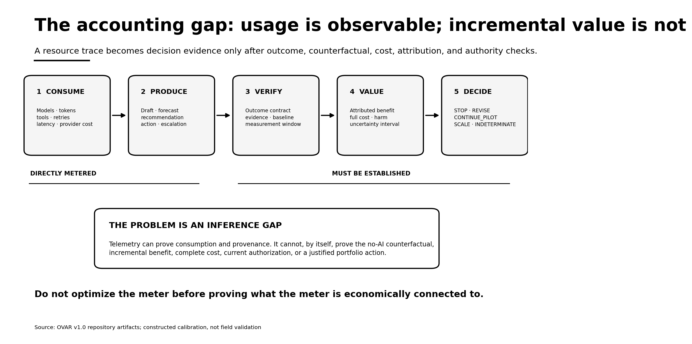
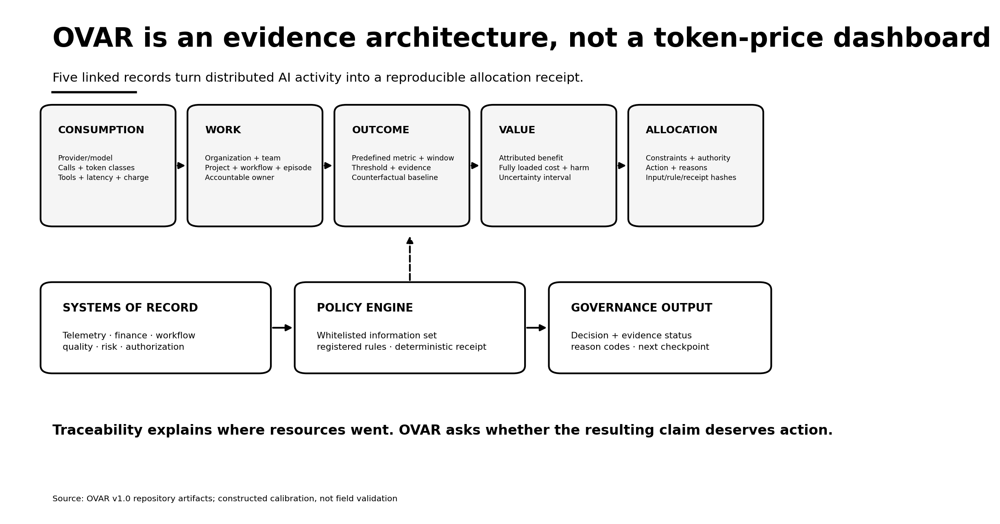
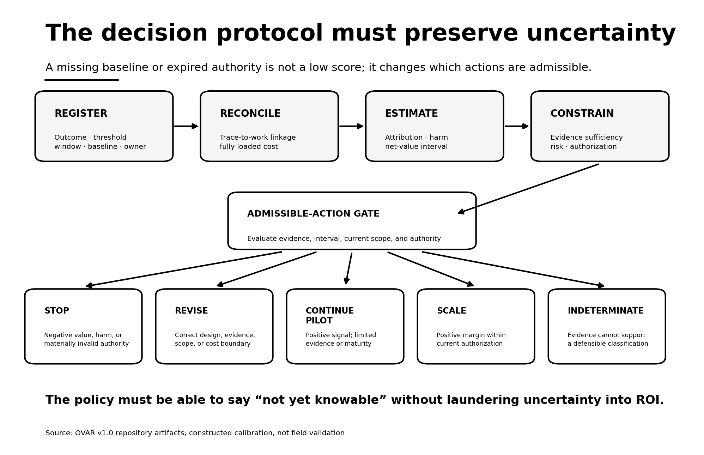
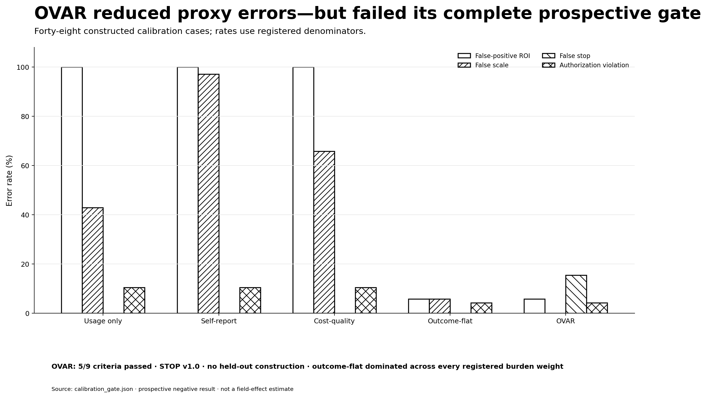
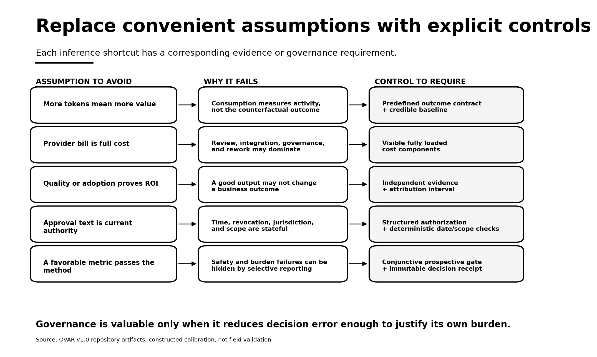

# From AI Usage to Auditable Outcomes: Engineering the Evidence Layer for Enterprise AI Allocation

## Why token visibility is necessary—and radically insufficient

Enterprise AI has acquired an instrumentation layer faster than it has acquired an evidence layer.

We can meter requests, prompt and completion tokens, cached and reasoning tokens, model routes, retrieval operations, tool calls, latency, retries, evaluation runs, and provider charges. In sophisticated agentic systems, we can reconstruct an execution trace across planners, retrievers, models, tools, reviewers, and human escalation.

That achievement is valuable. It is not the same as proving value.

A trace can establish that resources were consumed by a workflow. It cannot, on its own, establish that:

- the business outcome was defined before measurement;
- the observed change exceeded what would have happened without the AI workflow;
- the evidence can be independently located and reproduced;
- provider charges represent the complete economic cost;
- the outcome is attributable to AI rather than a concurrent intervention;
- uncertainty and delayed effects have matured enough for a decision;
- the proposed action remains authorized for the relevant time, scope, purpose, and jurisdiction; or
- the correct portfolio action is to stop, revise, continue, scale, or withhold judgment.

The central technical problem is therefore not token accounting. It is the **conversion of an attributed resource trace into an independently reviewable incremental-value claim and an accountable action**.



## The problem statement

Let an AI-enabled workflow episode (i) consume a heterogeneous resource vector (X_i): models, token classes, tools, retrieval, infrastructure, human review, integration, governance, and rework. Let (Y_i(1)) denote the observed outcome with the workflow and (Y_i(0)) the counterfactual outcome without it.

Operational systems observe parts of (X_i) and (Y_i(1)). They do not directly observe (Y_i(0)). Yet incremental value depends on the difference:

\[
\Delta Y_i = Y_i(1) - Y_i(0)
\]

That difference must then be adjusted for attribution confidence (A_i), fully loaded cost (C_i), and expected harm (H_i):

\[
N_i = A_i \cdot \Delta Y_i - C_i - H_i
\]

Even this point estimate is insufficient. A defensible system needs an uncertainty interval ([N_i^L, N_i^U]), evidence-sufficiency status, measurement maturity, and an authorization state evaluated at decision time.

This is why “cost per successful task” is not automatically ROI, why “time saved” is not automatically incremental benefit, and why a technically excellent output can still be economically neutral, harmful, or unauthorized.

## Why this is a need-of-the-hour systems problem

The shift from single model calls to compound AI systems changes the accounting surface.

Before, a team might associate a provider invoice with an application. Now, one business episode may involve:

- a router choosing among models;
- a planner decomposing work;
- multiple retrieval calls;
- tool execution against enterprise systems;
- retries caused by tool or model failure;
- automated evaluation and guardrails;
- a human reviewer correcting or approving an action;
- downstream integration and exception handling; and
- governance, security, audit, and remediation work.

Token optimization asks: **How can we produce an acceptable output with fewer or better-allocated compute resources?**

Outcome verification asks a different question: **Did the workflow create enough attributable, evidenced, authorized value to justify the next investment action?**

The two questions are complementary, not interchangeable. A perfectly optimized call can belong to a valueless project. An expensive workflow can be justified if it prevents a rare, material loss. High utilization can indicate adoption—or retries, poor routing, unresolved defects, or an incentive to consume an expiring budget.

The systems risk is an inference shortcut:

```text
measured usage -> attributed cost -> assumed benefit -> reported ROI -> scaled deployment
```

The missing bridge is evidence.

## A narrower and more defensible direction: OVAR

Outcome-Verified AI Resource Allocation (OVAR) is a research method for the decision-accountability layer. It does not replace observability, FinOps, model routing, evaluation platforms, accounting systems, or AI governance standards. It consumes records from those capabilities and binds them into a decision object.

OVAR links five record classes:

1. **Consumption record** — provider, model, calls, token classes, tools, latency, and direct charge.
2. **Work record** — organization, team, project, workflow, episode, accountable owner, and stable identifiers.
3. **Outcome record** — prospectively defined metric, threshold, measurement window, independently locatable evidence, and counterfactual baseline.
4. **Value record** — incremental benefit, fully loaded cost, expected harm, attribution confidence, and uncertainty.
5. **Allocation record** — constraints, authorization, action, reasons, rule version, input hashes, and immutable receipt hash.



This structure forces an important separation:

| Layer | Question | Typical evidence |
|---|---|---|
| Resource attribution | What did the workflow consume? | Telemetry, billing, infrastructure, tools, human effort |
| Work attribution | Which operational episode owns that consumption? | Stable workflow, project, episode, and owner identifiers |
| Outcome verification | What changed, and was it measured as registered? | Outcome contract, acceptance threshold, evidence, window |
| Causal attribution | What would have happened without the workflow? | Experiment, matched comparator, time series, adjudicated baseline |
| Economic reconciliation | Did attributable benefit exceed complete cost and harm? | Finance, labor, integration, rework, risk, uncertainty |
| Authority validation | Is the contemplated action currently permitted? | Structured scope, dates, signer, jurisdiction, revocation state |
| Allocation action | What is justified now? | Versioned deterministic rule and decision receipt |

## The action vocabulary matters

Binary “approve/reject” governance collapses distinct epistemic and operational states. OVAR preserves five actions:

- **STOP** when evidence supports negative value, unacceptable harm, or materially invalid authority.
- **REVISE** when the design, evidence, scope, baseline, cost boundary, or control must be corrected before reassessment.
- **CONTINUE_PILOT** when the signal justifies bounded learning but does not justify organization-wide scale.
- **SCALE** when evidence supports a positive margin within a current authorization boundary.
- **INDETERMINATE** when the evidence cannot support a defensible classification.

“Indeterminate” is not indecision. It is a typed result that prevents uncertainty from being silently converted into positive ROI.



## What the research tested

The OVAR v1.0 study did not claim field effectiveness. It tested policy behavior on a leakage-controlled, deliberately constructed calibration.

The research design included:

- a 24-case engineering pilot used to establish executability, not confirmation;
- 48 new calibration cases across healthcare, financial services, e-commerce, transportation and logistics, cybersecurity, and customer operations;
- eight difficult construction strata per domain;
- reviewer-visible facts separated from restricted reference records;
- two isolated synthetic reviewers used only for rubric, clarity, and leakage stress testing—not human inter-rater validation;
- one disclosed clarity-only packaging revision after a visible stratum/order shortcut was found;
- five frozen policies with distinct information sets;
- 25 tests and artifact hashes locked before the one-time run; and
- nine mandatory progression criteria evaluated conjunctively.

The comparison policies were:

| Policy | Permitted decision information | Registered burden |
|---|---|---:|
| Usage only | Utilization and budget position | 0.05 |
| Self-reported value | Usage plus owner-reported benefit | 0.10 |
| Cost-quality | Direct cost plus technical acceptance/quality | 0.20 |
| Outcome-flat | Outcome contract, evidence, baseline, attribution, full cost | 0.65 |
| OVAR ledger | Outcome-flat plus uncertainty, risk, authorization, and receipt constraints | 0.80 |

The burden values are analytical assumptions for sensitivity testing, not measured labor hours.

## The result: a useful negative gate

OVAR v1.0 produced an intuitively attractive partial result:

- false-positive ROI fell to 2/35 (5.7%), versus 35/35 (100%) for usage-only and self-reported-value policies;
- false-scale fell to 0/35, versus 15/35 for usage-only; and
- the indeterminate rate remained within the registered gate.

But the complete method failed:

- it produced two false stops among 13 safe reference cases;
- it produced two authorization-related harmful actions by missing expired approvals;
- it matched the exact reference action on 25/48 cases, below outcome-flat at 32/48;
- its weighted loss was 1.155 at burden 0.800, versus 1.001 at burden 0.650 for outcome-flat; and
- outcome-flat dominated OVAR at every registered measurement-burden weight.

OVAR passed five of nine mandatory criteria. The frozen decision was:

> **STOP OVAR v1.0; do not construct or open a held-out benchmark for this version.**



This is not an “almost validated” result. The gate was conjunctive. A favorable false-scale rate could not compensate for authorization violations, false stops, or strict domination by a lower-burden comparator.

That is exactly why prospective gates matter. Without them, a team could select the favorable metrics, present a successful dashboard, and suppress the mechanism that makes the policy unsafe.

## The failure mechanism is more important than the headline score

The frozen authorization logic used lexical treatment of unstructured text. It failed in two opposite directions.

First, it detected conditional language but did not reliably compare explicit expiry dates with the August 2026 decision time. Two approvals had expired, yet the policy allowed continued action.

Second, it overgeneralized absent or out-of-scope wording. Two records described a valid studied scope and a different excluded scope. The classifier treated the exclusion as applying to the whole project and stopped safe in-scope work.

The lesson is architectural:

> Time and scope are not adjectives to detect in prose. They are state variables to model, version, validate, and join to a contemplated action.

A future authorization record should minimally include:

```text
authorization_id
subject / accountable principal
resource or workflow
permitted action
purpose and organizational scope
jurisdiction
valid_from / valid_until
revocation state and timestamp
required signer and signature status
decision timestamp
governing policy version
```

Temporal validity and scope containment should be evaluated deterministically before any language-model interpretation. Mixed-scope documents should become multiple scoped records, not one global label. The decision receipt should identify exactly which authorization record governed which action.

## Assumptions that enterprise systems should refuse



### 1. “More tokens mean more work or more innovation”

Tokens are heterogeneous billing and compute units. Their economic meaning varies by model, modality, cache treatment, workflow position, and downstream effect. A retry loop can consume more than a successful path. Low adoption can still create value in rare high-consequence cases.

**Required control:** treat usage as a cost and provenance input, never as the value label.

### 2. “Lower provider cost implies positive ROI”

Provider charges exclude infrastructure, tools, integration, evaluation, human review, governance, rework, incident response, and evidence production.

**Required control:** reconcile visible fully loaded cost components. Do not hide them inside a single opaque total.

### 3. “Technical quality or acceptance proves business value”

An output can be accurate and accepted without changing an operational outcome. It can shift work downstream or improve a proxy while degrading the actual service objective.

**Required control:** register the operational outcome and counterfactual design before the decision window closes.

### 4. “Owner-reported time saved is causal evidence”

Self-report can be informative for hypothesis generation but is vulnerable to recall bias, selection, strategic reporting, omitted rework, and concurrent process change.

**Required control:** use independent evidence, a credible baseline, and an explicit attribution interval.

### 5. “An approval document means the action is authorized”

Authority is time-bound, scope-bound, purpose-bound, jurisdiction-bound, revocable, and action-specific.

**Required control:** use structured authorization with deterministic validity and containment checks at decision time.

### 6. “More governance is automatically safer”

Governance introduces measurement, review, latency, and false-stop burden. A richer policy can be dominated by a simpler one if its controls do not reduce error enough.

**Required control:** measure governance as part of the decision system. Require a non-dominated error–burden position.

### 7. “A calibrated design is production-ready”

Constructed cases expose logic defects; they do not estimate field error rates, organizational ROI, stakeholder behavior, fairness, or production resilience.

**Required control:** distinguish engineering pilot, design calibration, held-out confirmation, field study, and controlled deployment.

## End-to-end workflow: from investment intent to a verified decision


The workflow is deliberately ordered. Rearranging it can reintroduce retrospective success definition or evidence leakage.

### Step 1 — Define the decision

Specify the decision unit: project, workflow, use case, deployment episode, or portfolio increment. Identify the accountable owner, decision deadline, available actions, and what resources may change as a result.

### Step 2 — Register the outcome

Before measurement, define the operational metric, acceptance threshold, practical-equivalence margin, maturation window, evidence source, and minimum evidence quality. A post-hoc metric is an observation, not a prospective contract.

### Step 3 — Capture the resource trace

Instrument model calls, token classes, routes, retrieval, tools, retries, latency, infrastructure, evaluation, and human escalation. Bind every event to stable organization, project, workflow, and episode identifiers.

### Step 4 — Reconcile fully loaded cost

Join provider charges with infrastructure, tools, integration, evaluation, human review, governance, rework, and expected remediation. Preserve components so investigators can see which boundary changes the conclusion.

### Step 5 — Verify outcome evidence

Confirm that the outcome was measured in the registered window, that evidence is independently locatable, and that the reproduction note is sufficient. Record missingness and corrections rather than silently imputing success.

### Step 6 — Establish the baseline

Identify the no-AI alternative through randomization, staged rollout, matched comparison, interrupted time series, or a justified adjudicated baseline. Record concurrent events and spillovers.

### Step 7 — Estimate net value and uncertainty

Estimate incremental benefit, discount it by defensible attribution confidence, subtract complete cost and expected harm, and produce an interval. Avoid collapsing delayed/shared value into a single overconfident point estimate.

### Step 8 — Validate authority and risk

Evaluate current authorization against the contemplated action: subject, resource, purpose, scope, jurisdiction, valid dates, revocation, signer, and policy version. Separate consequence severity, exposure probability, and loss rather than using one lexical risk score.

### Step 9 — Issue a decision receipt

Select `STOP`, `REVISE`, `CONTINUE_PILOT`, `SCALE`, or `INDETERMINATE` under a registered policy. Bind action, reasons, evidence status, input hashes, rule version, authority record, and next checkpoint in an immutable receipt.

### Step 10 — Monitor and reassess

A decision is not permanent. Outcomes mature, costs change, authorization expires, drift occurs, and new harms appear. Reopen the contract at registered checkpoints and invalidate earlier receipts when their governing state changes.

## How to put this research into practice without deploying OVAR v1.0

The v1 policy should not be deployed. The research artifacts can still improve system design.

### Phase A — Establish trace-to-work integrity

- create stable organization, project, workflow, episode, and decision identifiers;
- map model, tool, infrastructure, and human events to those identifiers;
- reconcile provider invoices and internal cost centers;
- expose retries, rework, exception handling, and review effort; and
- define ownership for every unmapped event.

Exit criterion: the organization can explain where resources went without claiming that the trace proves value.

### Phase B — Introduce prospective outcome contracts

- define the operational outcome before rollout;
- specify threshold, window, evidence source, and baseline design;
- document confounders, delayed effects, spillovers, and attribution rules;
- separate model-quality metrics from business-outcome metrics; and
- make `INDETERMINATE` a valid status.

Exit criterion: an independent reviewer can reproduce whether the registered outcome was met.

### Phase C — Reconcile value and uncertainty

- include all material cost categories;
- estimate expected harm explicitly;
- report intervals and sensitivity, not only point ROI;
- preserve numerator, denominator, attribution, and maturity assumptions; and
- test whether the decision changes under plausible boundaries.

Exit criterion: a portfolio committee can see why the action follows—and which assumptions would reverse it.

### Phase D — Structure authorization

- replace prose-only approvals with typed, versioned records;
- validate time, scope, jurisdiction, purpose, signer, and revocation deterministically;
- bind authorization to the exact contemplated action;
- require revalidation at each material decision checkpoint; and
- keep natural-language documents as evidence, not the executable policy state.

Exit criterion: the system can distinguish expired, revoked, mixed-scope, and valid in-scope authority without lexical guessing.

### Phase E — Calibrate the governance mechanism

- preregister comparators, loss components, thresholds, burden assumptions, and pass/fail criteria;
- isolate reference decisions from policy inputs;
- include adversarial boundary cases and safe-completion cases;
- freeze implementation and hashes before execution;
- preserve every failed criterion and dominated result; and
- prohibit held-out progression when the design gate fails.

Exit criterion: the richer policy earns its burden rather than merely appearing more comprehensive.

### Phase F — Earn field claims

- obtain independent domain, finance, risk, privacy, security, and operations review;
- run prospective field studies with mature outcomes and credible comparators;
- measure real evidence-production and governance labor;
- evaluate fairness, access, incentives, and strategic gaming;
- test operational resilience and incident response; and
- use decision receipts to support audit, not to manufacture certainty.

Exit criterion: claims are limited to the population, action, outcome, and time window actually studied.

## Engineering precautions

An enterprise implementation should treat the following as non-negotiable design properties:

1. **Prospective registration:** outcome, threshold, baseline, window, and action rule exist before observation can influence them.
2. **Data lineage:** every derived value retains links to source system, version, timestamp, transformation, and accountable owner.
3. **Information-set isolation:** a policy receives only approved fields and cannot access reference labels or post-decision data.
4. **Determinism at the gate:** identical canonical inputs and rule versions reproduce the same receipt.
5. **Current authorization:** time and scope validation occur at decision time and are bound to the contemplated action.
6. **Uncertainty preservation:** missing evidence is not silently transformed into neutral or positive value.
7. **Full-cost transparency:** cost components remain separable and auditable.
8. **Burden accounting:** evidence and governance effort count against the method, not outside it.
9. **Safe completion:** a control must be tested for both unsafe action and unnecessary blocking.
10. **Immutable negative results:** failed gates, counterexamples, and dominating comparators remain visible.
11. **Versioned reevaluation:** material evidence or authority change invalidates affected receipts.
12. **Claim discipline:** calibration, held-out confirmation, field effect, and production readiness are never conflated.

## What the research contributes—even though the gate failed

The strongest scientific contribution is not a positive OVAR score. It is a reusable way to expose when a plausible governance mechanism does not earn deployment.

The repository contributes:

- a formal separation of consumption, work, outcome, value, and allocation records;
- an explicit outcome-evidence and authorization-sensitive decision object;
- five comparator information sets and deterministic receipts;
- a constructed benchmark with leakage controls and all five action classes;
- a prospective, multi-criterion progression gate;
- a preserved negative result with case-level failure tracing; and
- a falsifiable direction for a successor using structured temporal and scoped authority.

The narrow constructive finding is important: **outcome evidence can prevent consumption proxies from being mistaken for value, but unstructured authorization heuristics can erase the benefit of a richer governance layer**.

## Research agenda

A successor OVAR v2 should not be tuned and declared successful on the exposed 48 cases. Those cases are now regression tests for known defects. A new study should:

1. formalize structured temporal, scoped, jurisdictional, and revocable authorization;
2. create new boundary cases that independently vary expiry, revocation, nested scope, and conditional approval;
3. test deterministic containment before language-model interpretation;
4. measure actual evidence-production and review burden;
5. obtain independent human adjudication;
6. connect heterogeneous enterprise traces to stable outcome contracts;
7. evaluate delayed, shared, and avoided-loss value;
8. stress-test Goodhart effects, budget gaming, and strategic under- or over-consumption;
9. freeze the successor protocol before a new prospective run; and
10. preserve another negative result if the richer mechanism remains dominated.

The next hypothesis is deliberately harder: a structured-authorization successor must preserve low false-scale behavior, eliminate systematic authorization violations and false stops, and occupy a non-dominated error–burden position on new preregistered data.

## Closing perspective

The most dangerous enterprise AI metric is not an inaccurate token count. It is a precise count attached to an unsupported value inference.

Observability tells us what the system did. FinOps tells us what resources cost. Evaluation tells us something about output behavior. Governance constrains what may be done. None of these, independently, proves incremental organizational value.

The responsible architecture joins them through a prospective outcome contract, credible baseline, reviewable evidence, fully loaded cost, attribution and uncertainty, structured current authority, and a reproducible decision receipt.

The governing principle is simple:

> **Consumption is an input to cost. Verified incremental outcome, complete cost, uncertainty, risk, and current authority determine action.**

And when the evidence does not support the method, the system should stop at the gate—before a polished dashboard becomes an unearned claim.

## Research and source links

### Primary OVAR artifacts

- [OVAR repository](https://github.com/khshaik/applied-ai-research-lab/tree/main/value-aware-enterprise-ai-tokenomics)
- [Camera-ready manuscript](../../../papers/thinkai-2026/manuscript/OVAR_ThinkAI2026_CAMERA_READY_v1.0.pdf)
- [Formal objective and estimands](../../../studies/ovar/method/FORMAL_OBJECTIVE_AND_ESTIMANDS_v0.1.md)
- [Causal model](../../../studies/ovar/method/CAUSAL_MODEL_v0.1.md)
- [Prospective analysis plan](../../../studies/ovar/calibration/PROSPECTIVE_ANALYSIS_PLAN_v1.0.md)
- [Machine-readable calibration gate](../../../studies/ovar/calibration/results/calibration_v1.0/calibration_gate.json)
- [Calibration decision memorandum](../../../studies/ovar/calibration/results/calibration_v1.0/CALIBRATION_DECISION_MEMORANDUM_v1.0.md)
- [Claim-to-evidence ledger](../../../studies/ovar/publication/CLAIM_TO_EVIDENCE_LEDGER_v1.0.csv)
- [Novelty source register](../../../studies/ovar/novelty/source_register.csv)

### Closest research, standards, and practice streams

- Zhu (2026), [AI Tokenomics](https://arxiv.org/abs/2606.24616)
- Chen et al. (2026), [Token Economics for LLM Agents](https://arxiv.org/abs/2605.09104)
- Zhu (2026), [Agentic AI Systems Should Be Designed as Marginal Token Allocators](https://arxiv.org/abs/2605.01214)
- Salim et al. (2026), [Tokenomics in Agentic Software Engineering](https://arxiv.org/abs/2601.14470)
- Bai et al. (2026), [How Do AI Agents Spend Your Money?](https://arxiv.org/abs/2604.22750)
- Chen, Zaharia, and Zou (2023), [FrugalGPT](https://arxiv.org/abs/2305.05176)
- Ong et al. (2024), [RouteLLM](https://arxiv.org/abs/2406.18665)
- Noy and Zhang (2023), [Experimental Evidence on the Productivity Effects of Generative AI](https://doi.org/10.1126/science.adh2586)
- Brynjolfsson, Li, and Raymond (2025), [Generative AI at Work](https://doi.org/10.1093/qje/qjae044)
- Peng et al. (2023), [The Impact of AI on Developer Productivity](https://arxiv.org/abs/2302.06590)
- [FinOps for AI](https://www.finops.org/framework/technology-categories/ai/)
- [OpenTelemetry Generative AI Semantic Conventions](https://opentelemetry.io/docs/specs/semconv/registry/attributes/gen-ai/)
- [NIST AI Risk Management Framework](https://www.nist.gov/itl/ai-risk-management-framework)
- [ISO/IEC 42001:2023](https://www.iso.org/standard/42001)

*Interpretation boundary: OVAR v1.0 is a prospective negative calibration on deliberately constructed cases. It does not establish field effectiveness, enterprise ROI, production readiness, legal compliance, or universal superiority of any comparator.*
