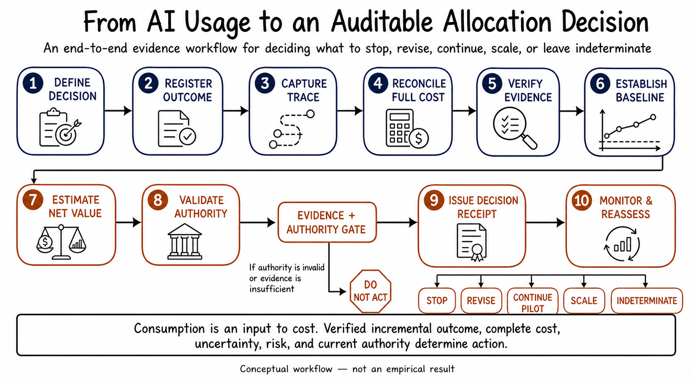

# LinkedIn Post — From AI Usage to Auditable Outcomes

We have become very good at measuring AI consumption.

We can observe model calls, token classes, retrieval, tools, retries, latency, evaluation, and provider spend.

But this precision can create a dangerous illusion:

> A perfectly attributed resource trace is still not proof of incremental business value.

The missing questions are causal, economic, and governable:

- What outcome was defined before measurement?
- What would have happened without the AI workflow?
- Can the evidence be independently reproduced?
- Does cost include integration, review, governance, and rework?
- How much of the observed change is attributable to AI?
- Is the value interval actually positive?
- Is the proposed action currently authorized for this time and scope?
- Does the evidence justify stop, revise, continue, scale—or “indeterminate”?

This is the problem behind **Outcome-Verified AI Resource Allocation (OVAR)**.

OVAR connects five records:

1. consumption;
2. accountable work ownership;
3. prospective outcome + counterfactual evidence;
4. fully loaded value + harm + uncertainty; and
5. allocation action + reasons + immutable receipt.

The research result is deliberately not a success story.

OVAR v1.0 was prospectively frozen and evaluated once on 48 constructed cases across six domains.

It reduced false-positive ROI to **2/35**, versus **35/35** for usage-only and self-reported-value rules. It produced **0/35 false-scale decisions**.

But it also:

- missed **two expired approvals**;
- falsely stopped **two safe in-scope cases**;
- passed only **five of nine** mandatory criteria; and
- was strictly dominated by a simpler outcome-flat policy across every registered measurement-burden weight.

So the correct decision was:

**STOP OVAR v1.0. No held-out benchmark. No deployment claim.**

The failure mechanism is the deeper lesson.

The policy treated authorization as text. Text heuristics could not reliably calculate expiry or distinguish an authorized scope from a different excluded scope.

Time and scope are not adjectives. They are state variables.

A production-grade system should use structured records for:

- subject and accountable principal;
- resource and permitted action;
- purpose, organizational scope, and jurisdiction;
- valid-from and valid-until;
- revocation state;
- signer and approval status; and
- decision timestamp.

Deterministic time/scope validation should happen before any language-model interpretation.

Practical takeaway:

**Do not optimize the meter before proving what the meter is economically connected to.**

An enterprise implementation should progress in this order:

1. Trace resources to a stable workflow episode.
2. Register the outcome and baseline prospectively.
3. Reconcile fully loaded cost.
4. Verify evidence and estimate attributable value with uncertainty.
5. Validate current structured authority.
6. Issue an auditable `STOP / REVISE / CONTINUE_PILOT / SCALE / INDETERMINATE` receipt.
7. Reassess when evidence, cost, risk, or authority changes.

The final principle:

> **Consumption is an input to cost. Verified incremental outcome, complete cost, uncertainty, risk, and current authority determine action.**

Full technical article: [From AI Usage to Auditable Outcomes](../LINKEDIN_CONSOLIDATED_ARTICLE.md)

Repository: https://github.com/khshaik/applied-ai-research-lab/tree/main/value-aware-enterprise-ai-tokenomics

#EnterpriseAI #AgenticAI #AIGovernance #LLMOps #FinOps #AIValue #ResponsibleAI #CausalInference #AIResearch #Tokenomics

*Evidence boundary: prospective negative calibration on constructed cases; no field-effectiveness, enterprise-ROI, production-readiness, or legal-compliance claim.*
