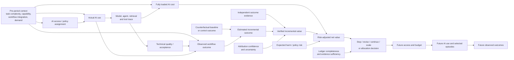

# Causal Model v0.1

## Purpose

This model prevents three common substitutions:

1. AI access or usage is substituted for AI-caused value;
2. token or monetary cost is substituted for work performed;
3. observed business outcome is substituted for incremental outcome attributable to AI.

## Core causal structure



## Interpretation

`X` contains common causes that can make AI use and outcomes appear related even when AI did not cause the difference. Examples include task difficulty, employee experience, management support, data quality, demand, workflow maturity, and selective access to better projects.

The ledger records the `U → T → C/Q` process, but tracing alone does not identify the causal effect `U → Y`. Identification requires a credible `B`, such as randomized assignment, stepped rollout, matched comparison, interrupted time series, or another prespecified design with defensible assumptions.

Independent evidence `E` supports whether the contracted outcome occurred. It does not alone show that AI caused it. Attribution confidence `K` must reflect the identification design, missing data, measurement reliability, and plausible alternative explanations.

## Feedback and selection risk

Allocation decision `D` affects which future projects receive access and therefore which outcomes become observable. This creates feedback:

```text
past measured value → future allocation → future observed sample → next value estimate
```

Without protected exploration and access floors, the system can become self-confirming: historically funded teams generate more evidence and continue receiving funds, while new or under-instrumented teams cannot demonstrate value. Evaluation must therefore record eligibility, rejected proposals, protected exploration, and missing outcomes—not only funded successes.

## Candidate identification strategies

| Design | Strongest use | Principal assumption or risk |
|---|---|---|
| Randomized access or policy assignment | Episode- or team-level causal effect | Interference, non-compliance, and sufficient sample size |
| Stepped-wedge rollout | Operational adoption when simultaneous randomization is impractical | Time trends and anticipation effects |
| Difference-in-differences | Treated and comparison workflows over time | Parallel trends and no differential co-intervention |
| Matched concurrent comparison | Similar episodes with and without AI | No important unmeasured confounding |
| Interrupted time series | Stable, repeated workflow before and after deployment | No concurrent shock and adequate pre-period |
| Synthetic-control or weighted comparator | Project or portfolio intervention | Donor-pool validity and pre-fit quality |
| Constructed benchmark with deterministic ground truth | Initial policy and error-rate pilot | Limited ecological validity; not a field-effect estimate |

The initial pilot should use deterministic constructed ground truth to validate classification behavior. It must not be presented as organizational ROI evidence. Field claims require a later credible causal design.

## Outcome hierarchy

Keep outcomes separate:

```text
trace completion
  < technical success
  < human acceptance
  < operational outcome
  < incremental outcome versus baseline
  < verified monetary value
  < realized risk-adjusted net value
```

Passing a lower level does not imply passing a higher level.

## Minimum evidence for a positive ROI classification

A positive classification requires all of:

- predefined outcome contract and measurement window;
- trace-to-work attribution;
- reconciled fully loaded cost boundary;
- valid outcome evidence;
- prespecified baseline or counterfactual method;
- attribution confidence above a frozen minimum;
- uncertainty interval satisfying the decision rule;
- risk and compliance gate passed;
- no unresolved material missing-cost or rework field.

Otherwise, the correct classification is negative, neutral, or indeterminate according to the frozen rule—not automatically positive.

